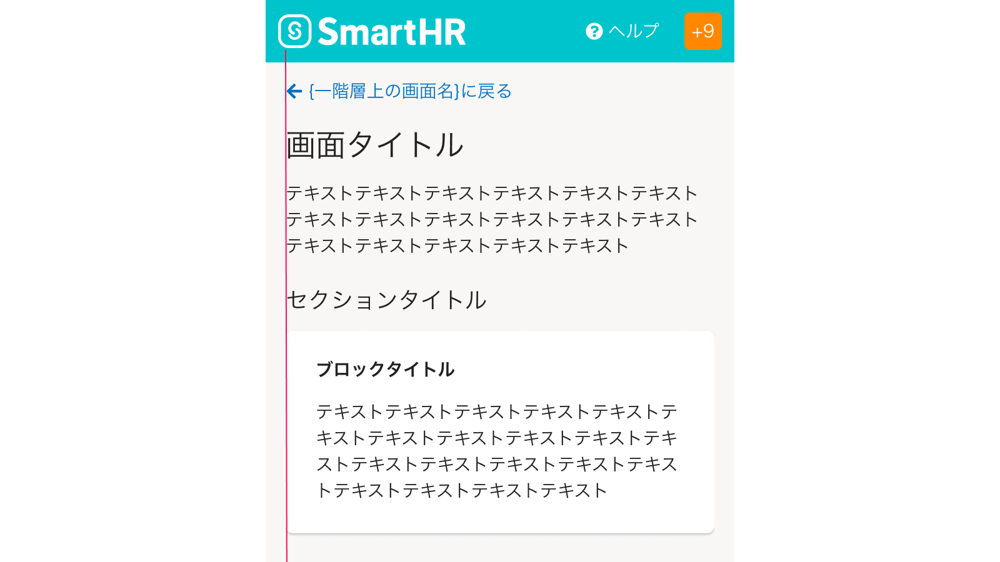

import { FaArrowLeftIcon } from 'smarthr-ui'

一階層上のコンテンツに誘導する役割を持ち、コンテンツ間の階層構造を認知させるためのナビゲーションです。

正しくは「上階層に戻るリンク」ですが、呼びにくいため「上に戻るリンク」としています。

## 構成
上に戻るリンクは、次の要素で構成されています。

1. リンクテキスト
2. アイコンで伝える。


### 1. リンクテキスト
基本的に「`{一階層上の画面名}に戻る`」と表記し、[TextLink](/products/components/text-link/)を用います。

パーマリンクで直接遷移してきた場合など、一階層上のコンテンツの特定や類推が難しい場合に限り、下記のように「`{一階層上の画面名}{一階層上のコンテンツの種類}に戻る`」と表記します。


| 一階層上のコンテンツ | リンクテキスト | 例 |
| :--- | :--- | :--- |
| コレクション<br />（[よくあるテーブル](/products/design-patterns/smarthr-table/)） | `{一階層上の画面名}一覧に戻る` | *「権限一覧に戻る」*<br />（「権限に戻る」だけでは、上の階層に権限に関するどのコンテンツかを類推しにくいため） |


### 2. アイコン
階層構造を認知させるために、[TextLink](/products/components/text-link/)の`prefix`を使いリンクテキストの左側に「<FaArrowLeftIcon visuallyHiddenText="左矢印" />（`FaArrowLeftIcon`）」を置きます。  
※`TextLink`を使えない場合は、アイコンの色に[`TEXT_LINK`](/products/design-tokens/color/#h2-2)を使います。


## レイアウト
上に戻るリンクのレイアウトは次の通りです。  
※ヘッダーとの間隔は[余白](#h3-2)を参照してください。

```tsx editable withStyled layout=product
const SomePage = () => (
  <Wrapper>
    <UpwardLink>
      <TextLink href="#h2-1" prefix={<FaArrowLeftIcon />}>分析レポートに戻る</TextLink>
    </UpwardLink>
    <Stack>
      <Heading>分析対象の従業員項目</Heading>
      <Text as="p">一部の数値データにおいて、クロス集計する際の集計単位を変更できます例えば「年齢」を「60」以上をまとめる、「20」以下をまとめる、「10」単位でまとめるのように設定すると、以下のように出力されます。</Text>
    </Stack>
  </Wrapper>
)

const Wrapper = styled(Stack).attrs({ gap: 1.5 })`
  ${({ theme: { space } }) => css`
    padding-block: ${space(2)};
  `}
`
const UpwardLink = styled.div`
  ${({ theme: { leading, space } }) => css`
    /* アイコン(1)とその間隔（0.25）分をずらしている */
    transform: translateX(${space(-1.25)});
    /* Stack の margin を上書くために詳細度を上げる
     * https://styled-components.com/docs/faqs#how-can-i-override-styles-with-higher-specificity */
    &&& {
      /* UpwardLink がない場合にレイアウトが崩れないように negative margin で制御 */
      margin-block-start: ${space(-1)};
    }
    line-height: ${leading.NONE};

    @media (max-width: 480px) {
      transform: revert;
    }
  `}
`

render (
  <SomePage />
)
```


### 余白
[画面タイトル](/products/components/heading/#h3-0)と`24px`の余白をとります。
ヘッダーとの余白は、周囲のナビゲーションを考慮して以下から選択します。

| 画面パターン | ヘッダーとの余白 | 画面例 | 備考 |
| :--- | :--- | :--- | :--- |
| A. ヘッダーのみ | `16px` | 申請、給与明細 |  |
| <span style={{whiteSpace: 'nowrap'}}>B. ヘッダー＋[AppNavi](/products/components/app-navi/)</span> | `24px` | プラスアプリ  | ヘッダーと[AppNavi](/products/components/app-navi/)とは異なるグループであることを強調するため |
| C. SmartHR基本機能の共通設定 | `22px` | SmartHR基本機能の共通設定 | SmartHR基本機能のサイドナビゲーションとヘッダーの余白と揃えるため（[画面例](#h4-0)） |


### インデント
基本的に、リンクテキストとメインコンテンツの左端を揃えます。

<FaArrowLeftIcon visuallyHiddenText="左矢印" /> アイコンとリンクテキストとの余白（4px）分だけ、メインコンテンツより左に飛び出して配置します。
これは「一階層上に遷移するリンクである」ことをユーザーに示し、認知を促すための装飾です。

ただし、以下に示すように、<FaArrowLeftIcon visuallyHiddenText="左矢印" /> アイコンのインデント分の余白を十分に確保できない場合は例外とします。

#### 例外1. メインコンテンツにサイドナビゲーションが隣接する場合
[SmartHR基本機能の共通設定](/products/design-patterns-core-features/main-admin/)のように、メインコンテンツにサイドナビゲーションが隣接する場合は、<FaArrowLeftIcon visuallyHiddenText="左矢印" size={16} /> アイコンをメインコンテンツの左端に合わせて配置します。


#### 例外2. モバイルでの表示
モバイル（スマートフォンや画面幅が狭い場合）では、<FaArrowLeftIcon visuallyHiddenText="左矢印" /> アイコンをメインコンテンツの左端に合わせて配置します。
（参考：[メディアクエリ](/products/design-tokens/media-query/)）


