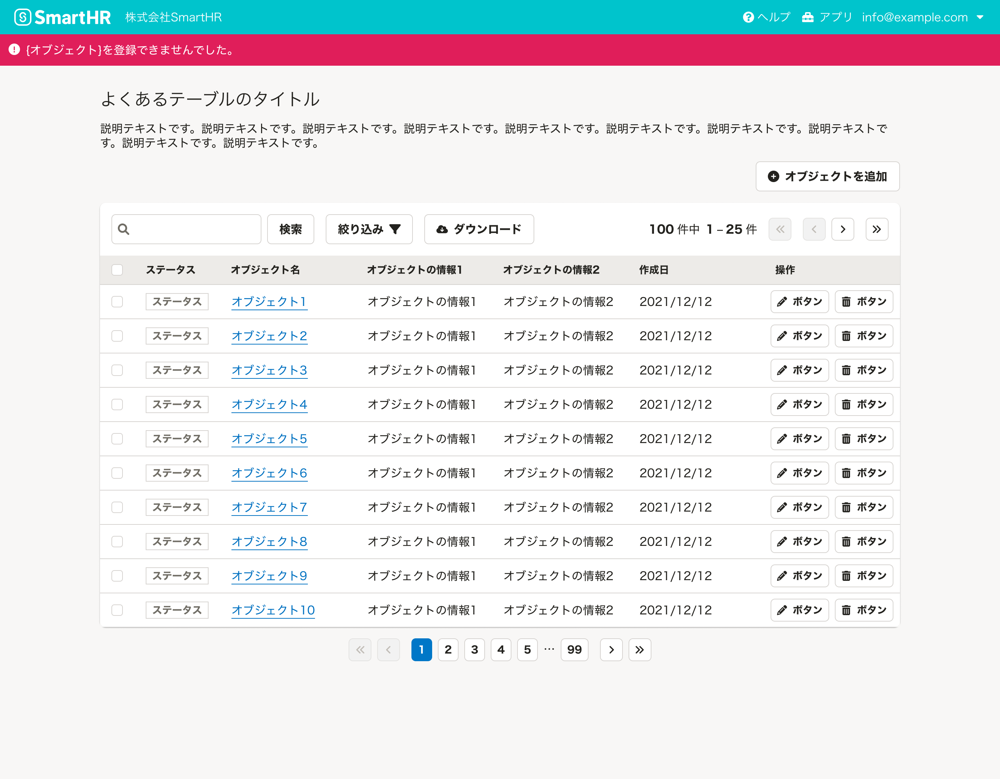

ユーザーの操作によってエラー状態になった場合の基準を定義します。

「エラー状態」とは、システムに何らかの問題が発生したことをユーザーに認知させ、問題を解決するための画面の状態やUIを指します。

## 基本的な考え方
**前提としてエラーが起きないように設計し工夫することが重要ですが**、すべてのエラーを防ぐことは不可能であり、一定の確率でエラーは発生します。
ユーザーにエラー状態をわかりやすくを伝え、正しくエラーを解消させ、エラー状態から回復できるようにするためには以下が重要です。

- エラーが起こっている対象の近くにエラーを表示する
- 操作結果の表示は、フィードバックがある範囲に対して表示する

### ライティング
[エラーメッセージの基本的な要素](/products/contents/error-messages/#h2-2)に従います。

## 構成
ダイアログとページを例にして、エラーメッセージを表示する箇所を説明します。

1. 入力要素
2. 操作領域
3. エラーパネル

### 1. 入力要素
エラーが起きている具体的な原因を、[Fieldset](/products/components/fieldset/)や、[FormControl](/products/components/form-control/)の`errorMessages` propsで表示します。  
エラーテキストは、エラーを解消するために「何が原因でどうしたらエラーが解消されるのか」を具体的かつ簡潔に伝える内容にしましょう。

また、入力要素はエラーをリアルタイムに処理できる場合があります。[FormControlのエラーメッセージ](/products/components/form-control/#h4-4)を参照してください。

#### 例1
- OK
    - 100文字以内で入力してください。
- NG
    - 入力できる文字数を超えています。

#### 例2
- OK
    - 数字で入力してください。
- NG
    - 入力されている文字タイプが違います。

### 2. 操作領域

#### アクセシビリティの考慮
ボタンは無効化せず、ユーザーがボタンを押したうえでエラーを表示するようにしてください。詳しくは、[モーダルなUIの「エラー状態のアクセシビリティ」](/products/design-patterns/modal-ui/#h2-3)を参照してください。

#### 基本的な考え方
操作した結果、エラーが発生したことを簡潔に伝えます。  
あくまで「エラーが発生したこと」だけを表示してください。エラーの件数や具体的な解消方法を表示する場合には、[3. エラーパネル](#h3-3)に表示しましょう。

複数の種類のエラーがあり具体的に伝えられない場合は、「修正の必要な箇所があります。」といった包括的な伝え方をします。
簡潔に伝えきれない場合は、[3. エラーパネル](#h3-3)を検討してください。

#### エラーの表示方法
操作領域に関連するエラーメッセージを表示するためのコンポーネントを以下に示します。

- [FloatArea](/products/components/float-area/)
    - `responseMessage` propsを使用してください。
- [Dialog](/products/components/dialog/)
    - `responseMessage` propsを使用してください。
- [Button](/products/components/button/)
    - ボタン自体にはエラーテキストを表示する機能はないため、[ResponseMessage](/products/components/response-message/)を使って、できるだけボタンの近くにエラーメッセージを表示することを検討してください。

  
### 3. エラーパネル
エラーパネルは、入力要素と操作領域で伝えきれない内容を補足するために表示します。

- 入力要素と操作領域を表示できない場合、エラーパネルが必要です。
- 入力要素と操作領域が表示されている場合、追加の情報が不要であればエラーパネルを省略できます。

#### ダイアログを使う場合
基本的に、エラーパネルはダイアログ内で表示してください。   
ただし、以下の場合にはダイアログを閉じたあとにページでエラーパネルを表示してください。

- ダイアログ内や画面全体が切り替わった場合
- ダイアログで操作が完了し、元の画面に戻った場合

### エラーパネルの例
エラーパネルを表示する場合、内容量に応じてコンポーネントを選択してください。

#### エラーの全体像が一目でわからない場合
情報量の多いダイアログでは、[SideNav](/products/components/side-nav/)や[TabBar](/products/components/tab-bar/)などでレイアウトを分割していることがあります。このような場合は、エラーに気づきやすくするために以下の対策を検討してください。

- エラーが含まれるナビゲーションに`FaExclamationCircle`アイコンを表示する
- エラーが発生していることを[NotificationBar](/products/components/notification-bar/)で表示する

#### 入力要素が多い場合
入力要素が多い長大なページなど、1つ1つのエラーを気づかせずらい場合は、エラーパネルを表示することを検討してください。エラーパネルには[InformationPanel](/products/components/information-panel/)を使い、以下の内容を表示します。

- 入力要素に出ているエラー
- エラーの出ている入力要素への移動リンク

#### エラーの解消方法を表示する場合
エラーが起きていることはわかるが、修正方法を詳細に書かないと伝わりにくい場合は、[InformationPanel](/products/components/information-panel/)で具体的な解決方法を提示します。

