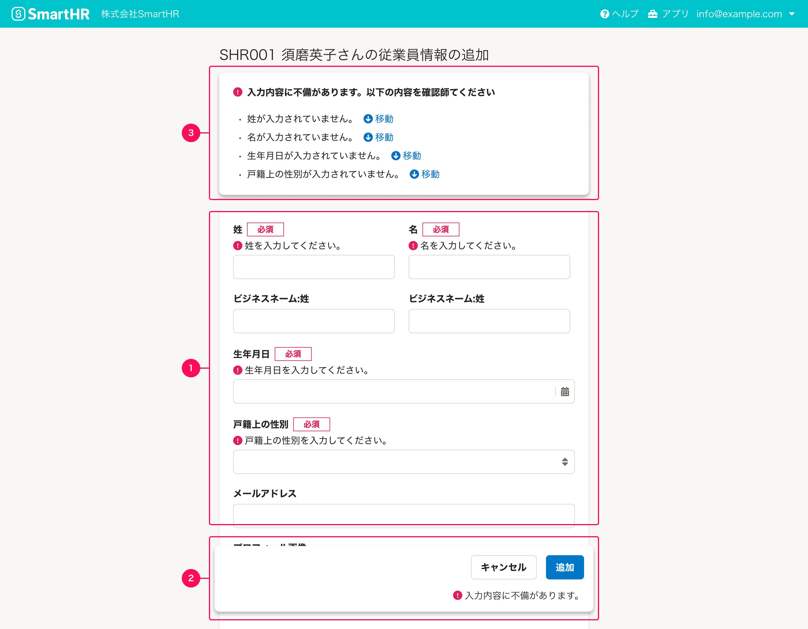

ユーザーの操作によってエラー状態になった場合の基準を定義します。

## 基本的な考え方
「エラー状態」とは、システムに何らかの問題が発生したことをユーザーに認知させ、問題を解決するための画面の状態やUIを指します。

**前提としてエラーが起きないように設計し工夫することが重要ですが**、すべてのエラーを防ぐことは不可能であり、一定の確率でエラーは発生します。
ユーザーにエラー状態をわかりやすくを伝え、正しくエラーを解消させ、エラー状態から回復できるようにするためには以下が重要です。

- エラーが起こっている対象の近くにエラーを表示する
- 操作結果の表示は、フィードバックがある範囲に対して表示する

### ライティング
[エラーメッセージの基本的な要素](/products/contents/error-messages/#h2-2)に従います。

## 構成
ダイアログとページを例にして、エラーメッセージを表示する箇所を説明します。

1. 入力要素
2. 操作ボタン
3. エラーのサマリー

### 1. 入力要素
エラーが起きている具体的な要因を[FormControl](/products/components/form-control/)の`errorMessages`を使い表示します。
エラーテキストはユーザーがエラーを解消するのに、何が原因でどうしたらエラーが解消されるのかを具体的かつ簡潔に伝える内容にしましょう。

例1:
- OK
    - 100文字以内で入力してください。
- NG
    - 入力できる文字数を超えています。

例2:
- OK
    - 数字で入力してください。
- NG
    - 入力されている文字タイプが違います。

また、入力要素はエラーをリアルタイムに処理できる場合があります。[FormControlのエラーメッセージ](https://smarthr.design/products/components/form-control/#h4-4)を参照してください。

### 2. 操作ボタン
操作の結果としてどのような事象のエラーが出たのかを簡潔に伝えましょう。
あくまでエラーが起こったことだけを表示するので、エラーの具体的な解消方法やエラーの件数を表示するのを避けましょう。簡潔に伝えきれない場合は、`3. エラーのサマリー`を使いましょう。

また、複数の種類が違うエラーがあり具体的に伝えられない場合は、`修正の必要な箇所があります。`というような包括的な言い方をしてください。

#### アクセシビリティの考慮
アクセシビリティを担保するために、完了ボタンを無効化せず、ユーザーに完了ボタンを押させた上でエラーを返すようにしてください。詳しくは、[エラー状態のアクセシビリティ](https://smarthr.design/products/design-patterns/modal-ui/#h2-3)を参照してください。

#### エラーの表示方法
操作ボタンに関連するエラーメッセージを表示するためのコンポーネントを以下に示します。

- [FloatArea](/products/components/float-area/)
    - `responseMessage` propsを使用してください。
- [Dialog](/products/components/dialog/)
    - `responseMessage` propsを使用してください。
- [Button](/products/components/button/)
    - ボタン自体にはエラーテキストを表示する機能はないため、[ResponseMessage](/products/components/response-message/)を使って、できるだけボタンの近くにエラーメッセージを表示することを検討してください。

  
### 3. エラーのサマリー
エラーのサマリーは、入力要素と操作ボタンで伝えきれない内容を補足するために表示します。ただし、以下の状況ではエラーのサマリーを必須としてください。

- ダイアログ内や画面全体が切り替わったとき
- ダイアログで操作し、元の画面に戻るとき

これらの状況では、入力要素と操作ボタンを画面に表示できないため、エラーのサマリーが必要です。
入力要素と操作ボタンが表示されている場合、追加の情報が不要であればエラーのサマリーを省略できます。

エラーのサマリーを表示する場合、内容量に応じてコンポーネントを選択してください。

#### エラーの全体像が一目でわからない場合

情報量の多いダイアログでは、`SideNav`や`TabBar`などで情報を分割していることがあります。このような場合、エラーに気づきやすくするために以下の対策を検討してください。

- エラーが含まれるナビゲーションに`FaExclamationCircle`アイコンを表示する
- エラーが発生していることを`NotificationBar`で表示する

#### 入力要素が多い場合

入力要素が多く、ページが長くなりエラーに気づきにくい場合は、エラーのサマリーを表示してユーザーに認識させることを検討してください。エラーのサマリーには`InformationPanel`を使い、以下の内容を表示します。
- 入力要素に出ているエラー
- エラーの出ている入力要素への移動リンク

#### エラーの解消方法を表示する場合

エラーが起きていることはわかるが、修正方法を詳細に書かないと伝わらない場合は`InformationPanel`で具体的な解決方法を記載します。