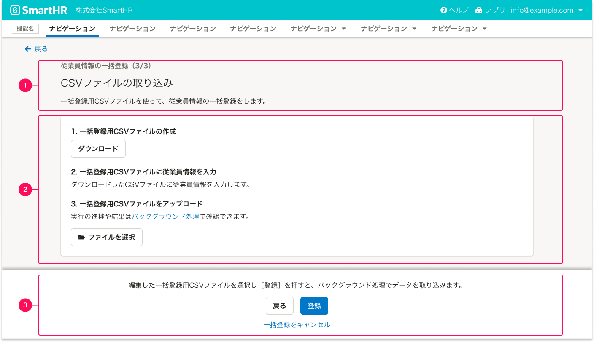

## 基本的な考え方
- 特定の作業のために複数の操作が必要な場合には、1つのモードに対してステップを複数に分けます。  
- ユーザーが必要な操作を認知しやすい状況を設計するために、1画面内の操作を絞ります。
- 画面間の動線は一方通行ではなく、前のステップにも移動できるようにリンクを設けます。加えて、途中で操作をキャンセルできるようにします。
- 基本的には[ActionDialog](#h2-2)を使用します。ただし、フォームなどの要素が多い場合は、[BottomFixedAreaを伴うページ](#h2-3)を使用して、**モーダル（一連の操作）であることを明示**します。

### ライティング
複数ステップの操作モードに入るためのボタンのアクションテキストと、操作画面のタイトルは関連付けます。

各ステップには共通のタイトルを表示し、複数ステップであることを`（1/n）`として明示します。ユーザーが作業ボリュームを把握し、操作過程の現在地と残りの操作ステップ数を認知できる状態を作ることが目的です。

## 構成
複数ステップのモードのダイアログ・ページに共通する構成要素は次の通りです。
<!-- textlint-disable -->
1. タイトルエリア（[ダイアログ](#h3-1)・[ページ](#h3-6)）
2. 操作エリア（[ダイアログ](#h3-2)・[ページ](#h3-7)）
3. 画面遷移エリア（[ダイアログ](#h3-3)・[ページ](#h3-8)）

## ダイアログの構成
[ActionDialog](/products/components/dialog/#h3-1)を使用し、操作に必要なコンポーネントは[余白の取り方](/products/design-patterns/spacing-layout-pattern/)に従って配置します。  

1. タイトルエリア
2. 操作エリア
3. 画面遷移エリア

### 1. タイトルエリア
`複数ステップの操作画面`の見出しを表示するエリアです。

#### ライティングパターン
基本的に、`{オブジェクト名}の{操作名}（1/n）`という表記します。
- [アクションに関する画面やダイアログのタイトルでは、助詞は「の」を使用する](../../../products/contents/app-writing/#h2-3)

併せて、[Dialog](https://smarthr.design/products/components/dialog/#h2-3)のライティングパターンも参照してください。

### 2. 操作エリア
[FormControl](/products/components/form-control/)などを使用して、ステップごとの操作に必要な要素を配置するエリアです。

FormControlの`helpMessage`や`title`に表示するテキストでユーザーへの説明が十分な場合には、操作説明用の[Text](/products/components/text/)を省略しても構いません。

### 3. 画面遷移エリア

操作ステップ画面間の移動、一連の操作モードの取り消す、複数ステップの最後の操作のためのボタンをまとめたエリアです。
<!-- textlint-enable -->

#### ライティングパターン
ボタンのアクションテキストは、以下のように表示します。
- 次の画面に移動する：`次へ`
- 前の画面に移動する：`戻る`
- 操作を取りやめる：`キャンセル`
- 最後の画面のアクションボタン：一連の操作の最終目的の操作名（`登録`、`書き出し`など）

<!-- textlint-disable -->
## BottomFixedAreaを伴うページの構成
[BottomFixedArea](/products/components/bottom-fixed-area/)を使用し、操作に必要なコンポーネントは[余白の取り方](/products/design-patterns/spacing-layout-pattern/)に従って配置します。

1. タイトルエリア
2. 操作エリア
3. 画面遷移エリア
<!-- textlint-enable -->

### 1. タイトルエリア
`複数ステップの操作画面`の見出しと説明テキストを含むエリアです。

- A. 見出し
- B. 説明テキスト

**見出しと操作テキストを表示しているパターン**

**見出しのみを表示しているパターン**

#### A. 見出し

[Heading](/products/components/heading/)を使用し、画面タイトル（`screenTitle`）を使用します。

##### ライティングパターン
基本的には、[ダイアログの場合](/products/design-patterns/wizard/#h4-0)と同様です。

それぞれのステップごとの操作を見出しで伝えたい場合、画面タイトル（`screenTitle`）はライティングパターンに合わせる必要はありません。ただし、同じモードであることがわかるように、サブ・ブロックタイトル（`subBlockTitle`）を使って複数ステップの操作画面タイトルのライティングパターンに合わせたテキストを表示します。

##### 例
- サブ・ブロックタイトル：一連の操作の共通タイトル  
`従業員のhoge情報の一括登録（1/4）`
- 画面タイトル：このページでやることを表したタイトル  
`登録する従業員の選択`

#### B. 説明テキスト
表示中のページでする操作に関する説明を表示します。
操作エリアのUIでユーザーへの説明が十分な場合には、[Text](/products/components/text/)を省略しても構いません。

### 2. 操作エリア
[「よくあるテーブル」](/products/design-patterns/smarthr-table/)や[FormControl](/products/components/form-control/)などを使用して、ステップごとの操作するためのエリアです。

<!-- textlint-disable -->
### 3. 画面遷移エリア

操作ステップ画面間の移動、一連の操作モードの取り消す、複数ステップの最後の操作のためのボタンをまとめたエリアです。
[BottomFixedArea](/products/components/bottom-fixed-area/)を使用します。

<!-- textlint-enable -->

#### BottomFixedAreaの説明テキスト
この画面のPrimaryボタンを押すことを促す説明を書きます。

##### 例
`〇〇を選択したら、［{ボタンのアクションテキスト}］を押してください。`

#### BottomFixedAreaのボタンテキスト
Primaryボタンでは、次のステップに移動するか、複数ステップの操作のアクションを伝えます。
- 次の画面に移動する：`次へ`
- 最終画面のアクションテキスト：`登録`、`書き出し`など

Secondaryボタンでは、前のステップに移動できることを伝えます。
- 前の画面に移動する：`戻る`

#### 複数ステップの操作を取り消すテキスト
2ステップ以降の画面では、この操作モードから離脱するための[TextLink](/products/components/text-link/)を設置してください。
途中まで操作した状態が失われる場合には、操作自体を取り消すことが明らかになるようにモードの操作名を明示してください。

- 途中までの操作を破棄する場合：`{モードの操作名}をキャンセル`
