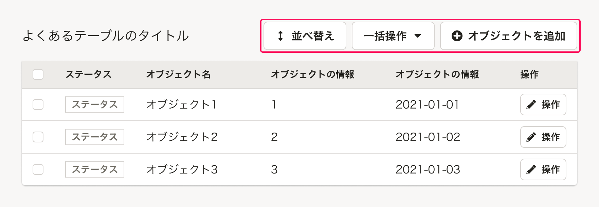

## 基本的な考え方
特定の作業のために複数の操作が必要な場合には、1つのモードに対してステップを複数に分けます。
1画面内の操作を絞って、ユーザーが必要な操作を認知しやすい状況を設計することが目的です。

基本的にはアクションダイアログを使用します。ただし、フォームなどの要素が多い場合は、BottomFixedAreaを使ってモーダル（一連の操作）であることを明示しします。
画面間の動線は一方通行ではなく、前のステップにも移動できるようにしましょう。加えて、作業をキャンセルできるようにします。

### ライティング
複数ステップの操作モードに入るためのボタンのアクションテキストと、操作画面のタイトルは関連付けます。
加えて、各ステップには共通のタイトルを表示し複数ステップであることを`（1/n）`のように明示します。ユーザーが作業ボリュームを把握し、操作過程の現在地と残りの操作ステップ数を意識しながら操作を進められるようにしましょう。

## 構成
複数ステップのモードのダイアログ・ページに共通する構成要素は次の通りです。

1. [タイトルエリア](#ページ内リンク)
2. [画面移動エリア](#ページ内リンク)
3. [操作エリア](#ページ内リンク)

### 2. タイトルエリア
`複数ステップの操作画面`の見出しと説明テキストを含むエリアです。

[画面タイトル](/products/components/heading/#h3-0)が`よくあるテーブル`の見出しを兼ねる場合は、タイトルエリアを省略できます。

#### A. 見出し
`複数ステップの操作画面`の見出しです。

- ダイアログの場合は、[ActionDialog](/products/components/dialog/#h3-1)を使用してください。
- ページの場合は、[Heading](/products/components/heading/)を使用し、適切な見出しレベルを設定してください。

#### B. 説明テキスト
表示中のページでする操作に関する説明を表示できます。  
入力フォームごとのラベルやヘルプメッセージなどで説明十分な場合には説明テキストを省略し、見出しを操作エリアと並べて表示します。  

### 2. 画面移動エリア
操作ステップ画面間の移動、一連の操作モードのキャンセル操作に関するボタンをまとめたエリアです。

- ダイアログの場合は、[ActionDialog](/products/components/dialog/#h3-1)を使用してください。
- ページの場合は、[Bottom fixed Area](/products/components/bottom-fixed-area/)を使用します。

### 3. 操作エリア
[「よくあるテーブル」](/products/design-patterns/smarthr-table/)や[FormControl](/products/components/form-control/)などを使用して、ステップごとの操作をまとめたエリアです。

## アクションダイアログ

### レイアウト
基本的に[余白の取り方](/products/design-patterns/spacing-layout-pattern/)に従って配置します。  
[テーブル内の一括操作エリア](#h3-2)の要素間の余白は以下のとおりです。

### ライティングパターン

#### ダイアログタイトル
- 多くの場合、`{オブジェクト名}の{操作名}`という表記を採用しています。
    - [アクションに関する画面やダイアログのタイトルでは、助詞は「の」を使用する](../../../products/contents/app-writing/#h2-3)
1. 一連の操作の共通タイトル
    - 例：`従業員のhoge情報の一括登録`
2. 操作工程が全部でいくつかわかるように、（1/n）みたいに示す
    - 例：`（1/4）`
- 工程に入るアクションボタンのラベルと、工程のタイトルが関連づいていることがわかるようにする
    - 例：
        - 工程に入るアクションボタン： `従業員のhoge情報を一括登録`
        - 工程のタイトル：`従業員のhoge情報の一括登録`

#### ボタンテキスト

## Bottom fixed Areaを伴うページ

### レイアウト
基本的に[余白の取り方](/products/design-patterns/spacing-layout-pattern/)に従って配置します。  

### ライティングパターン

#### ページタイトル
複数工程のモードに入るためのボタンのアクションテキストと複数工程の画面タイトルを関連づける
- 例：
    - 工程に入るアクションボタン： `従業員のhoge情報を一括登録`
    - 工程のタイトル：`従業員のhoge情報の一括登録`

- 複数の工程に対して、それぞれ別のタイトルが必要な場合は、ScreenTitleで表示します。ただし、一貫したモードであることがわかるように、subBlockTextで共通のタイトルを表示します。
- 画面タイトル
    - subBlockText
        - オブジェクト名 + モードに入るためのボタンのアクションテキストと一致
    - ScreenTitle
        - その工程で行なう主な作業

例：
1. 一連の操作の共通タイトル
    - 例：`従業員のhoge情報の一括登録`
2. 操作工程が全部でいくつかわかるように、（1/n）みたいに示す
    - 例：`（1/4）`
3. このページでやることを表したタイトル
    - 例：`登録する従業員の選択` 

#### Bottom fixed Areaのディスクリプション
    - このページでのアクションを示す。
        - 例：hogeを選択したら、fugaを押してください。

#### Bottom fixed Areaのボタンテキスト
- BFAのアクション、「次の画面に移動する」「前の画面に移動する」「操作を取りやめる」のライティングと使用するUIを決める
    - 次の画面に移動する：次へ
        - 複数案あり
            - 次へ
            - 進む
            - 次の画面のScreenTitle
                - リンクと同じ考えで、次の画面で何をしてほしいのかがイメージしやすくなるメリットはありそう
    - 前の画面に移動する：戻る
    - 操作を取りやめる：{モードのアクション}をキャンセル
        - 複数ステップにまたがっている場合、何がキャンセルの対象なのか明確にする
    - 工程から抜けるためのアクションボタン
        - 例：キャンセル
    - 1つ前の工程に戻るためのアクションボタン
        - 例：戻る
    - 1つ先の工程に進むためのアクションボタン
        - 例：次へ
    - 工程でやりたいことをやるためのアクションボタン
      - このモードの最終目的（登録、削除など）をボタンのテキストにする
        - 押しても完了しない可能性（エラーなど）があるので、完了ではない

## {その他のルール}
基本的に上記の項目に当てはめることを推奨しますが、主題がルールのみの場合など、これらに当てはまらない内容を説明する場合に使用する自由項目です。  
よしなに子セクションを分けて書きます。
