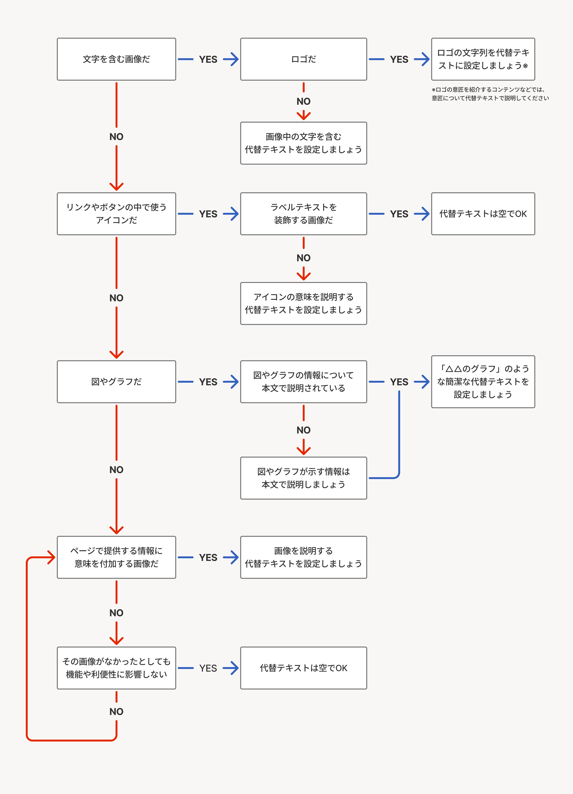
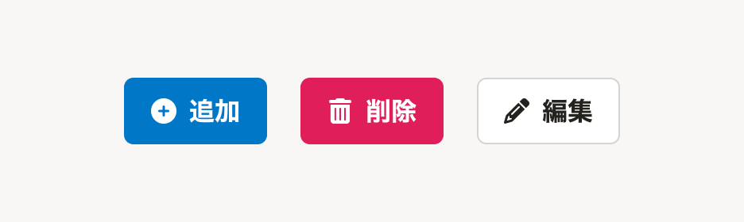
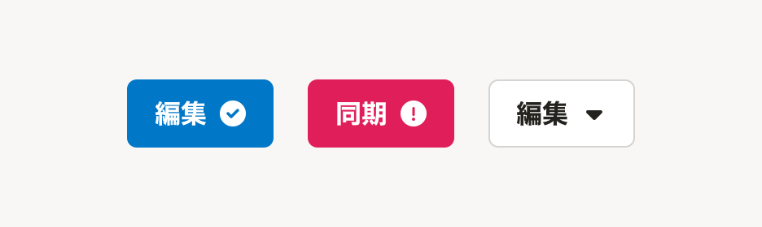

## 画像の代替テキストとは 

画像の代替テキストは、画面上のビジュアルイメージの代替となるテキストです。

代替テキストを設定することで、画像を直接見ないユーザーにも画像が持つ情報を提供できます。

ウェブサイトのページやブログなどの記事、プロダクトのなかで画像を使うときは、代替テキストをつけることを検討してください。

### 代替テキストによるアクセシビリティの向上
代替テキストは、さまざまな状況で多くの人に有効な、画像の内容を伝える手段です。

視覚障害のあるユーザーなど、視覚情報に依存しない閲覧をするユーザーには、代替テキストが特に役立ちますが、視覚的に困難な状況は、障害の有無に関わらず誰にでも発生する可能性があります。

以下は、視覚情報を受取ることが難しい状況の例です。

* 視力が低い
* 視野が欠ける、ぼやける、まぶしい、かすむ
* スクリーンリーダーや音声ブラウザ、テキストブラウザでの閲覧
* 通信速度が低く、画像を読み込めない
* 画像がリンク切れになっている
* 液晶画面が破損している
* 検索エンジンやRPAツールなどのロボット

## 代替テキストの書き方
画像が文脈上どんな意味を持つかによって、代替テキストの内容を検討してください。[alt属性の良い事例(つけ方・書き方)｜情報バリアフリーポータルサイト](http://jis8341.net/jirei_sample/jirei_chapter_01.html)にある多くの事例が参考になります。

### 代替テキストを書かないとき

特に意味を持たない、ページ装飾用の画像の場合は、代替テキストを空にしてください。

HTMLの`img`要素で画像を挿入する場合は、``のように`alt`の属性値を空にします。

代替テキストのない画像は、スクリーンリーダーやテキストブラウザなどの画像を見ない閲覧方法で、その画像自体がない場合と同じように扱われます。

### 代替テキストを書くとき

画像が伝える情報を過不足なく簡潔に書いてください。以下の点に注意してください。

* 特別な意図がない限り、本文にある内容を繰り返さない
* 画像が持つ以上の情報を含めない
* 代替テキストはプレーンテキストとして扱われ、` `などのHTML要素は使用できない
* 画像に含まれる情報が多く、説明が長くなったり、複雑になってしまう場合は、要約した内容を代替テキストにするか、説明を本文に追加することを検討する

## SmartHR alt ディシジョンツリー
[altディシジョンツリー](https://www.w3.org/WAI/tutorials/images/decision-tree/ja)をベースに、SmartHRのプロダクトやウェブサイトの画像について判断しやすいようカスタマイズしたディシジョンツリーです。
代替テキストが必要かどうか、判断に迷うときに使います。

<ul>
  <li>
    テキストを含む画像だ（<a href="#q2">はい</a> / <a href="#q3">いいえ</a>）
    <ul>
      <li>
        はい: 画像に含まれるテキストは近くの説明や本文にも書かれている（<a href="#a1">はい</a> / <a href="#a2">いいえ</a>）
        <ul>
          <li>はい: 代替テキストは空でOK</li>
          <li>いいえ: 画像中のテキストを含む説明を代替テキストに設定しましょう</li>
        </ul>
      </li>
      <li>
        いいえ: リンクやボタンのなかで使うアイコンだ（<a href="#q4">はい</a> / <a href="#q5">いいえ</a>）
        <ul>
          <li>
            はい: ラベルテキストを装飾する画像だ（<a href="#a3">はい</a> / <a href="#a4">いいえ</a>）
            <ul>
              <li>
                はい: 代替テキストは空でOK
                <dl style={{ marginLeft: '2em' }}>
                  <dt style={{ fontWeight: 'bold' }}>ラベルテキストを装飾するアイコンの例</dt>
                  <dd>
                    <figure style={{ margin: 0 }}>
                      
                      <figcaption style={{ marginTop: '20px' }}>アイコンはラベルテキストと同じ意味を表しており、単独で示す情報がないため、装飾だと言える。</figcaption>
                    </figure>
                  </dd>
                </dl>
              </li>
              <li>
                いいえ: アイコンの意味を説明する代替テキストを設定しましょう
                <dl style={{ marginLeft: '2em' }}>
                  <dt style={{ fontWeight: 'bold' }}>単独で意味を持つアイコンの例</dt>
                  <dd>
                    <figure style={{ margin: 0 }}>
                      
                      <figcaption style={{ marginTop: '20px' }}>１つ目のチェックマークは「編集済み」、２つ目のエクスクラメーションは「エラー発生」、３つ目の下向き三角は「クリックで展開すること」を示唆しており、テキストラベルでは提示していない情報を示しているため、代替テキストが必要。</figcaption>
                    </figure>
                  </dd>
                </dl>
              </li>
            </ul>
          </li>
          <li>
            いいえ: 情報を示す画像やグラフだ（<a href="#a5">はい</a> / <a href="#q6">いいえ</a>）
            <ul>
              <li>はい: 近くの本文や説明で、画像と同等の情報を提供しましょう</li>
              <li>
                いいえ: ページで提供する情報に意味を付加する画像だ（<a href="#a6">はい</a> / <a href="#q7">いいえ</a>）
                <ul>
                  <li>はい: 画像を説明する代替テキストを設定しましょう</li>
                  <li>
                    いいえ: その画像がなかったとしても機能や利便性に影響しない（<a href="#a7">はい</a> / <a href="#q6">いいえ</a>）
                    <ul>
                      <li>はい: 代替テキストは空でOK</li>
                      <li>いいえ: 前の質問「ページで提供する情報に意味を付加する画像だ」に<a href="#q6">戻る</a></li>
                    </ul>
                  </li>
                </ul>
              </li>
            </ul>
          </li>
        </ul>
      </li>
    </ul>
  </li>
</ul>

## 関連情報
* [ウェブアクセシビリティ簡易チェックリスト - 代替テキスト](https://smarthr.design/accessibility/check-list/#h2-0) 
* [altはつけるだけじゃなくて - 実践アクセシブルHTML 第一回](https://yuugop.com/articles/practicalaccessiblehtml/pah01.html)
* [4.8.4.4 画像に対して代替として動作するテキストを提供に対する要件 - HTML Standard 日本語訳](https://momdo.github.io/html/images.html#alt)
* [An alt Decision Tree | Web Accessibility Initiative (WAI) | W3C](https://www.w3.org/WAI/tutorials/images/decision-tree/)
