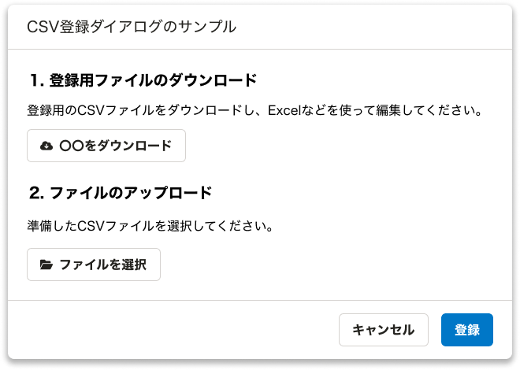
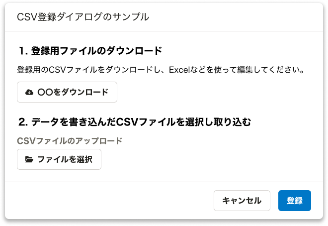

## なぜダウンロードボタンとアップロードボタンが同じ画面にある場合に注意が必要なのか

SmartHRでは、CSVファイルを使ってデータの一括登録をする機能があります。
このとき、CSVファイルをダウンロードするためのボタンと、CSVファイルをアップロードするためのボタンが同じ画面にあります。



これらのボタンは、SmartHR UIを使用すると見た目は似ていますが、実際の実装は異なります。ダウンロードボタンは `<a>` 要素（リンク）として実装されるのに対し、アップロードボタンは `<input type="file">` 要素として実装されます。
この違いにより、アップロードボタンには適切なラベルを提供する必要があります。

また、手順の説明文は通常セクションの見出しとして表示されます。この見出しの文章をラベルとして使用したくなりますが、見出し要素（h1〜h6）を`<label>`要素として使用することは非推奨となっています。

これらの実装上の課題を解決するための実践的なガイドラインを以下にまとめました。


## 実装ガイドライン

### 1. 手順ごとに `<ol>` `<li>` 要素で囲む

手順を説明するテキストは、順番が前後すると意味が通用しなくなるため、順番を持つ `<ol>` `<li>` 要素で囲んでください。
このとき、 `<ol>` 要素の配下で `Stack` などのレイアウトコンポーネントを使うと `div` 要素が入ってしまうため注意が必要です。

```jsx
<ol>
  <li>
    ファイルをダウンロードするためのコンテンツ
  </li>
  <li>
    ファイルをアップロードするためのコンテンツ
  </li>
</ol>
```

### 2. 手順を説明するテキストは見出し要素にする

手順を説明するテキストは、見出し要素にします。

```jsx
<Heading type="blockTitle">登録用ファイルのダウンロード</Heading>
```

#### :warning: smarthr/a11y-prohibit-sectioning-content-in-form でエラーになる点について

現在、form内に見出し要素を設置すると `smarthr/a11y-prohibit-sectioning-content-in-form` でエラーになります。

このルールは、フォーム内部に `<legend>` 要素と見出し要素が混在しているとスクリーンリーダーのナビゲーションがしにくいという意見から設定されました。

今回はform内に `<legend>` 要素がなく、見出し要素のみで構成されています。そこで主要なスクリーンリーダーで今回のフォームでナビゲーションをチェックし問題なく操作できると判断しました。

しかしながら、現状だとeslintルールをdisableしないとエラーが出てしまうため、アクセシビリティ本部で今後改善する予定です。


### 3. アップロードボタン( InputFile )にはラベルを用意する

InputFile には可視ラベルが必要です。可視ラベルを設定するには、SmartHR UIで提供されている [FormControl](/products/components/form-control/) コンポーネントを使ってください。

このとき、見出し要素は `<label>` 要素に設定することは非推奨です。そのため、以下のようにラベル用のテキストを説明部分に設置することで画面のバランスを保ちつつ適切なラベルを設定できます。



また、ラベルがアップロードボタンのラベルとして適しているかという点に注意してください。ラベルには入力する内容や操作がわかるような内容を設定してください。
ラベルとして適切かどうかに関しては、 [入力する内容や、操作がラベルとして表示されている](/accessibility/check-list/label/) を参考にしてください。


