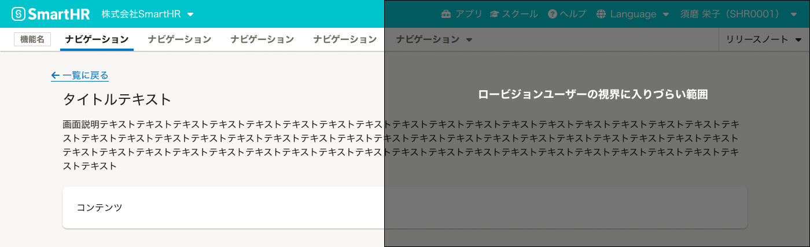

import { Image } from 'astro:assets'
import { Chip, Cluster } from 'smarthr-ui'

<Cluster gap={0.25} style={{ margin: '-20px 0 -80px' }}>
  <Chip>UIデザイン</Chip>
</Cluster>

## 概要
この基準では、画面の左側に見出しやUIが配置され、UIの一部または全体が表示されることを確認してください。
画面の左側にタスク完了に必要な主要なUIを配置することで、拡大鏡を利用するユーザーや視野が狭いユーザーが情報を見落とすリスクを軽減できます。
ただし、[送信]などの画面右下に配置されるのが一般的なUIの場合は除きます。

## メリット
1. 画面の左側に見出しやフォームパーツなどの主要なUIが表示されることで、ズーム機能を利用するユーザーや視野が狭いユーザーが情報を見落とすリスクを軽減できます。
2. UIの全体に限らず一部が表示されるだけでも、ユーザーがUIの存在を認識できる可能性が高まります。

## 達成方法
1. **左寄せのレイアウト**:
    - 見出しやフォームパーツなどのタスク完了に必要な情報が、画面の左側に表示されているか確認します。
    - textareaなどのフォームパーツの横幅を広げて表示範囲を広くすることも有効です。
    - ただし、[視線誘導](https://smarthr.design/products/design-patterns/visual-guidance/)の観点から、[送信]などの画面右下に配置されるのが一般的なUIはこのチェックリストの対象外とします。視線誘導から外れることは、かえってユーザーの混乱を招く可能性があるためです。

## テスト方法
1. **目視での確認**:
    - 画面の左半分に見出しやフォームパーツなどの主要なUIの一部もしくは全体が表示されていることを確認します。

## 参考
- [視線誘導](https://smarthr.design/products/design-patterns/visual-guidance/)
- [弱視・ロービジョンのユーザーのウェブ利用時の課題](https://smarthr.design/accessibility/low-vision/)