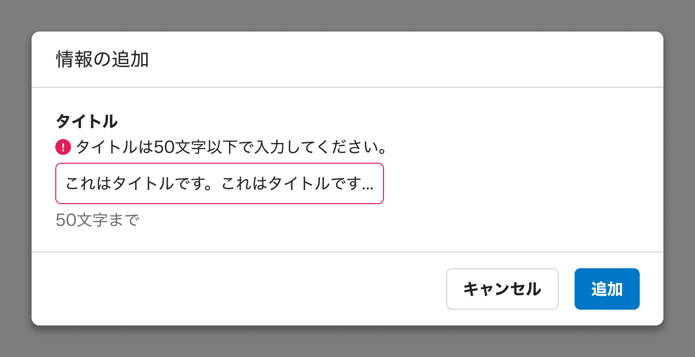
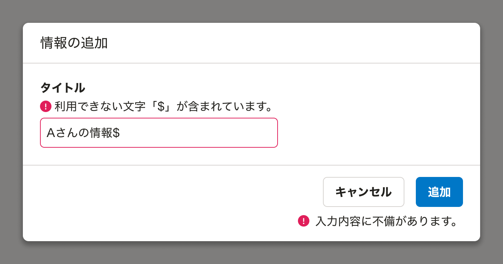

import { Image } from 'astro:assets'
import { Chip, Cluster } from 'smarthr-ui'

<Cluster gap={0.25} style={{ margin: '-20px 0 -80px' }}>
  <Chip>UIデザイン</Chip>
</Cluster>

## 概要
この基準では、エラーメッセージや確認通知などの重要な通知が、操作を行なった要素の近くに表示されることを確認してください。
拡大鏡を使用しているユーザーや視野が狭いユーザーは、画面の一部しか見えていないことがあります。
操作した要素から離れた場所に通知が表示されると、その通知に気づけない可能性があります。

## メリット
1. 拡大鏡を使用しているユーザーや視野が狭いユーザーが、操作の結果として表示される重要な通知を見逃しにくくなります。

## 達成方法
1. **入力時のエラー表示**:
    - 入力要素からフォーカスが外れたタイミングで、入力要素の直上にエラーメッセージを表示します。
    
2. **送信時のエラー表示**:
    - 送信ボタン押下後に値が不正な場合、入力要素と送信ボタンの両方に対してエラーメッセージを表示します。
    
## テスト方法
1. **目視での確認**:
    - フォームの送信やボタンのクリックなど、通知が発生する操作を行ないます。
    - 表示される通知（エラーメッセージ、確認メッセージなど）が、操作を行なった要素の近くに表示されていることを確認します。

## 参考
- [フィードバック](https://smarthr.design/products/design-patterns/feedback/)
- [弱視・ロービジョンのユーザーのウェブ利用時の課題](https://smarthr.design/accessibility/low-vision/)
- [達成基準 3.3.1: エラーの特定を理解する](https://waic.jp/translations/WCAG21/Understanding/error-identification.html)
