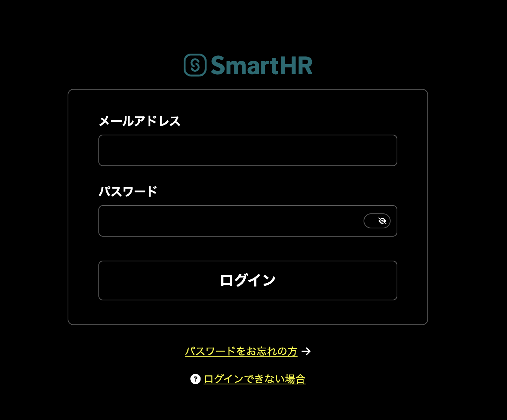

## 弱視・ロービジョンのユーザーの利用環境

弱視・ロービジョンのユーザーの多くは、画面拡大や色反転などの支援技術を活用して、ウェブを利用します。
弱視・ロービジョンの視覚特性と、支援技術の仕様によって、特有の困難に直面することがあります。

このページでは、弱視・ロービジョンのユーザーがSmartHR製品を利用する際に観察された問題点をまとめています。

また、これらの課題をできるだけ多く解決する方法として[弱視・ロービジョンのユーザビリティチェックリスト](./low-vision-check-list.mdx/)を公開しています。

### 画面拡大

弱視・ロービジョンのユーザーは、OSの標準機能や専用ソフトを用いて画面の全体や一部を拡大して閲覧することがあります。拡大時はウェブページ全体を俯瞰することが難しくなります。

参考

- [[動画]アクセシビリティ勉強会 MacOS 画面拡大機能（拡大鏡）の基本](https://www.youtube.com/watch?v=T1w5u8rx9sk&t=2s)
- [弱視ユーザーは制限時間がある通知の何に困るのか - SmartHR Tech Blog](https://tech.smarthr.jp/entry/2024/12/17/172235)

### 色反転機能

弱視・ロービジョンのユーザーは、画面上の色を見やすい組み合わせに変更したり、色を反転するOSの設定や機能を利用することがあります。設定や機能の仕様により、ウェブページのUIは任意の色の組み合わせで表示されます。

参考

### スクリーンリーダー
弱視・ロービジョンのユーザーは、拡大鏡や色反転機能と併せて、スクリーンリーダーを利用することがあります。残存視力や視野で画面を見るユーザーの場合、見えにくい・見えない情報を得るための補助として、スクリーンリーダーの読み上げを利用します。

## 弱視・ロービジョンのユーザーのウェブ利用に関連する課題

### 1. 画面全体を俯瞰して捉えるのが難しい
- 拡大鏡の拡大表示範囲外の変化を認識できない
  - リンクテキストをクリックした際に画面全体の変化を捉えられず、別のページに移動したことに気づけない。
  - 表示中の狭い範囲の外に表示される通知バナーなどに気づけない。
  - ボタンを押した後、見えている範囲全体を覆うようなUI(ダイアログなど)が表示される場合、画面の変化を認識することが難しい。
- 拡大時、表示範囲外のUIを認識・特定できない
  - 画面の右端や動線から外れた場所にあるボタンなどに気づけない。
  - 表示範囲外にあるUIについて知っていても、そのUIにたどり着くことが難しく、多くの時間がかかる。
### 2. 視力が低い
- ポインタ操作が難しい
  - 小さな領域を狙ったマウスによるクリックが難しい。
  - ドラッグによるスクロールバーの操作や対象物の移動が難しい。
### 3. 色の識別がしづらい
- グレー色のテキストや画像、disabled状態のUIに気づけない。
- 背景色の違いによって提示された領域の区切りに気づけない。
  - 例：<a href="https://story.smarthr-ui.dev/?path=/docs/data-display%EF%BC%88%E3%83%87%E3%83%BC%E3%82%BF%E8%A1%A8%E7%A4%BA%EF%BC%89-base-basecolumn--docs">BaseColumnコンポーネント</a>
