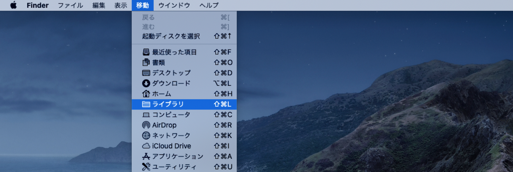
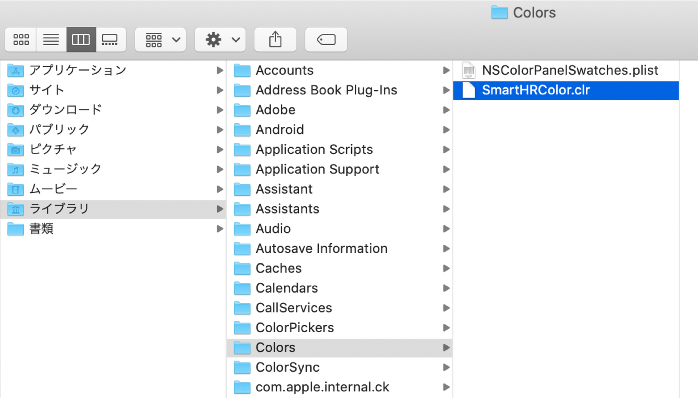
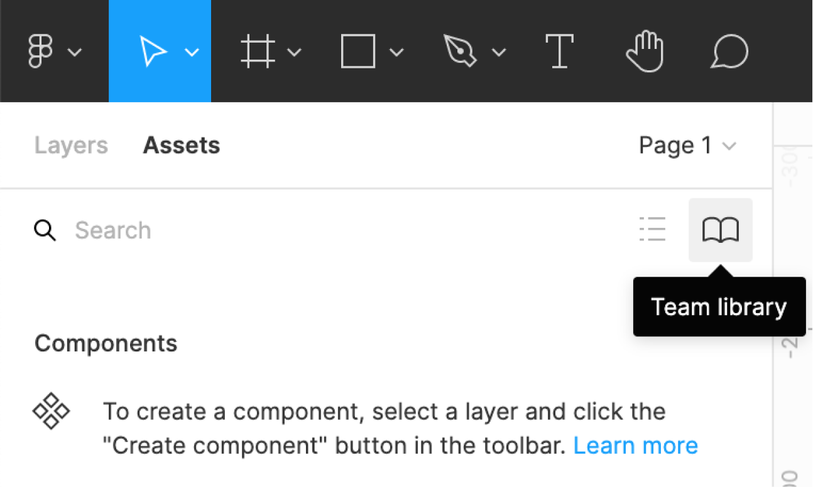
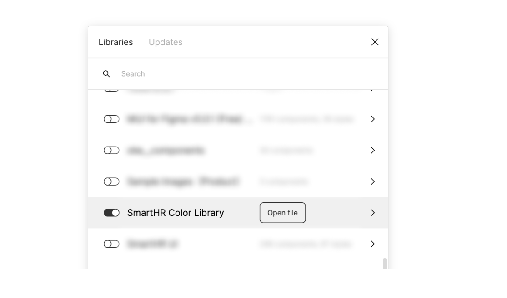
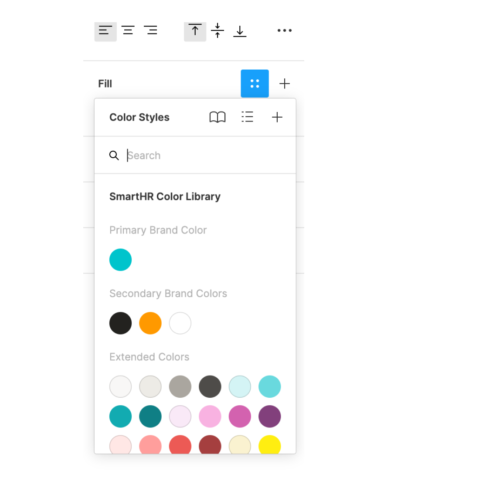
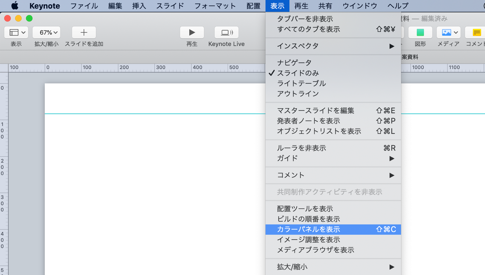
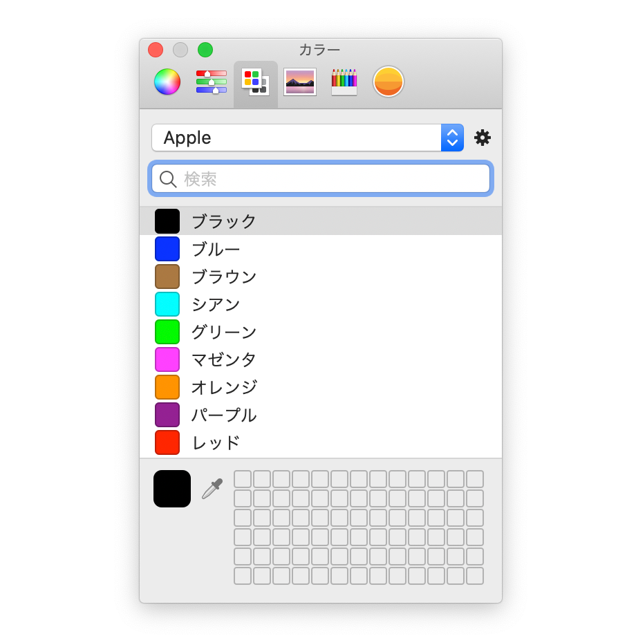
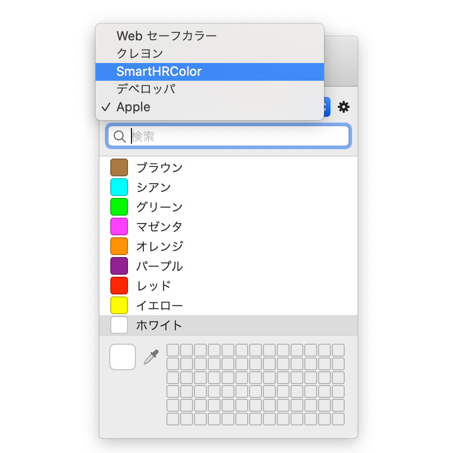
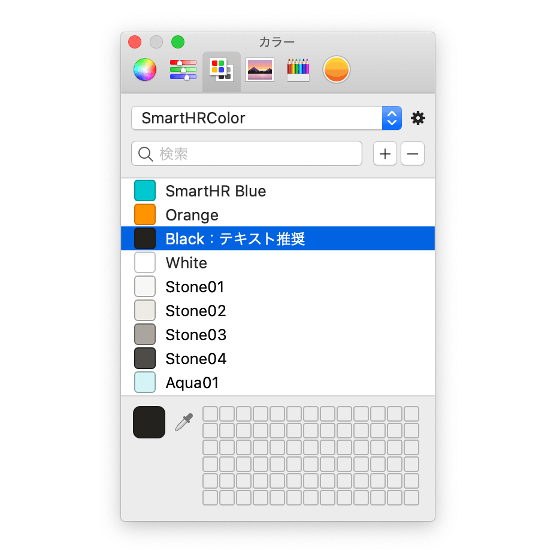

import ColorPalettesWrapper from '@/components/article/ColorPaletteWrapper.astro'
import ColorPalette from '@/components/article/ColorPalette.astro'

ポジティブで親しみやすい、SmartHRらしい印象に近づけることができる色を定義しました。

サイトにアクセスするすべての人が参照できますが、利用に関しては[利用者・利用範囲](#h2-3)を確認してください。

## ガイドライン

SmartHRでは、基本的に以下の色を使用してください。  

### Primary Brand Color
SmartHRブランドの中心となるブランドカラーです。

<ColorPalettesWrapper>
  <ColorPalette colorValue="#00c4cc" colorName="SmartHR Blue" description="CMYK(70, 0, 30, 0)DIC 96、PANTONE 2397、白地でのテキストへの使用は非推奨です。" />
</ColorPalettesWrapper>

### Secondary Brand Colors
Primary Brand Colorを引き立たせるブランドカラーです。
<ColorPalettesWrapper>
  <ColorPalette colorValue="#23221f" colorName="Black" description="テキストへの使用を推奨します。" />
  <ColorPalette colorValue="#ff9900" colorName="Orange" description="アクセントとしての使用を推奨します。" />
  <ColorPalette colorValue="#ffffff" colorName="White" description="" />
</ColorPalettesWrapper>

### Extended Colors
Primary Brand Color、Secondary Brand Colorと調和するカラーです。

SmartHRを説明/表現する際に必要な要素（テキスト、イラスト、背景など）で、Extended Colorsを用いることで、ブランドカラーをより印象的に扱うことに繋がります。

これらの色の使用を推奨しますが、利用シーンに合う色がない場合は、Extended Colorsのトーンを参考に、色を調整して使用できます。色づかいで迷った際には `# design_comm_依頼`で気軽にご相談ください。

#### Stone
<ColorPalettesWrapper>
  <ColorPalette colorValue="#f8f7f6" colorName="Stone01" description="" />
  <ColorPalette colorValue="#edebe6" colorName="Stone02" description="" />
  <ColorPalette colorValue="#aaa69f" colorName="Stone03" description="" />
  <ColorPalette colorValue="#4e4c49" colorName="Stone04" description="テキストへの利用を推奨します。" />
</ColorPalettesWrapper>

#### Aqua
<ColorPalettesWrapper>
  <ColorPalette colorValue="#d4f4f5" colorName="Aqua01" description="" />
  <ColorPalette colorValue="#69d9de" colorName="Aqua02" description="" />
  <ColorPalette colorValue="#12abb1" colorName="Aqua03" description="" />
  <ColorPalette colorValue="#0f7f85" colorName="Aqua04" description="テキストへの使用を推奨します。" />
</ColorPalettesWrapper>

#### Sakura
<ColorPalettesWrapper>
  <ColorPalette colorValue="#f9e9f7" colorName="Sakura01" description="" />
  <ColorPalette colorValue="#f8b2e1" colorName="Sakura02" description="" />
  <ColorPalette colorValue="#d362af" colorName="Sakura03" description="" />
  <ColorPalette colorValue="#82407c" colorName="Sakura04" description="" />
</ColorPalettesWrapper>

#### Momiji
<ColorPalettesWrapper>
  <ColorPalette colorValue="#ffe7e5" colorName="Momiji01" description="" />
  <ColorPalette colorValue="#ff9e9c" colorName="Momiji02" description="" />
  <ColorPalette colorValue="#ec5a55" colorName="Momiji03" description="" />
  <ColorPalette colorValue="#a53f3f" colorName="Momiji04" description="" />
</ColorPalettesWrapper>

#### Sunlight
<ColorPalettesWrapper>
  <ColorPalette colorValue="#faf2d0" colorName="Sunlight01" description="" />
  <ColorPalette colorValue="#ffee11" colorName="Sunlight02" description="" />
  <ColorPalette colorValue="#ffd74a" colorName="Sunlight03" description="" />
  <ColorPalette colorValue="#f56121" colorName="Sunlight04" description="" />
</ColorPalettesWrapper>

#### Grass
<ColorPalettesWrapper>
  <ColorPalette colorValue="#e6f2c8" colorName="Grass01" description="" />
  <ColorPalette colorValue="#aee26b" colorName="Grass02" description="" />
  <ColorPalette colorValue="#3dcc65" colorName="Grass03" description="" />
  <ColorPalette colorValue="#378445" colorName="Grass04" description="" />
</ColorPalettesWrapper>

#### Sky
<ColorPalettesWrapper>
  <ColorPalette colorValue="#ddf2fb" colorName="Sky01" description="" />
  <ColorPalette colorValue="#8fe2fc" colorName="Sky02" description="" />
  <ColorPalette colorValue="#32b7f0" colorName="Sky03" description="" />
  <ColorPalette colorValue="#1376a0" colorName="Sky04" description="" />
</ColorPalettesWrapper>

#### Marine
<ColorPalettesWrapper>
  <ColorPalette colorValue="#dee9ff" colorName="Marine01" description="" />
  <ColorPalette colorValue="#8ac0ff" colorName="Marine02" description="" />
  <ColorPalette colorValue="#0075e3" colorName="Marine03" description="" />
  <ColorPalette colorValue="#26519f" colorName="Marine04" description="" />
</ColorPalettesWrapper>

#### Galaxy
<ColorPalettesWrapper>
  <ColorPalette colorValue="#eee5fd" colorName="Galaxy01" description="" />
  <ColorPalette colorValue="#9d8ef8" colorName="Galaxy02" description="" />
  <ColorPalette colorValue="#8c5eee" colorName="Galaxy03" description="" />
  <ColorPalette colorValue="#6e4ca6" colorName="Galaxy04" description="" />
</ColorPalettesWrapper>

#### Earth
<ColorPalettesWrapper>
  <ColorPalette colorValue="#fbede1" colorName="Earth01" description="" />
  <ColorPalette colorValue="#f2d3a4" colorName="Earth02" description="" />
  <ColorPalette colorValue="#ba621e" colorName="Earth03" description="" />
  <ColorPalette colorValue="#76533e" colorName="Earth04" description="" />
</ColorPalettesWrapper>

## ダウンロード

### Mac

SmartHRのカラーパレットをMacにインストールする方法です。  
SmartHR従業員に支給されていてるMacにはプリインストールされているため、ダウンロードは不要です。  

##### 1. 下記の「SmartHRColor.zip」をダウンロード

[SmartHRColor_mac.zip](/SmartHRColor_mac.zip)

##### 2. Finderのメニューバーから「移動」→「ライブラリ」を選択

「ライブラリ」が表示されない場合は、Optionキーを押しながら「移動」→「ライブラリ」を選択。

##### 3.「ライブラリ」内の「Colors」に「SmartHRColor.clr」を格納

### Figma

Figma CommunityでSmartHR Color Libraryを公開しています。

[SmartHR Color Library | Figma Community](https://www.figma.com/community/file/1072452407633827459/SmartHR-Color-Library)

##### 1.カラーライブラリを使用したいFigmaファイルを開く

##### 2.左サイドメニューの「Assets」を選択→「Team library」のアイコンを選択

##### 3.「SmartHR Color Library」をONにする

##### 4.SmartHR Color Libraryを利用できます

### そのほか

ase , LESS , scss形式の色情報をダウンロードできます。

[SmartHRColor_ase_less_scss.zip](/SmartHRColor_ase_less_scss.zip)

## 利用方法
### Keynote

SmartHRのカラーパレットをKeynoteで利用する方法です。  

##### 1. Keynoteを開く

##### 2. メニューバーから「表示」→「カラーパネルを表示」を選択

##### 3. カラーパネルの「カラーパレット（左から3つめ）」タブを選択

##### 4. ドロップダウンリストから「SmartHRColor」を選択

##### 5. SmartHRColorのパレットをお使いいただけます

## 利用者・利用範囲
色の利用者・利用範囲は以下のとおりです。

  <table>
    <thead>
      <tr>
        <th>利用者</th>
        <th>名義</th>
        <th>利用可否</th>
      </tr>
    </thead>
    <tbody>
      <tr>
        <td>SmartHR従業員</td>
        <td>サービスSmartHR 株式会社SmartHR</td>
        <td><strong>◯ 利用できます</strong></td>
      </tr>
      <tr>
        <td>SmartHR従業員</td>
        <td>SmartHR Plus</td>
        <td><strong>◯ 利用できます</strong></td>
      </tr>
      <tr>
        <td>SmartHR従業員</td>
        <td>SmartHRグループ会社と その提供サービス</td>
        <td>× 利用できません</td>
      </tr>
      <tr>
        <td>SmartHR外部パートナー</td>
        <td>サービスSmartHR 株式会社SmartHR</td>
        <td><strong>◯ 利用できます</strong></td>
      </tr>
      <tr>
        <td>SmartHR Plusパートナー</td>
        <td>SmartHR Plusパートナーが 提供するアプリ</td>
        <td><strong>◯ 利用できます</strong></td>
      </tr>
      <tr>
        <td>SmartHRグループ会社 従業員</td>
        <td>SmartHRグループ会社と その提供サービス</td>
        <td>× 利用できません</td>
      </tr>
      <tr>
        <td>すべてのかた 広報担当者のかた</td>
        <td>SmartHRの広報活動</td>
        <td>× 利用できません(※)</td>
      </tr>
    </tbody>
  </table>

※ カラーコード一式は、SmartHRのオリジナルの組み合わせです。サービスや会社などのブランドカラーとして「Primary Brand Color」「Secondary Brand Colors」を利用することはお控えください。

ほかのコンテンツの利用範囲は[利用者のかたへ](/introduction/user/)を参照してください。

## フィードバック先
色に関する相談・フィードバック

- 社内Slack `#design_comm_依頼`
