 
import { Grid } from '@Components/shared/Grid/Grid'
import ImgWithDesc from '@/components/article/ImgWithDesc.astro'

色は「SmartHRらしさ」を伝える大事な要素です。  
SmartHR Blueを一定に保つことで、ブランド品質の安定につながります。  
印刷物をつくる際の色の基準として「SmartHR Blue カラーチップ」（以下「カラーチップ」）を使用してください。  

## SmartHR Blue カラーチップ Version1.0
 
### 概要
カラーチップは、SmartHR Blueの色を指定・確認するためのツールです。   
デザイン制作者がイメージしている色を関係者に伝える際、データ上の数値だけで色を指定してしまうと、それぞれが使用しているモニターや出力環境の違いで、同じ数値でも目に見える色に差が生まれてしまいます。  
そのため特に印刷物の色を指定する際は、データ上の数値だけでなくカラーチップを使って指定するのが確実です。  

特色印刷、4色印刷どちらの場合でも、SmartHR Blueの色を指定・確認する際にはカラーチップの色を基準とします。ただしインクの練り具合、用紙の違い、温度や湿度などさまざまな要因により、厳密に全く同じ色にすることは難しいという前提で使用してください。  
 
### 仕様
7種類の紙（合計18枚）が、透明ファイル+遮光性のある銀色の封筒に入っています。

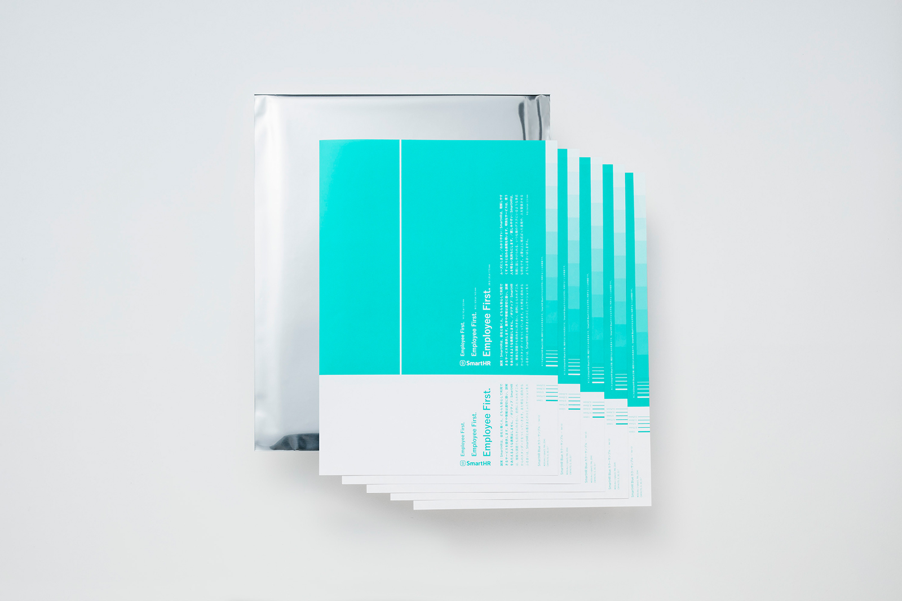

### 紙の内訳
 
クリアファイルの上から順に、下記の7種類の用紙が入っています。
 
#### 基準の紙
<ImgWithDesc description="①コート紙（加工なし）  6枚">

  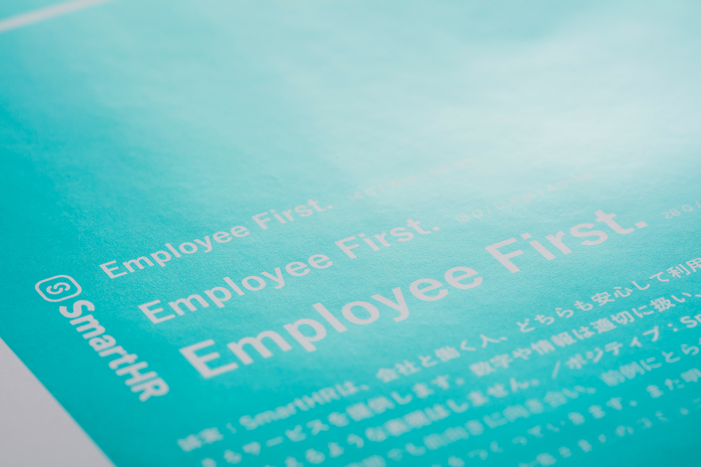

 </ImgWithDesc>
 
色合わせや色校確認の際は、実際に印刷する加工や用紙に関係なく、「①コート紙（加工なし）」のカラーチップを使ってください。

#### 参考の紙

基準となる①コート紙（加工なし）以外に6種類の紙があります。色のブレ幅の参考として利用してください。
 
<Grid>
  <ImgWithDesc description="②コート紙（ニス加工） 2枚   ">

  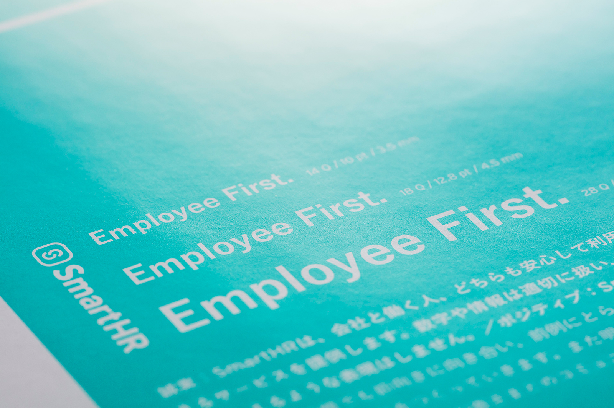

  </ImgWithDesc>

  <ImgWithDesc description="③コート紙（グロスPP加工）  2枚">

  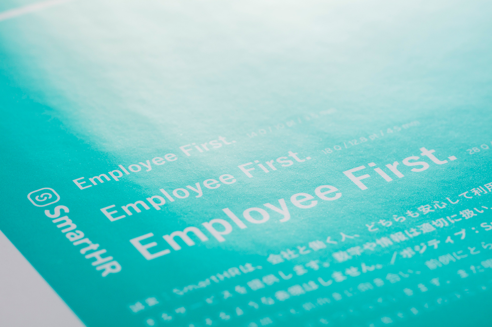

  </ImgWithDesc>

  <ImgWithDesc description="④コート紙（マットPP加工）  2枚　">

  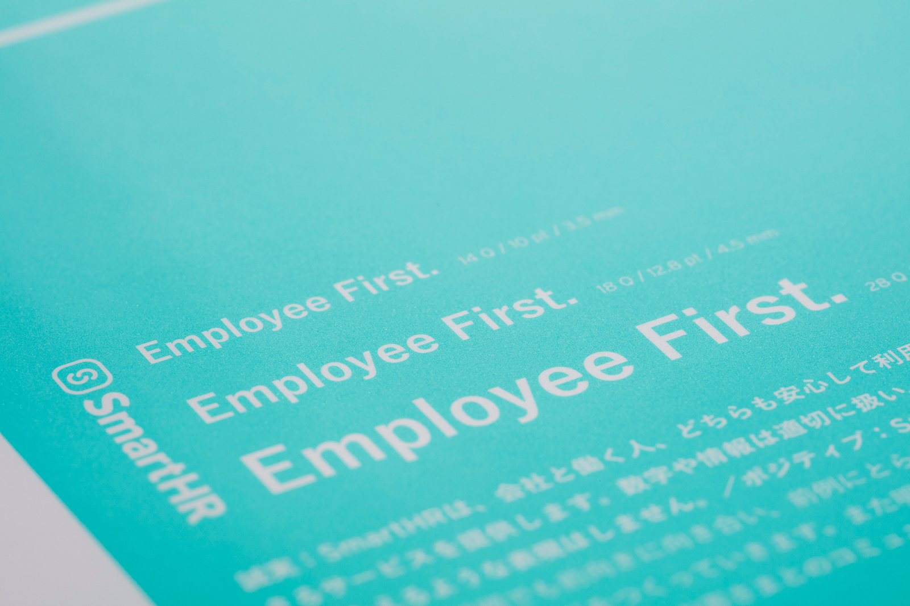

  </ImgWithDesc>

  <ImgWithDesc description="⑤マットコート紙  2枚">

  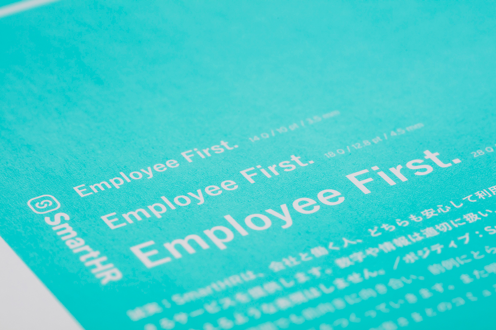

  </ImgWithDesc>

  <ImgWithDesc description="⑥上質紙  2枚">

  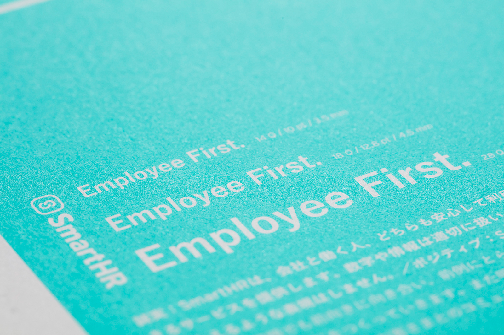

  </ImgWithDesc>

  <ImgWithDesc description="⑦クラフト紙  2枚">

  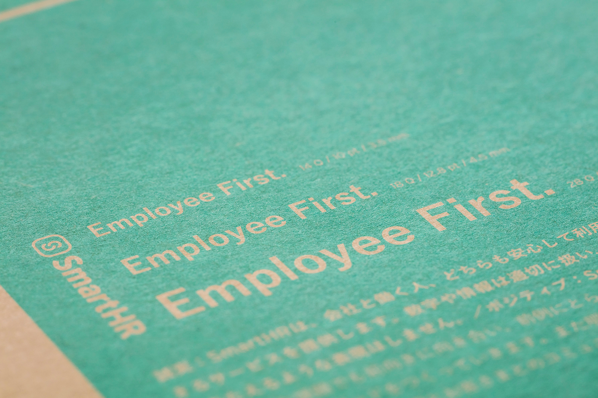

  </ImgWithDesc>
</Grid>

#### 注意事項
- 紫外線による退色防止のため銀色の封筒に入れて保管してください。  
- 紙本体には用紙の情報は記載されていません。紙の順番を変える際や1枚だけ取り出す際などは、紙の種類を間違えないようにご注意ください。（裏面にメモを書いたり、付箋で分けるなど各自での工夫をお願いします。 ）

### 図柄

 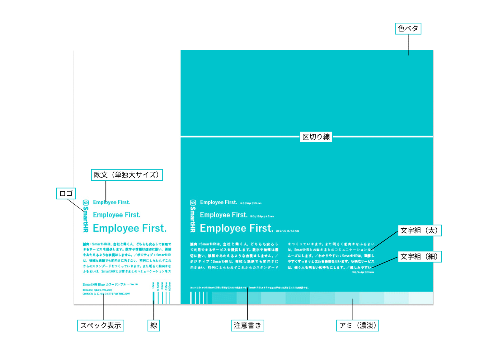

図柄は参考情報です。サイズ感や見え方などの参考にしてください。

## 活用シーン例

### 社内外に共有し、色の認識を揃える
- 常に共通のカラーチップを参照することで、社内外を問わず、関係者間で色の認識を揃えることができます。  
- 印刷データを入稿する際に、カラーチップを色見本として添付することで目指す色を正確に印刷会社に伝えることができます。  
- カラーチップの一部を切り取って共有できます。  

 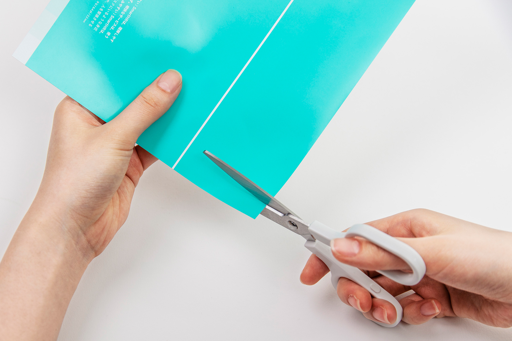

### 色校正の確認をする際に使用する
- 色校正を確認する際に、カラーチップと比較しながら色合いを検証できます。

 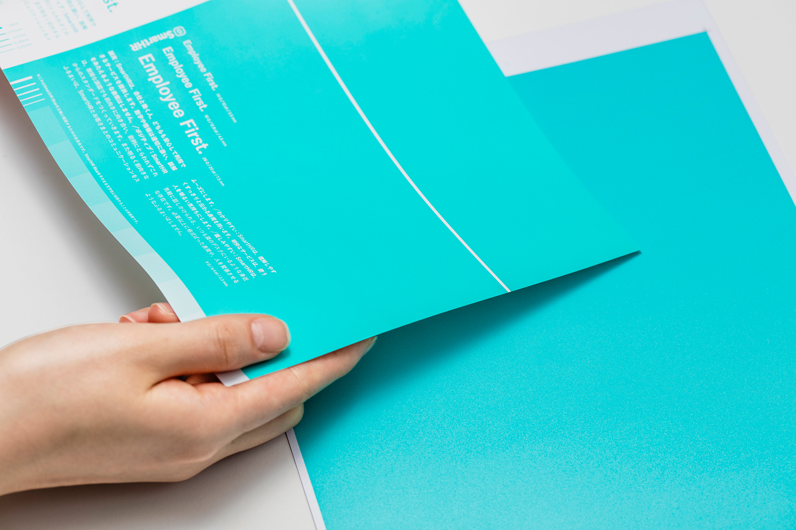

## 配布方法
ブランドコミュニケーション本部で在庫を保管しています。使用したい場合は下記お問い合わせ先からお知らせください。 
 
## フィードバック先
カラーチップの利用方法に関する相談・フィードバック
- 株式会社SmartHR　smarthr-design-system@smarthr.co.jp
- 社内Slack `#design_communication`
