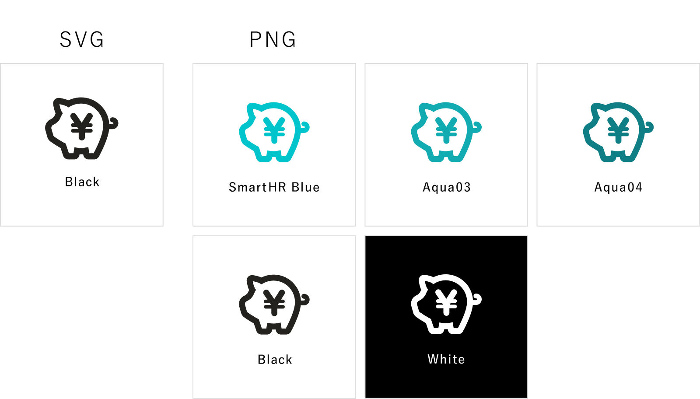

import { AnchorButton } from 'smarthr-ui'

SmartHRサービス全体で利用するアイコンです。

サイトにアクセスするすべての人が参照できますが、利用に関しては[利用者・利用範囲](#h2-3)を確認してください。

## 利用ガイドライン
- SmartHRに関するシーンでどこでも使用できます。
- solidとoutlineの2種類があります。シーンに合わせて適したほうを選んでください。

- 基本的に、視認性の高いoutlineを使用してください。
- solidとoutlineの混在は避けてください。

## アイコン一覧

### 意味を限定するアイコン

機能や仕様といった、特定の意味に限定するアイコンです。
特定の意味を示すものとして利用してください。

| 分類 | 意味 | アイコン | 補足 |
| :--- | :--- | :---: | :--- |
| SmartHR基本機能 | 従業員データベース |  | 「従業員リスト」「従業員情報」として利用することもあります。 |
| SmartHR基本機能 | 手続き |  |  |
| SmartHR基本機能 | 申請 |  |  |
| SmartHR基本機能 | 給与明細 |  |  |
| SmartHR基本機能 | お知らせ掲示板 |  |  |
| SmartHR基本機能 | マイナンバー |  |  |
| SmartHR基本機能 | 電子申請 |  |  |
| SmartHR基本機能 | 源泉徴収票 |  |  |
| SmartHR基本機能 | 設定 |  |  |
| SmartHR基本機能 | スマートフォン向けアプリ |  | solidとoutlineのデザインは同じです。 |
| SmartHRオプション機能 | 年末調整 |  |  |
| SmartHRオプション機能 | 文書配付 |  |  |
| SmartHRオプション機能 | 人事労務レポート |  |  |
| SmartHRオプション機能 | 従業員サーベイ |  |  |
| SmartHRオプション機能 | 人事評価 |  |  |
| SmartHRオプション機能 | ファイル一括アップロード |  |  |
| SmartHRオプション機能 | 通勤経路検索 |  |  |
| SmartHRオプション機能 | 配置シミュレーション |  |  |
| SmartHRオプション機能 | スキル管理 |  |  |
| SmartHRオプション機能 | 学習管理 |  |  |
| SmartHRオプション機能 | 届出書類 |  |  |
| SmartHRオプション機能 | 組織図・名簿 |  |  |
| SmartHRオプション機能 | キャリア台帳 |  |  |
| SmartHRオプション機能 | HRアナリティクス |  |  |
| SmartHRオプション機能 | 採用管理 |  |  |
| SmartHRオプション機能 | IdP |  |  |
| SmartHRオプション機能 | メッセージ |  |  |
| SmartHRオプション機能 | 勤怠管理 |  |  |
| SmartHRオプション機能 | ID管理 |  |  |
| SmartHRオプション機能 | 給与計算 |  |  |
| SmartHRオプション機能 | マネジメント育成計画 |  |  |
| SmartHRオプション機能 | 汎用申請 |  |  |
| 仕様・サービス | サービス連携 |  |  |
| 仕様・サービス | データ連携 |  |  |
| 仕様・サービス | 多言語化対応 |  |  |
| 仕様・サービス | SAML/SSO認証 |  | 旧デザインのため、利用は非推奨です。 |
| 仕様・サービス | API連携 |  |  |
| 仕様・サービス | 履歴閲覧・編集 |  |  |
| 仕様・サービス | 履歴登録 |  |  |
| 仕様・サービス | 予約管理 |  |  |
| 仕様・サービス | CSVカスタムダウンロード |  |  |

### 意味を限定しないアイコン

特定の意味に限定しないアイコンです。

| アイコン | 補足 |
| --- | --- |
|  | 旧デザインのため、利用は非推奨です。 |
|  | 旧デザインのため、利用は非推奨です。 |
|  | 旧デザインのため、利用は非推奨です。 |
|  | 旧デザインのため、利用は非推奨です。 |
|  | 旧デザインのため、利用は非推奨です。 |
|  |  |
|  |  |
|  |  |

## ダウンロード

SVG・PNG形式のアイコンデータをダウンロードできます。

<AnchorButton href="/downloads/icon.zip" downloads>まとめてダウンロード</AnchorButton>

## 関連する素材
### タイルパターン
Figmaで使用もしくはダウンロードできます。  
[タイルパターン | Figma](https://www.figma.com/file/SKAzbzSGkiRHmC3lCZk24T/%E3%82%BF%E3%82%A4%E3%83%AB%E3%83%91%E3%82%BF%E3%83%BC%E3%83%B3?type=design&node-id=0%3A1&mode=design&t=ZLhT3TShragwTM2M-1)

## 利用者・利用範囲

アイコンの利用者・利用範囲は以下のとおりです。

  <table>
    <thead>
      <tr>
        <th>利用者</th>
        <th>名義</th>
        <th>利用可否</th>
      </tr>
    </thead>
    <tbody>
      <tr>
        <td>SmartHR従業員</td>
        <td>サービスSmartHR 株式会社SmartHR</td>
        <td><strong>◯ 利用できます</strong></td>
      </tr>
      <tr>
        <td>SmartHR従業員</td>
        <td>SmartHR Plus</td>
        <td><strong>◯ 利用できます</strong></td>
      </tr>
      <tr>
        <td>SmartHR従業員</td>
        <td>・SmartHRグループ会社 ・提供サービス</td>
        <td>× 利用できません</td>
      </tr>
      <tr>
        <td>SmartHR外部パートナー</td>
        <td>サービスSmartHR 株式会社SmartHR</td>
        <td><strong>◯ 利用できます</strong></td>
      </tr>
      <tr>
        <td>SmartHR Plusパートナー</td>
        <td>SmartHR Plusパートナーが 提供するアプリ</td>
        <td><strong>◯ 利用できます</strong></td>
      </tr>
      <tr>
        <td>SmartHRグループ会社 従業員</td>
        <td>・SmartHRグループ会社 ・提供サービス</td>
        <td>× 利用できません</td>
      </tr>
      <tr>
        <td>すべてのかた 広報担当者のかた</td>
        <td>SmartHRの広報活動</td>
        <td>× 利用できません</td>
      </tr>
    </tbody>
  </table>

ほかのコンテンツの利用範囲は[利用者のかたへ](/introduction/user/)を参照してください。

## フィードバック先
アイコンに関する相談・フィードバック

- 社内Slack `#design_system_相談`
