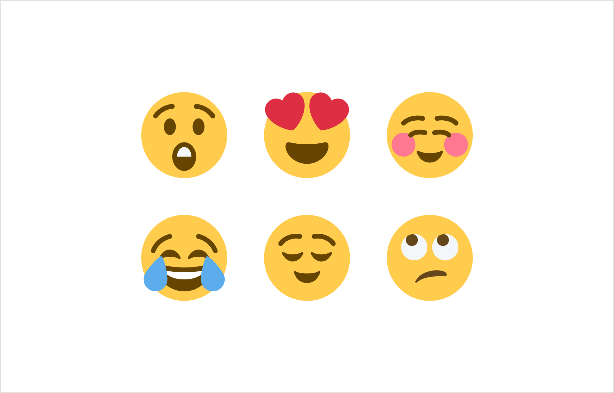
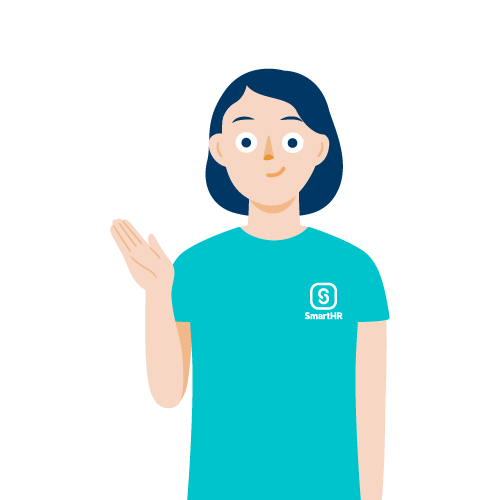
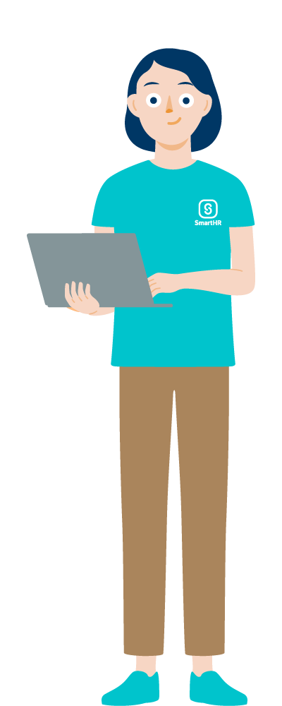

イラストレーションを作成する際のガイドラインです。

## デザインデータ
イラストレーションはすべて[master | Googleドライブ](https://drive.google.com/drive/folders/1C9Vjl3B8LKsYDmZVTPjzJtZGBZkaM4RD)をマスターデータとして管理しています。

### マスターデータの注意点
- マスターデータは完成したイラストレーションを管理するものです。新規イラストを作成する際は、**複製してから作業**をしてください。
- マスターデータの更新はすべて @moee が担当しますので、イラスト作成後にお声かけください。
- そのほか
    - エリア内に、なるべくきりのよい座標に配置してください。ピクセル単位で、端数の箇所には配置しない。（OK例：100px、NG例：100.5px）
    - アピアランスは削除してください。
    - 孤立点は削除してください。

## タイプ・画像サイズ

イラストレーションは基本的に3タイプに分かれています。

### 1. 人物

人物は全身、半身、アイコンの3種類があります。  
人物にはすべてペルソナを設定しており、ペルソナに沿って作成してください。  
表情は、[Twemoji | X](https://twemoji.twitter.com/) という絵文字の表情を参照してください。  
[Twemoji（表情参考用） | Google ドライブ](https://drive.google.com/drive/u/1/folders/1FKDL5gGmeCt8hiXjYVoCC4ZWOEiobcEV) で、表情の参考にできるTwemojiをみることができます。

[Copyright 2020 Twitter, Inc and other contributors is licensed under CC-BY 4.0](https://creativecommons.org/licenses/by/4.0/)

### 2. アイテム

建物、書類、小物といった、人物以外のイラストレーションです。

### 3.ヒーロー

人物やアイテムを組み合わせたイラストレーションです。

### 画像サイズ
| タイプ| 画像サイズ | サンプル |
| --- | --- | --- |
| 人物（アイコン） | 500px × 500px |  |
| 人物（半身） | 500px × 500px |  |
| 人物（全身）  | 1000px × 400px |  |
| アイテム | 500px × 500px | - |
| ヒーロー | 500px × 500px | - |

## 色

全体のトーンは、[基本要素 | 色](/basics/colors/)に基づいて制作してください。  
特に[Extended Colors](/basics/colors/#h3-3) に記載しているとおり、これらの色の使用を推奨しますが、利用シーンに合う色がない場合は、Extended Colorsのトーンを参考に、色を調整して使用できます。  
「この色しか使用してはいけない」というものではなく、あくまでトーンの参考として使用してください。  
影の表現については、Gamut Maskメソッドから定義した紫をベースとしています。
