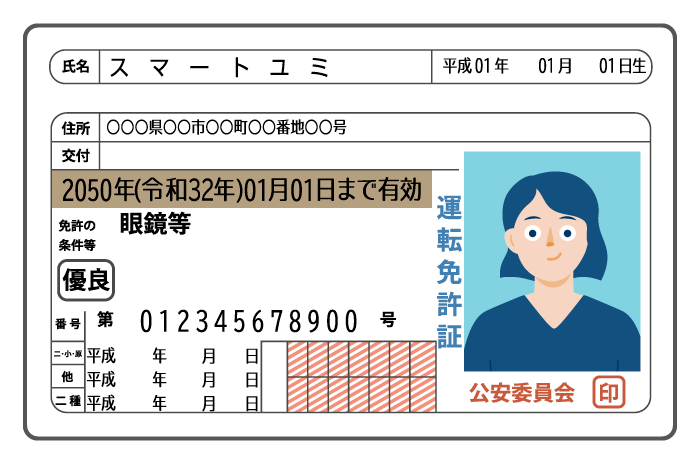
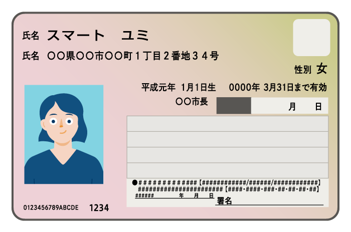
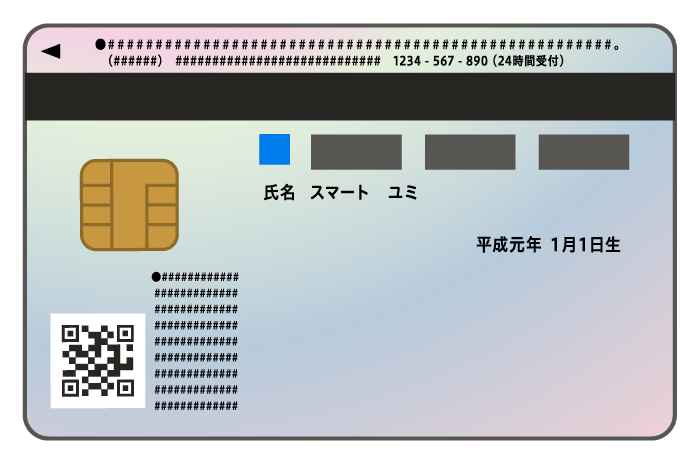
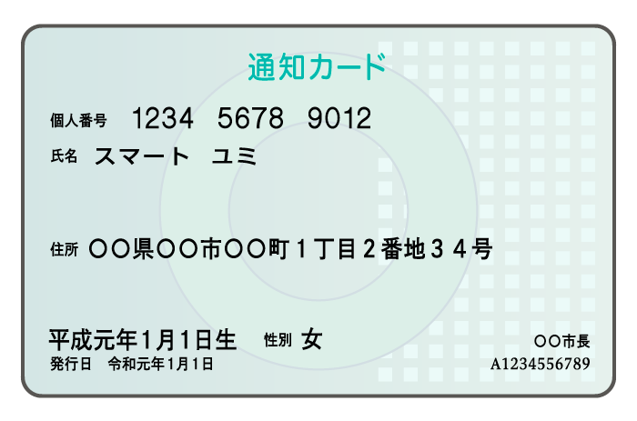
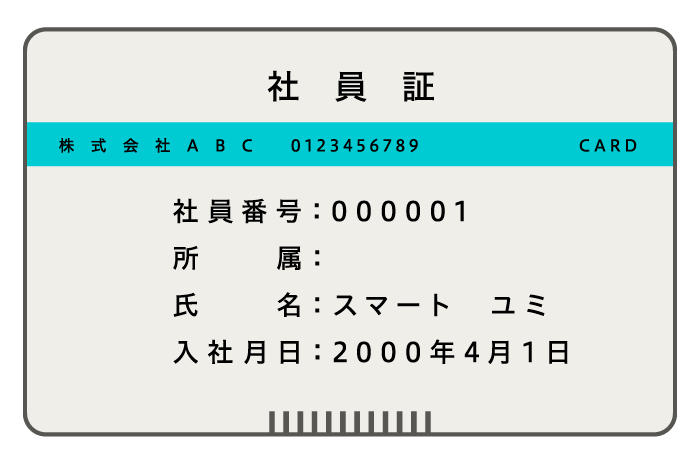
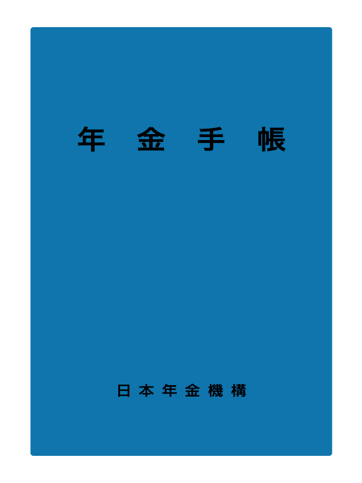
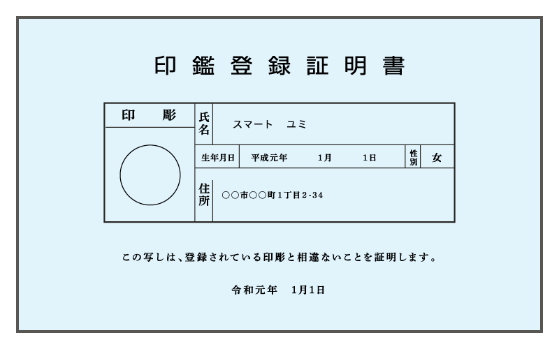
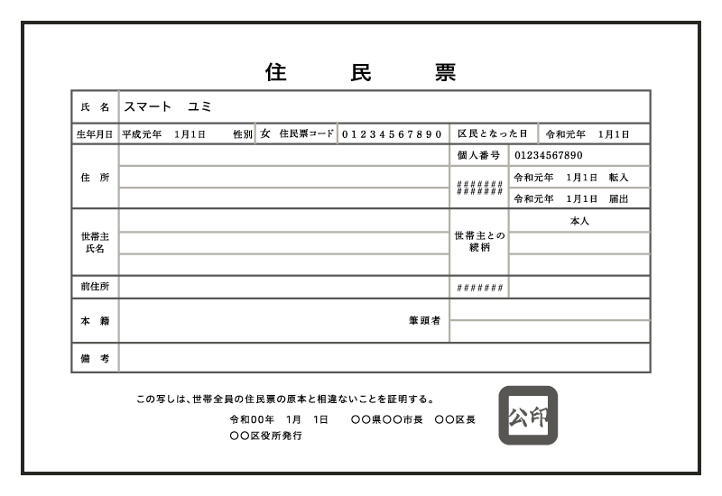

import Grid from '@/components/article/shared/Grid/Grid'
import ImgWithDesc from '@/components/article/ImgWithDesc.astro'
import { AnchorButton } from 'smarthr-ui'

アイテムに関連するイラストレーションです。  

サイトにアクセスするすべての人が参照できますが、利用に関しては[利用者・利用範囲](#h2-5)を確認してください。

## 身分証明書

<Grid autoRepeat="auto-fill" size="130px">

  <ImgWithDesc description="運転免許証">

  

  </ImgWithDesc>

  <ImgWithDesc description="マイナンバーカード（表）">

  

  </ImgWithDesc>

  <ImgWithDesc description="マイナンバーカード（裏）">

  

  </ImgWithDesc>

  <ImgWithDesc description="通知カード">

  

  </ImgWithDesc>

  <ImgWithDesc description="社員証">

  

  </ImgWithDesc>

  <ImgWithDesc description="パスポート">

  

  </ImgWithDesc>

  <ImgWithDesc description="年金手帳">

  

  </ImgWithDesc>

  <ImgWithDesc description="印鑑登録証明書">

  

  </ImgWithDesc>

  <ImgWithDesc description="住民票">

  

  </ImgWithDesc>

</Grid>

## 建物

<Grid autoRepeat="auto-fill" size="130px">

  <ImgWithDesc description="ふつうのビル（ブルー）">

  

  </ImgWithDesc>

  <ImgWithDesc description="ふつうのビル（ホワイト）">

  

  </ImgWithDesc>

  <ImgWithDesc description="中規模ビル">

  

  </ImgWithDesc>

  <ImgWithDesc description="高層ビル">

  

  </ImgWithDesc>

  <ImgWithDesc description="店舗">

  

  </ImgWithDesc>

</Grid>

## その他

<Grid autoRepeat="auto-fill" size="130px">

  <ImgWithDesc description="スマートフォンを操作する手">

  

  </ImgWithDesc>

  <ImgWithDesc description="ノートパソコン">

  

  </ImgWithDesc>

</Grid>

## ダウンロード

<AnchorButton href="/downloads/item.zip" downloads>まとめてダウンロード</AnchorButton>

## 利用方法・注意事項
- コンテンツの内容に応じてサイズ変更・トリミングできます。
- イラストレーションの著作権などを譲渡、放棄したものではありませんのでご注意ください。

## 利用者・利用範囲

サイトにアクセスするすべての人が参照できますが、利用には一部制限があります。
イラストレーションの利用者・利用範囲は以下のとおりです。

  <table>
    <thead>
      <tr>
        <th>利用者</th>
        <th>名義</th>
        <th>利用可否</th>
      </tr>
    </thead>
    <tbody>
      <tr>
        <td>SmartHR従業員</td>
        <td>サービスSmartHR 株式会社SmartHR</td>
        <td><strong>◯ 利用できます</strong></td>
      </tr>
      <tr>
        <td>SmartHR従業員</td>
        <td>SmartHR Plus</td>
        <td><strong>◯ 利用できます</strong></td>
      </tr>
      <tr>
        <td>SmartHR従業員</td>
        <td>SmartHRグループ会社と その提供サービス</td>
        <td>× 利用できません</td>
      </tr>
      <tr>
        <td>SmartHR外部パートナー</td>
        <td>サービスSmartHR 株式会社SmartHR</td>
        <td><strong>◯ 利用できます</strong></td>
      </tr>
      <tr>
        <td>SmartHR Plusパートナー</td>
        <td>SmartHR Plusパートナーが 提供するアプリ</td>
        <td>× 利用できません</td>
      </tr>
      <tr>
        <td>SmartHRグループ会社 従業員</td>
        <td>SmartHRグループ会社と その提供サービス</td>
        <td>× 利用できません</td>
      </tr>
      <tr>
        <td>すべてのかた 広報担当者のかた</td>
        <td>SmartHRの広報活動</td>
        <td>× 利用できません</td>
      </tr>
    </tbody>
  </table>

ほかのコンテンツの利用範囲は[利用者のかたへ](/introduction/user/)を参照してください。
