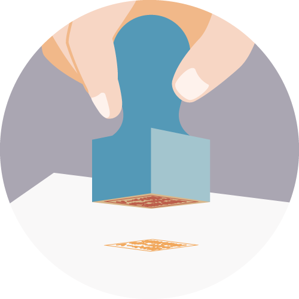
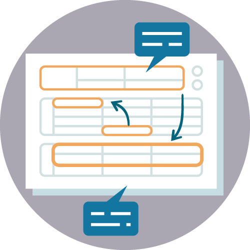
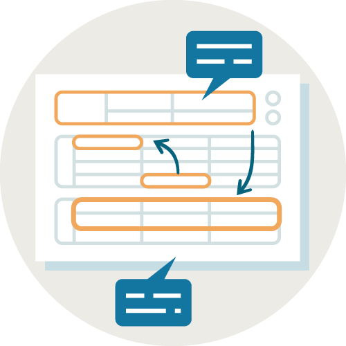
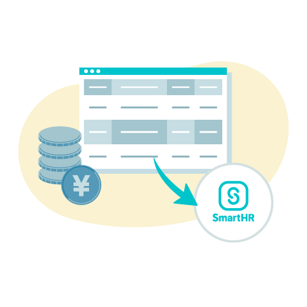
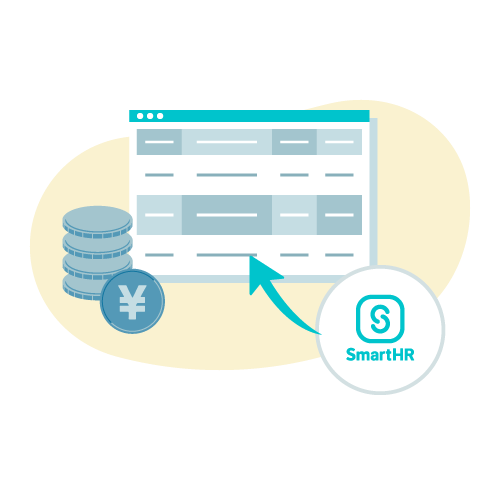

import ImgWithDesc from '@/components/article/ImgWithDesc.astro'
import { Grid } from '@Components/shared/Grid/Grid'
import { AnchorButton } from 'smarthr-ui'

特定のシーンを描いたイラストレーションです。  

サイトにアクセスするすべての人が参照できますが、利用に関しては[利用者・利用範囲](#h2-3)を確認してください。

## サービス導入効果

### SmartHR導入前の業務

日々の業務の忙しさや、複雑な作業に取り組むシーンを中心に描いたイラストです。SmartHRを導入することで解決したい、課題や困っていることを表現する際に利用してください。

<Grid autoRepeat="auto-fill" size="100px" gap="28px">

  <ImgWithDesc description="データ入力（労務担当者）">

  

  </ImgWithDesc>

  <ImgWithDesc description="データ入力（人事担当者）">

  

  </ImgWithDesc>

  <ImgWithDesc description="出社（労務担当者）">

  

  </ImgWithDesc>

  <ImgWithDesc description="電話（労務担当者）">

  

  </ImgWithDesc>

  <ImgWithDesc description="電話（人事担当者）">

  

  </ImgWithDesc>

  <ImgWithDesc description="問い合わせ対応（労務担当者）">

  

  </ImgWithDesc>

  <ImgWithDesc description="封入（労務担当者）">

  

  </ImgWithDesc>

  <ImgWithDesc description="封入（人事担当者）">

  

  </ImgWithDesc>

  <ImgWithDesc description="役所手続き（労務担当者）">

  

  </ImgWithDesc>

  <ImgWithDesc description="積み上がった書類と残業">

  

  </ImgWithDesc>

  <ImgWithDesc description="記入（従業員）">

  

  </ImgWithDesc>

  <ImgWithDesc description="記入（従業員）">

  

  </ImgWithDesc>

  <ImgWithDesc description="給与明細手渡し">

  

  </ImgWithDesc>

  <ImgWithDesc description="捺印（個人印）">

  

  </ImgWithDesc>

  <ImgWithDesc description="押印（法人印）">

  

  </ImgWithDesc>

  <ImgWithDesc description="従業員リスト">

  

  </ImgWithDesc>

  <ImgWithDesc description="配送">

  

  </ImgWithDesc>

  <ImgWithDesc description="書類確認">

  

  </ImgWithDesc>

  <ImgWithDesc description="書類差し戻し">

  

  </ImgWithDesc>

  <ImgWithDesc description="書類確認・差し戻し">

  

  </ImgWithDesc>

  <ImgWithDesc description="書類転記・押印">

  

  </ImgWithDesc>

  <ImgWithDesc description="プリンタ">

  

  </ImgWithDesc>

  <ImgWithDesc description="入社書類">

  

  </ImgWithDesc>

  <ImgWithDesc description="年末調整マニュアル">

  

  </ImgWithDesc>

  <ImgWithDesc description="年末調整マニュアル（明るめ）">

  

  </ImgWithDesc>

  <ImgWithDesc description="ファイリング">

  

  </ImgWithDesc>

</Grid>

### SmartHR導入後の業務

SmartHR導入後の「ラクラクな作業」「スマートな業務」といったポジティブな状況を表現する際に利用してください。

<Grid autoRepeat="auto-fill" size="130px">

  <ImgWithDesc description="送受信：労務担当者（入社情報の提出を依頼）">

  

  </ImgWithDesc>

  <ImgWithDesc description="送受信：労務担当者（入社情報の提出を依頼）">

  

  </ImgWithDesc>

  <ImgWithDesc description="送受信：人事担当者（入社情報の提出を依頼）">

  

  </ImgWithDesc>

  <ImgWithDesc description="送受信：従業員（入社手続き情報入力・年末調整アンケート回答・雇用契約更新の受信）">

  

  </ImgWithDesc>

  <ImgWithDesc description="送受信：従業員（入社手続き情報入力・年末調整アンケート回答・雇用契約更新の受信）">

  

  </ImgWithDesc>

  <ImgWithDesc description="電子申請（手続き書類の自動作成・電子申請）">

  

  </ImgWithDesc>

  <ImgWithDesc description="従業員情報">

  

  </ImgWithDesc>

  <ImgWithDesc description="オンライン署名">

  

  </ImgWithDesc>

  <ImgWithDesc description="給与ソフトからインポート">

  

  </ImgWithDesc>

  <ImgWithDesc description="給与ソフトへ取り込み">

  

  </ImgWithDesc>

  <ImgWithDesc description="年末調整内容確認">

  

  </ImgWithDesc>

  <ImgWithDesc description="年末調整自動催促">

  

  </ImgWithDesc>

  

</Grid>

## ダウンロード

<AnchorButton href="/downloads/scene.zip" downloads>まとめてダウンロード</AnchorButton>

## 利用方法・注意事項
- コンテンツの内容に応じてサイズ変更・トリミングできます。
- イラストレーションの著作権などを譲渡、放棄したものではありませんのでご注意ください。

## 利用者・利用範囲

サイトにアクセスするすべての人が参照できますが、利用には一部制限があります。
イラストレーションの利用者・利用範囲は以下のとおりです。

  <table>
    <thead>
      <tr>
        <th>利用者</th>
        <th>名義</th>
        <th>利用可否</th>
      </tr>
    </thead>
    <tbody>
      <tr>
        <td>SmartHR従業員</td>
        <td>サービスSmartHR 株式会社SmartHR</td>
        <td><strong>◯ 利用できます</strong></td>
      </tr>
      <tr>
        <td>SmartHR従業員</td>
        <td>SmartHR Plus</td>
        <td><strong>◯ 利用できます</strong></td>
      </tr>
      <tr>
        <td>SmartHR従業員</td>
        <td>SmartHRグループ会社と その提供サービス</td>
        <td>× 利用できません</td>
      </tr>
      <tr>
        <td>SmartHR外部パートナー</td>
        <td>サービスSmartHR 株式会社SmartHR</td>
        <td><strong>◯ 利用できます</strong></td>
      </tr>
      <tr>
        <td>SmartHR Plusパートナー</td>
        <td>SmartHR Plusパートナーが 提供するアプリ</td>
        <td>× 利用できません</td>
      </tr>
      <tr>
        <td>SmartHRグループ会社 従業員</td>
        <td>SmartHRグループ会社と その提供サービス</td>
        <td>× 利用できません</td>
      </tr>
      <tr>
        <td>すべてのかた 広報担当者のかた</td>
        <td>SmartHRの広報活動</td>
        <td>× 利用できません</td>
      </tr>
    </tbody>
  </table>

ほかのコンテンツの利用範囲は[利用者のかたへ](/introduction/user/)を参照してください。
