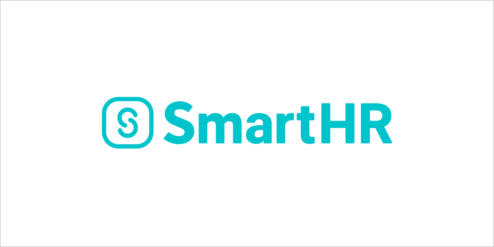
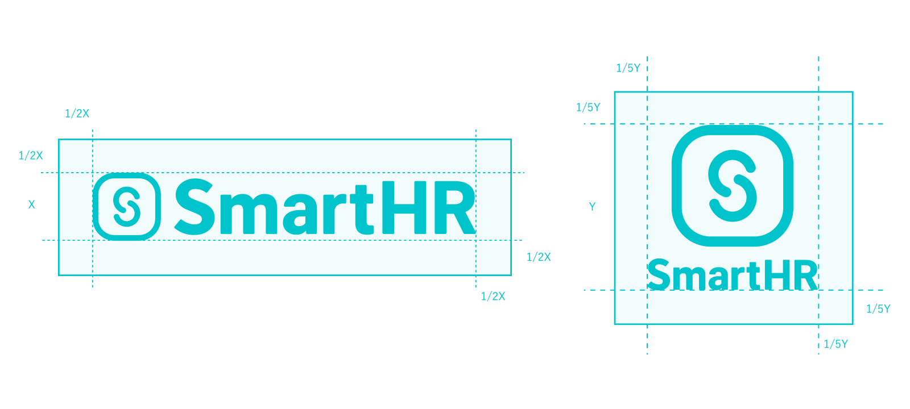
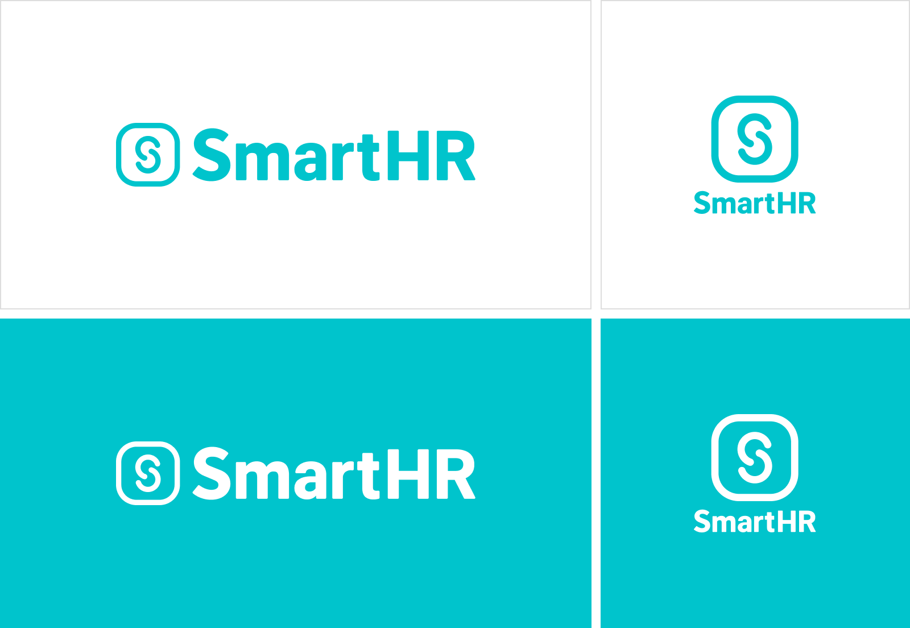
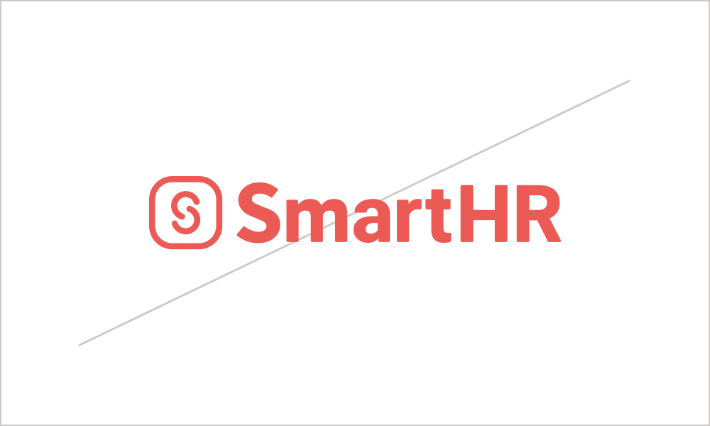
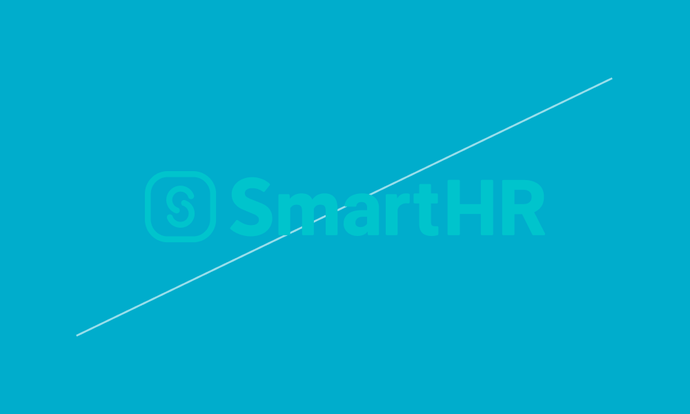
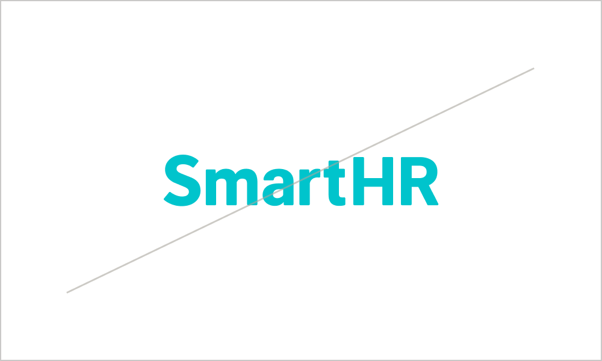
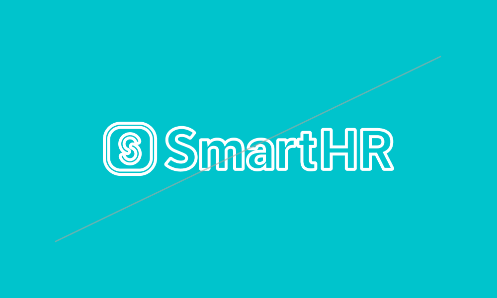
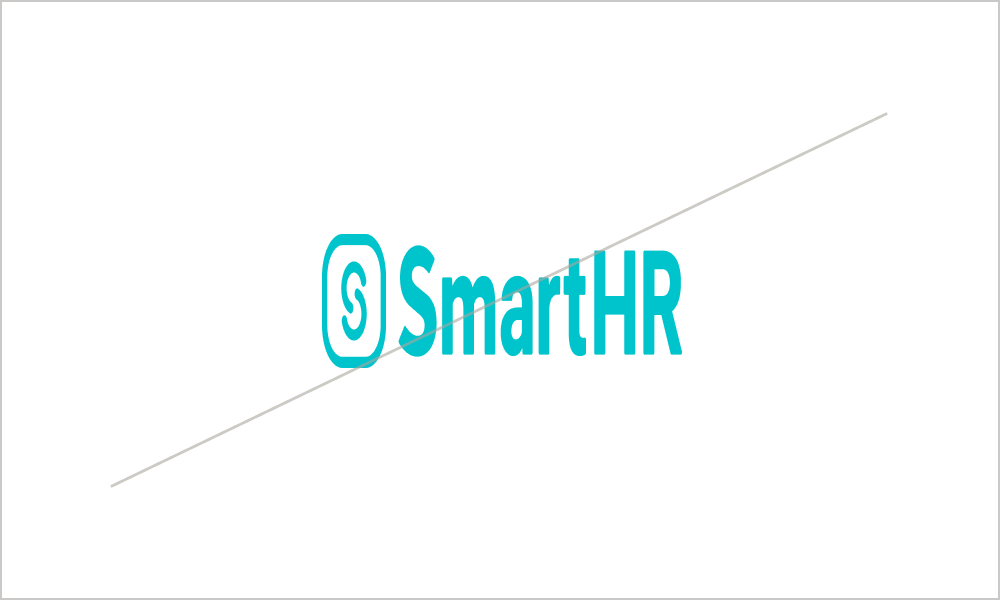
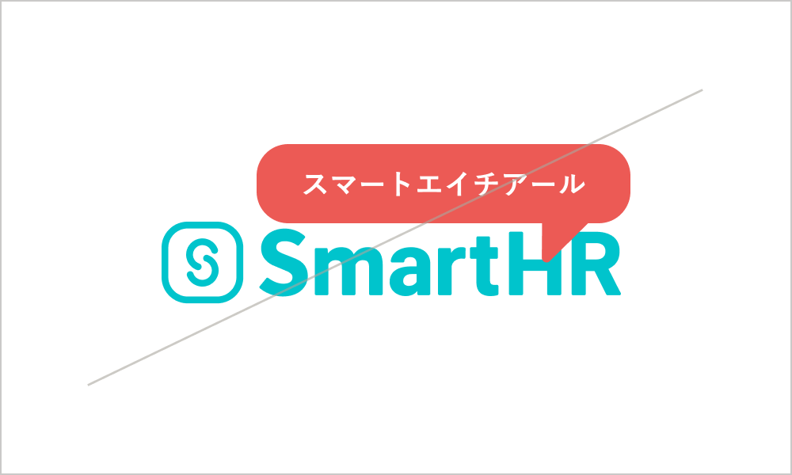
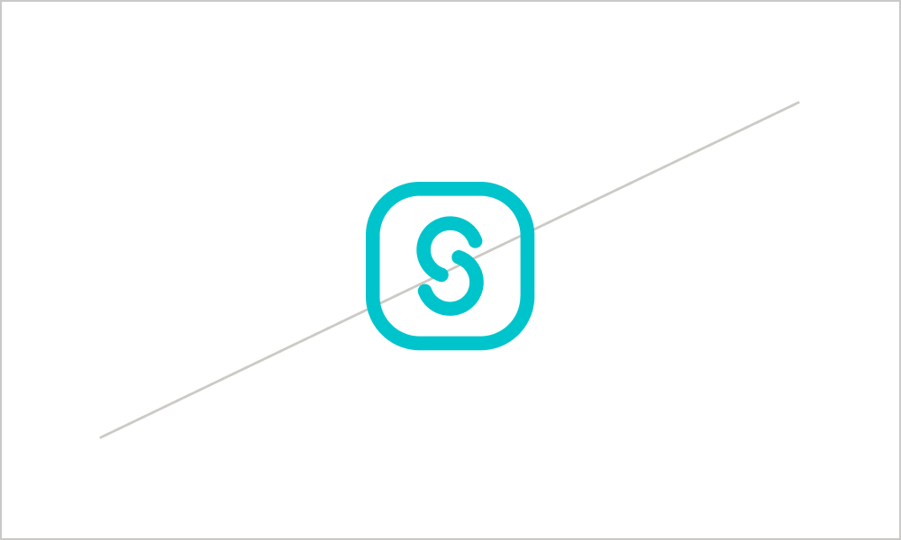

import Grid from '@/components/article/Grid.astro'
import ImgWithDesc from '@/components/article/article/ImgWithDesc/ImgWithDesc'

SmartHRロゴは、正しく使用されてはじめて本来の機能を発揮できます。

サイトにアクセスするすべての人が参照できますが、利用に関しては[利用者・利用範囲](#h2-2)を確認してください。

制作背景：<a href="https://tech.smarthr.jp/entry/2017/08/07/090000" target="_blank">リニューアルしたSmartHRロゴの作り方 | SmartHR Tech Blog</a>

## 利用ガイドライン

- [利用規約](/terms/)に違反する態様での複製・転用・変更することを禁止します。
- 本ガイドラインに沿って、ロゴを利用してください。  

本ガイドラインは、必ず守ることが目的ではなく、あくまでロゴを適切に扱うための指針です。ロゴやブランドを適切に扱って、SmartHRのより良い認知につなげる姿勢を大切にしてください。
本ガイドラインに沿うよりも効果的にロゴを利用できる場合や、ロゴの利用で迷う点がある場合は、問い合わせ先にご連絡ください。

### バリエーション

ロゴは、横組を使用してください。  
ただし正方形エリアでの利用の場合は、縦組も使用できます。

### アイソレーション

ロゴ周辺には、一定のアイソレーション（保護エリア）を設けます。  
この領域内には、他の要素・文字などは表示しないでください。

### 最小使用サイズ

デジタルデバイスで使用する場合は横幅78px以上、印刷物で使用する場合は横幅30mm以上で使用してください。

### 配色

ロゴは、以下のように必ずSmartHR BlueとWhiteを使用してください。  
グレースケールの場合は#000000 、モノクロ表記の場合はK100を使用してください。

### 背景

ロゴは、常に明瞭に見えるよう使用してください。  
背景に色や画像がある場合は、視認性を考慮して、以下を参考にSmartHR Blue、Whiteのいずれかを使用してください。

### 禁止事項

<Grid>
  <ImgWithDesc description="指定カラー以外で表記してはいけない">

  

  </ImgWithDesc>

  <ImgWithDesc description="不明瞭な表示をしてはならない">

  

  </ImgWithDesc>

  <ImgWithDesc description="シャドウをつけてはいけない">

  

  </ImgWithDesc>

  <ImgWithDesc description="ロゴを傾けてはいけない">

  

  </ImgWithDesc>

  <ImgWithDesc description="ロゴの一部だけを使用したり、要素を削除してはいけない">

  

  </ImgWithDesc>

  <ImgWithDesc description="ロゴを縁取ってはいけない">

  

  </ImgWithDesc>

  <ImgWithDesc description="アイソレーションの領域内に要素を配置してはいけない">

  

  </ImgWithDesc>

  <ImgWithDesc description="変形させてはいけない">

  

  </ImgWithDesc>

  <ImgWithDesc description="他要素やマークをロゴの上に重ねてはいけない">

  

  </ImgWithDesc>

  <ImgWithDesc description="平面表現において3D表現してはいけない">

  

  </ImgWithDesc>

  <ImgWithDesc description="文章中にロゴを使ってはいけない">

  

  </ImgWithDesc>

  <ImgWithDesc description="ロゴマークを単体で使ってはいけない">

  

  </ImgWithDesc>

</Grid>

## ダウンロード

PNG・SVG・AIのファイル形式のロゴをダウンロードできます。

[PNG](/SmartHR_Logo_png.zip)／[SVG](/SmartHR_Logo_svg.zip)／[AI（カラー）](/SmartHR_Logo_ai.zip)／[AI（モノクロ）](/SmartHR_Logo_monochrome.zip)

## アイソレーションの確認方法（社内向け）
ロゴ周辺のアイソレーション領域が確保できているか、Figmaで確認できます。

<a href="https://www.figma.com/file/ZkFiU1MN3IuzHzqCcRBTQB/%E3%83%AD%E3%82%B4%E3%81%AE%E3%82%A2%E3%82%A4%E3%82%BD%E3%83%AC%E3%83%BC%E3%82%B7%E3%83%A7%E3%83%B3%E3%83%81%E3%82%A7%E3%83%83%E3%82%AF%E4%BC%9A%E5%A0%B4?type=design&node-id=0%3A1&mode=design&t=s542qXgF1PJO7x6Z-1" target="_blank">ロゴのアイソレーションチェック会場 | Figma</a>

Figmaを利用開始する方法や使い方になどについては、[Figmaの利用方法](/operational-guideline/figma-operation/)を参照してください。

## 利用者・利用範囲

サイトにアクセスするすべての人が参照できますが、利用には一部制限があります。

  <table>
    <thead>
      <tr>
        <th>利用者</th>
        <th>名義</th>
        <th>利用可否</th>
      </tr>
    </thead>
    <tbody>
      <tr>
        <td>SmartHR従業員</td>
        <td>サービスSmartHR 株式会社SmartHR</td>
        <td><strong>◯ 利用できます</strong></td>
      </tr>
      <tr>
        <td>SmartHR従業員</td>
        <td>SmartHR Plus</td>
        <td><strong>◯ 利用できます</strong></td>
      </tr>
      <tr>
        <td>SmartHR従業員</td>
        <td>SmartHRグループ会社と その提供サービス</td>
        <td>× 利用できません</td>
      </tr>
      <tr>
        <td>SmartHR外部パートナー</td>
        <td>サービスSmartHR 株式会社SmartHR</td>
        <td><strong>◯ 利用できます</strong></td>
      </tr>
      <tr>
        <td>SmartHR Plusパートナー</td>
        <td>SmartHR Plusパートナーが 提供するアプリ</td>
        <td>× 利用できません</td>
      </tr>
      <tr>
        <td>SmartHRグループ会社 従業員</td>
        <td>SmartHRグループ会社と その提供サービス</td>
        <td>× 利用できません</td>
      </tr>
      <tr>
        <td>すべてのかた 広報担当者のかた</td>
        <td>SmartHRの広報活動</td>
        <td><strong>◯ 利用できます</strong></td>
      </tr>
    </tbody>
  </table>

ほかのコンテンツの利用範囲は[利用者のかたへ](/introduction/user/)を参照してください。  

## ライセンス情報

SmartHRロゴの、デザインやレイアウト、ロゴマーク、商標などに関しては、株式会社SmartHR（以下「当社」といいます）または、当社にその利用を認めた権利者が著作権などの知的財産権、使用権その他の権利を有しています。

## 問い合わせ先

ロゴの掲載、使用の可否についての相談・問い合わせ
- 株式会社SmartHR　pr@smarthr.co.jp
- 社内Slack `#pr`

ロゴの利用方法に関する相談・問い合わせ
- SmartHR Design System 運営チーム smarthr-design-system@smarthr.co.jp
- 社内Slack `#design_comm_依頼`
