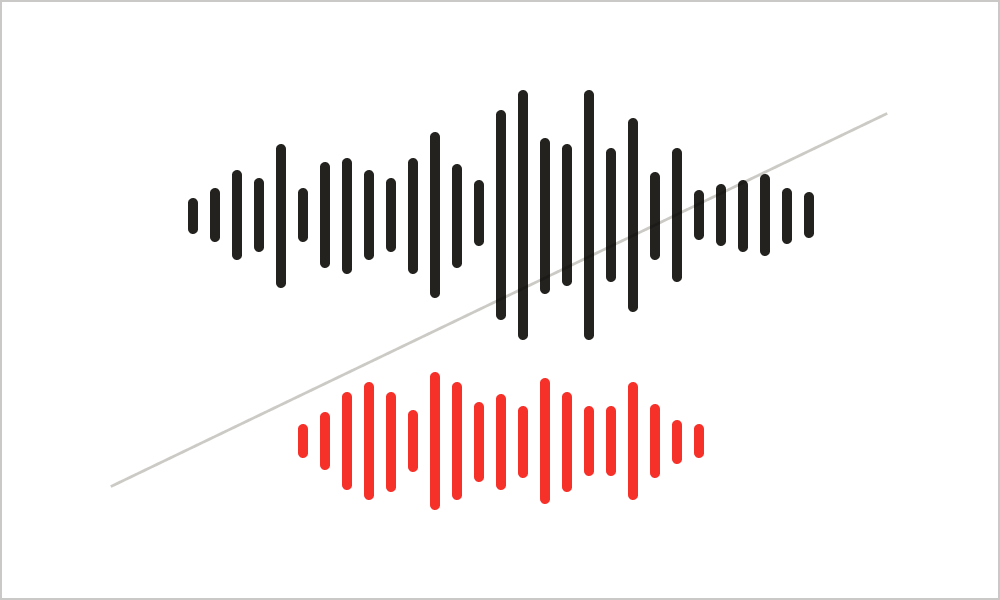
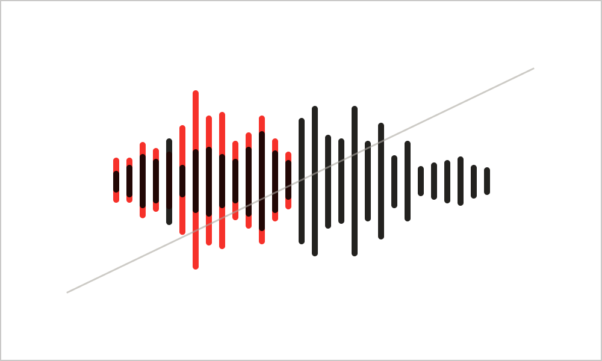

import { Grid } from '@Components/shared/Grid/Grid'
import { ImgWithDesc } from '@Components/article/ImgWithDesc/ImgWithDesc'

音声領域におけるSmartHRロゴです。

サイトにアクセスするすべての人が参照できますが、利用に関しては[利用者・利用範囲](#h2-2)を確認してください。  

<audio controls src="/sound/SmartHR_SoundLogo.wav">
  
音声の再生に対応していません

</audio>

## 利用ガイドライン

### 利用方法
- コンテンツの冒頭に挿入してください。冒頭が相応しくない場合は末尾に挿入してください。

### 禁止事項

<Grid>
  <ImgWithDesc description="他の音声を重ねてはいけない">

  

  </ImgWithDesc>

  <ImgWithDesc description="音声にエフェクトを追加してはいけない">

  

  </ImgWithDesc>
</Grid>

## ダウンロード
wav形式のサウンドロゴをダウンロードできます。

- [wav](/SmartHR_SoudLogo.zip)

## 利用者・利用範囲

サイトにアクセスするすべての人が参照できますが、利用には一部制限があります。
ロゴの利用者・利用範囲は以下のとおりです。

  <table>
    <thead>
      <tr>
        <th>利用者</th>
        <th>名義</th>
        <th>利用可否</th>
      </tr>
    </thead>
    <tbody>
      <tr>
        <td>SmartHR従業員</td>
        <td>サービスSmartHR 株式会社SmartHR</td>
        <td><strong>◯ 利用できます</strong></td>
      </tr>
      <tr>
        <td>SmartHR従業員</td>
        <td>SmartHR Plus</td>
        <td><strong>◯ 利用できます</strong></td>
      </tr>
      <tr>
        <td>SmartHR従業員</td>
        <td>SmartHRグループ会社と その提供サービス</td>
        <td>× 利用できません</td>
      </tr>
      <tr>
        <td>SmartHR外部パートナー</td>
        <td>サービスSmartHR 株式会社SmartHR</td>
        <td><strong>◯ 利用できます</strong></td>
      </tr>
      <tr>
        <td>SmartHR Plusパートナー</td>
        <td>SmartHR Plusパートナーが 提供するアプリ</td>
        <td>× 利用できません</td>
      </tr>
      <tr>
        <td>SmartHRグループ会社 従業員</td>
        <td>SmartHRグループ会社と その提供サービス</td>
        <td>× 利用できません</td>
      </tr>
      <tr>
        <td>すべてのかた 広報担当者のかた</td>
        <td>SmartHRの広報活動</td>
        <td><strong>◯ 利用できます</strong></td>
      </tr>
    </tbody>
  </table>

ほかのコンテンツの利用範囲は[利用者のかたへ](/introduction/user/)を参照してください。  
SmartHRサウンドロゴを本ガイドラインおよび[利用規約](/terms/)に違反する態様での複製・転用・変更することを禁止します。

## ライセンス情報

SmartHRサウンドロゴの、サウンド、商標などに関しては、株式会社SmartHR（以下「当社」といいます）または、当社にその利用を認めた権利者が著作権などの知的財産権、使用権その他の権利を有しています。

## お問い合わせ
サウンドロゴの掲載、使用の可否についての相談・お問い合わせ
- 社内Slack `#pr`
- 株式会社SmartHR　pr@smarthr.co.jp

サウンドロゴの利用方法に関する相談・お問い合わせ
- 社内Slack `#design_comm_依頼`
- SmartHR Design System 運営チーム smarthr-design-system@smarthr.co.jp
