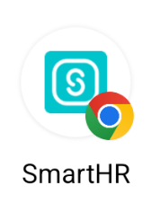
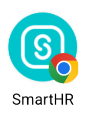

import Grid from '@/components/article/Grid.astro'
import ImgWithDesc from '@/components/article/ImgWithDesc.astro'


ファビコンは主にブラウザのタブやブックマークのシンボルとして、アイコン（タッチアイコン）はスマートフォンやタブレットのホーム画面に追加された際のシンボルとして表示されます。

ここで紹介するのはあくまで推奨している実装例になります。詳細は[利用ガイドライン](/basics/meta/#h2-0)を参照してください。関連するファイルは[ファイルセットのダウンロード](/basics/meta/#h2-2)から取得できます。

## ファビコン

ファビコンはブラウザのタブやブックマークのシンボルとして表示されます。

```html codeBlock
<link rel="icon" href="/favicon.ico">
```

ファビコンはこの一行のみで設定できます。`href`にはファビコンの画像ファイルのパスを指定します。`ico`形式の画像ファイルになっていますが、[ダウンロード](/basics/meta/#h2-0)で用意しているのはPNG画像の`ico`ファイルです。

### 補足

- 以前はPNG形式の画像をファビコンとして使用できないブラウザがありましたが、現在では主要なモダンブラウザのすべてでPNG形式がサポートされていますので扱いやすいPNG形式を推奨しています。
- Retinaディスプレイをはじめとする、高解像度・高ピクセル密度のディスプレイが増えていますので、これを受けてファビコンの解像度を高くするために大きめの48x48ピクセルの画像にしています。
- 画像のサイズを48x48ピクセルにしているのは、[Google検索の検索結果に表示されるfaviconは48×48ピクセルの倍数を推奨している](https://developers.google.com/search/docs/appearance/favicon-in-search?hl=ja#guidelines)ためです。


## アイコン（タッチアイコン）

ここで解説するアイコン（タッチアイコン）は、スマートフォンやタブレットのホーム画面に追加された際のシンボルとして表示されるアイコンを指します。

また、そのアイコンのすぐ下に表示されるタイトルも合わせて指定します。スペースが限られるため、短い名称が望ましいです。

```html codeBlock
<link rel="apple-touch-icon" sizes="180x180" href="/apple-touch-icon.png">
<link rel="manifest" href="/manifest.webmanifest">
<meta name="apple-mobile-web-app-title" content="SmartHR">
<meta name="application-name" content="SmartHR">
```

- `<link>`にはアイコンの画像ファイル、またはアイコンの画像ファイルの情報がまとめられたファイルのパスを指定します。
- `<meta>`タグにはホーム画面に表示されるタイトルなどを指定します。前述したとおり、表示領域が狭いため、なるべく短い名前にすることが推奨されています。
- `apple-touch-icon`、`apple-mobile-web-app-title`は主にApple製のOS向けですが、`manifest`に統一されつつあると思われます。ただし、これに関するAppleからの公式のアナウンスがないため現在は両方の設定することを推奨しています。
- `manifest.webmanifest`ファイルはJSONのテキストファイルで、`icons`や`name`、`short_name`などの設定項目があり、ホーム画面に追加された際に表示するアイコンやタイトルなどを指定できます。

### 補足

apple-touch-iconのサイズを180x180サイズにしているのは、[Configuring Web Applications](https://developer.apple.com/library/archive/documentation/AppleApplications/Reference/SafariWebContent/ConfiguringWebApplications/ConfiguringWebApplications.html)でRetinaのiPadで推奨されているサイズであり、それより小さいサイズのアイコンが必要な場合はこのサイズのアイコンが使用されるためです。

### maskableアイコン

[ダウンロード](/basics/meta/#h2-0)に含まれる`manifest.webmanifest`ファイルには、`icons`の項目に次のような`purpose`に`maskable`の指定と、そのためのアイコンを用意しています。

```json codeBlock
{ "src": "/icons/maskable-icon-192x192.png", "sizes": "192x192", "type": "image/png", "purpose": "maskable" }
```

これはOS（主にAndroid）によってはホーム画面に追加するアイコンの形状が四角いものではなく、例えば円形に表示されるようなケースがあり、そういったケースでもアイコンが見栄えよく表示されるようにするための設定です。

下記はAndroidでホーム画面に追加した際のアイコンの表示例です。表示に通常のアイコンが使用された場合とmaskableアイコンが使用された場合の比較になります。

<Grid autoRepeat="auto-fill" size="100px">

  <ImgWithDesc description="通常のアイコン">

  

  </ImgWithDesc>

  <ImgWithDesc description="maskableアイコン">

  

  </ImgWithDesc>

</Grid>

maskableアイコンにはセーフゾーンという確実に表示される領域が定義されています。独自にmaskableアイコンを用意する場合は、アイコンがこのセーフゾーンに収まるようにしてください。セーフゾーンの詳細については、W3Cの[Icon masks and safe zone](https://www.w3.org/TR/appmanifest/#icon-masks)を参照してください。

#### 補足

maskableアイコンは必ずしも設定する必要はありません。Androidのホーム画面に表示されるアイコンの見栄えにこだわる必要がないケースでは、わざわざmaskable用のアイコンを用意しなくても構いません。
実際の状況に合わせて適宜検討してください。


## 非推奨の設定

以下のような設定は、現在ではサポートされていないバージョンのブラウザ向けの設定であるため、記述する必要はありません。

```html codeBlock
{/*  ❌Windows 8、10とIEで、スタートメニューのタイルを飾るために使われることが主目的のメタタグです  */}
<meta name="msapplication-TileColor" content="#da532c">
<meta name="msapplication-TileImage" content="/mstile-150x150.png">
<meta name="msapplication-config" content="/browserconfig.xml">
```

```html codeBlock
{/*  ❌Safariのピン留め用アイコンですが、現在はファビコンが使われるようになっています  */}
<link rel="mask-icon" color="#5bbad5" href="/safari-pinned-tab.svg">
```

```html codeBlock
{/*  ❌shortcutを書かずただの"icon"でもfaviconの指定と解釈されるので、shortcutと書く必要はありません  */}
<link rel="shortcut icon" href="/favicon.ico">
```
