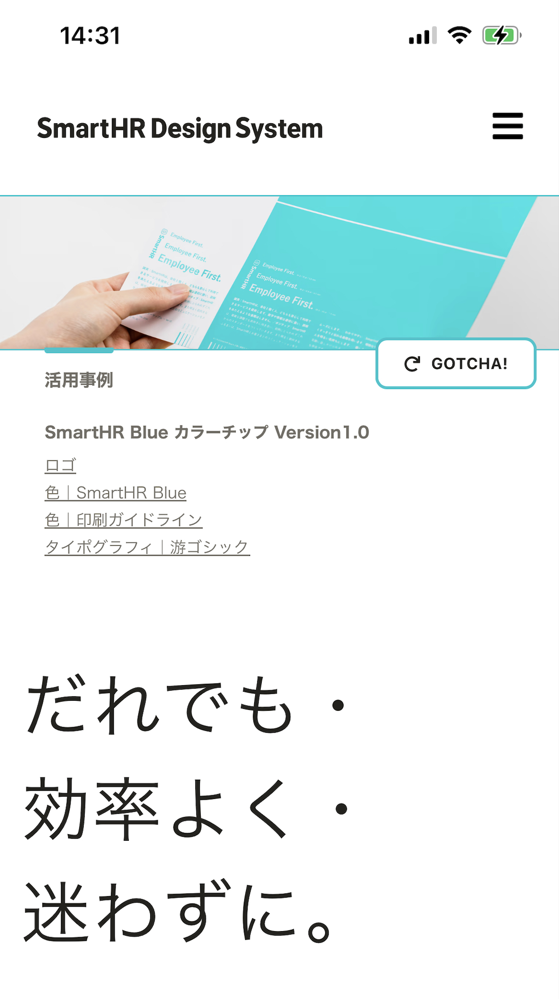
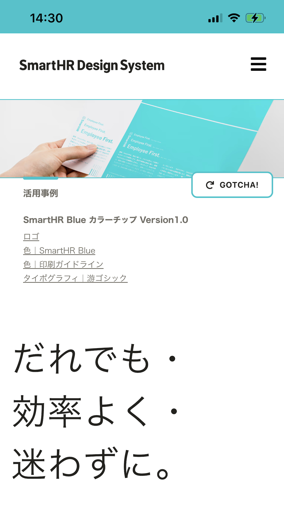

import { Grid } from '@Components/shared/Grid/Grid'
import { ImgWithDesc } from '@Components/article/ImgWithDesc/ImgWithDesc'

テーマカラーが指定されていると、特定のOS・ブラウザのユーザーインターフェイスの一部の色を変更できます。ブラウザは指定された色をページのタイトルバーやタブバーに使用します。

テーマカラーは必ずしも指定する必要はありません。例えば指定することでブランドカラーが強調され、それが有用なケースで指定すると良いでしょう。

指定するかしないか、またはどの色を指定するかはサイトやサービスの施策に合わせて検討してください。

```html codeBlock
<meta name="theme-color" content="#00c4cc">
```

<Grid autoRepeat="auto-fill" size="300px">

  <ImgWithDesc description="テーマカラーなし">

  

  </ImgWithDesc>

  <ImgWithDesc description="テーマカラーあり">

  

  </ImgWithDesc>

</Grid>

## 注意点

テーマカラーに指定する色は[MDNのtheme-colorのページ](https://developer.mozilla.org/ja/docs/Web/HTML/Element/meta/name/theme-color)では「推奨色」とされています。
これは、指定した色がアクセシビリティの観点から不適切とOSやブラウザから判断された場合などに、自動的に調整される可能性があるためだと考えられます。その点も考慮してテーマカラーを指定してください。
