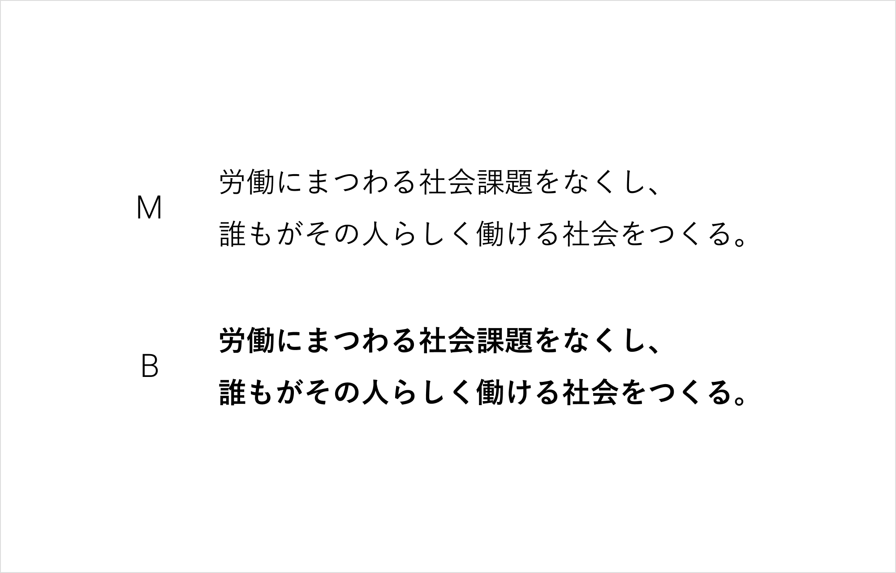

タイポグラフィとは、レイアウトや文字による視覚伝達法です。
文字を適切に扱うことは、ロゴと並ぶ最も重要な振る舞いです。
印刷やデジタル問わずあらゆる媒体で共通のフォントを使用することで、ユーザーが日常的・無意識的に受け取るブランドの印象を醸成します。

## 選定フォント

SmartHRでは、「游ゴシック体」を採用しています。  
字面が小さめに設計されていて全体的にゆとりがあるため、一文字ごとの識別性に優れている、長文でも読みやすいスタンダードなフォントです。
人事労務の業務や関連する法制度などを説明するコミュニケーションが欠かせないSmartHRにとっては、相性の良いフォントです。
加えて、一般的なゴシック体と比較して文字のエレメントに丸みが施されていることで、やわらかさや親しみやすい印象を与えられます。

游ゴシック体にはLからHの7種類のウェイト展開があります。SmartHRにおける推奨ウェイトは、MとBの2種類です。

## 利用範囲
macOSやWindowsに標準インストールされているシステムフォントなので、基本的にすべての従業員が游ゴシック体を利用できます。

## 利用シーン
ブランドの印象を重要視するシーンでは、游ゴシック体を推奨します。
必ず游ゴシック体を利用する必要はありません。媒体の特性や目的、意図を汲み取ってフォントを選択してください。

例
- バナー・アイキャッチ
    - 比較的制限が少なく、自由度高くフォントを選定できます。テンプレート化して誰でも利用できる状態にする場合、游ゴシックなどのシステムフォントを利用するのがよいでしょう。
- プロダクト
    - デザイナー以外の職種のメンバーが、デザインモックの作成をする場合もあるでしょう。あらゆるメンバーがデザインモックを触れるようにするためにも、全従業員が利用できるフォントを利用することをおすすめします。
    - また、動作が重くなったりするといった懸念があります。ユーザーやプロダクトの特性を鑑みて、フォントを選定しましょう。
- ウェブサイト
    - ホームページなどにも推奨フォントを適用しようとした場合に、ウェブフォントが必要になったり、動作が重くなったりするといった懸念があります。そのため、フォントの印象が体験を左右するようなサイトにおいてのみウェブフォントを適用するなど、利用シーンはプロジェクトの性質に合わせて適宜判断します。

## フィードバック先
フォントの利用方法に関する相談・フィードバック

- 株式会社SmartHR info@smarthr.co.jp
- 社内Slack `#design_system_相談`