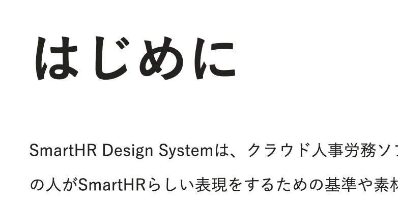
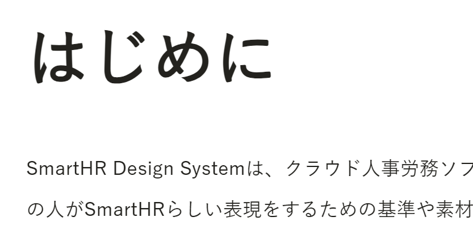

SmartHRが採用している游ゴシック体はmacOSやWindowsに標準インストールされているシステムフォントです。基本的にすべての従業員が游ゴシック体を利用できるため、別途ウェブフォントを入れる必要がないという利点があります。ですが、CSSで游ゴシック体を指定する際に注意が必要です。

ここでは、ウェブサイトで游ゴシック体を利用するとき、どのようにCSSを書けばよいか、なぜそのように書くのかを説明します。ただし、これは2023年9月時点のもので、将来的に状況が変わっていく可能性があることも留意してください。

## 游ゴシック体のCSSでの指定方法

CSSで次のように指定してください。font-familyの値である`AdjustedYuGothic`の部分は任意の名称で構いません。

```css
@font-face {
  font-family: AdjustedYuGothic;
  font-weight: 400;
  src: local("Yu Gothic Medium");
}

@font-face {
  font-family: AdjustedYuGothic;
  font-weight: 700;
  src: local("Yu Gothic Bold");
}

html {
  font-family: AdjustedYuGothic, Yu Gothic, YuGothic, sans-serif;
}
```

### なぜこのような対策が必要なのか

macOS、Windowsともに游ゴシック体は標準インストールされていますが、WindowsではmacOSよりも文字が細く見えるという問題があります。

これは游ゴシック体のフォントに含まれるウェイトがmacOSとWindowsで異なるためです。

|          |  weight |  Windows |  macOS  |
|  ---     |  :---   |  :---    | :---    |
|  Light   |  300    |  ○       | ×       |
|  Regular |  400    |  Default | ×       |
|  Medium  |  500    |  ○       | Default |
|  Bold    |  700	   |  ○       | ○       |

そして、ブラウザデフォルトの`font-weight: normal;`（`font-weight: 400;`）で適用される游ゴシック体のウェイトは、WindowsとmacOSで異なります。

つまり、CSSで対策をせずにただ游ゴシック体を指定した場合、macOSではMediumが、WindowsではRegularのウェイトが適用されることになります。その結果、macOSとWindowsで見え方が異なる問題が発生します。

下記は何も対策をしていない状態でのmacOSとWindowsでの見え方の違いです。

|  macOS   |  Windows |
|  ---     |  ---     |
|  ||


### 対策の詳細

この問題に対応するためには、@font-faceを利用します。@font-faceは複数の異なるフォントを組み合わせてCSS上で独自にファミリーを定義できます。
一方で、srcディスクリプタにlocal()構文を用いることで、ローカルにあるフォントを指定できます。

この特性を利用してWindowsのfont-weightの指定をmacOSに合わせるようにしています。

### Tailwind CSSの場合

メインとなるCSSに同様の指定を書き加えてください。

```css
@tailwind base;
@tailwind components;
@tailwind utilities;

@font-face {
  font-family: AdjustedYuGothic;
  font-weight: 400;
  src: local("Yu Gothic Medium");
}

@font-face {
  font-family: AdjustedYuGothic;
  font-weight: 700;
  src: local("Yu Gothic Bold");
}

@layer base {
  html {
    font-family: AdjustedYuGothic, Yu Gothic, YuGothic, sans-serif;
  }
}
```
