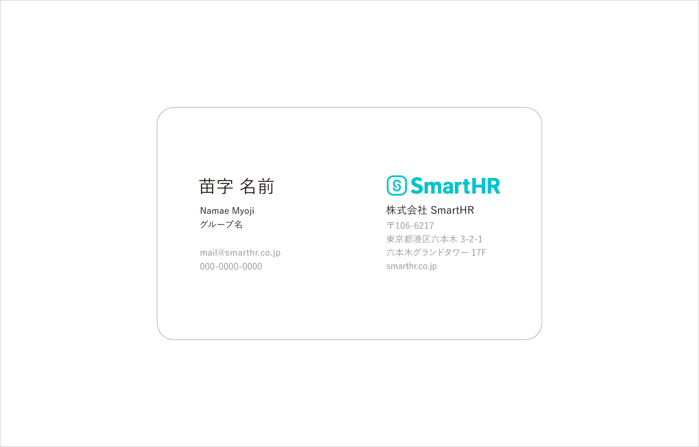
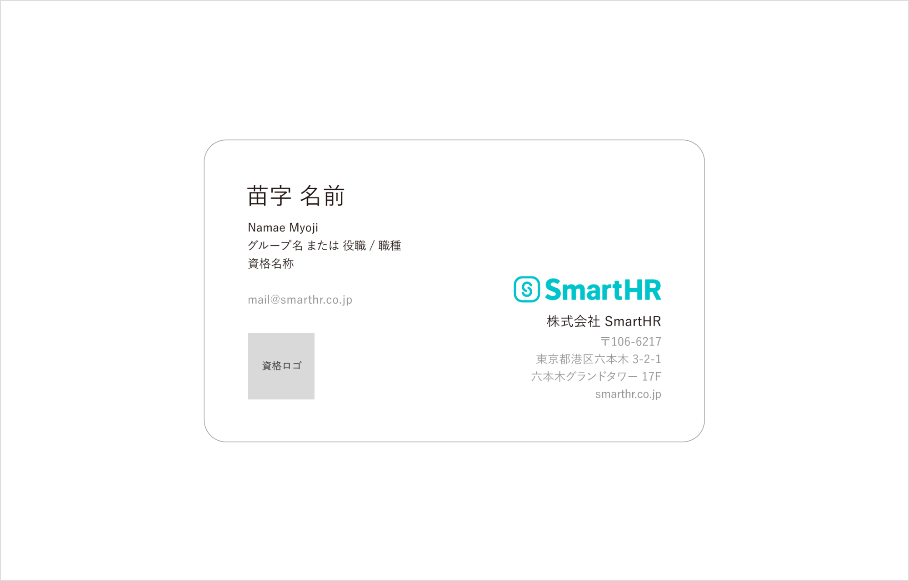
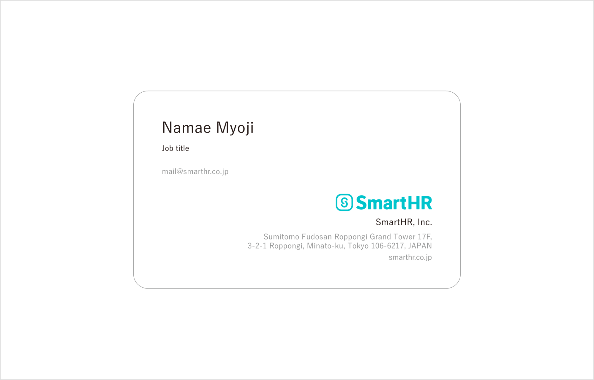

import Grid from '@/components/article/Grid.astro'
import ImgWithDesc from '@/components/article/ImgWithDesc.astro'

名刺は、自分の名前・所属・連絡先などを示すコミュニケーションツールです。

## デザイン
### 表面
名刺表面では、記載する情報量に関わらず一貫して印象が共通になるように、複数のテンプレートを用意しています。
記載したい情報に合わせて、最適なテンプレートを選んで発注してください。

#### デザインパターン例
下記はテンプレートの一例です。その他のテンプレートに関しては、発注画面からご確認ください。

  <ImgWithDesc description="名前、グループ名、連絡先等の基本的な情報を記載するテンプレート例">

  

  </ImgWithDesc>

  <ImgWithDesc description="資格情報を記載するテンプレート例">

  

  </ImgWithDesc>

  <ImgWithDesc description="英語表記のテンプレート例">

  

  </ImgWithDesc>

### 裏面

名刺裏面のデザインは1種類です。

2022年12月15日以降に発注をした名刺は、「[SmartHR Blue カラーチップ Version1.0](https://smarthr.design/basics/colors/printguideline/#h2-0)」 （以下「カラーチップ」）と同じインキで印刷をしています。  
そのため[SmartHR Blue](https://smarthr.design/basics/colors/#h3-1)の正確な色味を確認するためのアイテムとしても利用できます。

#### 色の確認に利用する場合
名刺裏面は、社内外で色見本として共有し、目指す色の認識を揃える色校正などの確認をする際に使用できます。

##### 注意事項
- **正確な色を確認できるのは2022年12月15日以降に発注をした名刺に限ります。** それ以前に発注をした名刺は別のインキで印刷しているため、色の確認時の利用は推奨しません。
- 名刺の保存状態によっては色が退色してしまう恐れがあるため、色の確認をする場合は注意してください。
- サービス／ブランドコミュニケーションデザイン部のメンバーが色の指定・確認をする際は、カラーチップを利用してください。
    - 実務上はこの名刺を色見本として使っても問題ない精度になっていますが、用紙の違いなどにより、カラーチップと完全に同じ色を再現できているわけではないため。

## 発注方法
発注方法については、下記Docbaseのリンク先を参照してください。  
[シン名刺発注システム(corezo)マニュアル | DocBase](https://smarthr-inc.docbase.io/posts/2430488)

## フィードバック先
名刺の利用方法に関する相談・フィードバック
- SmartHR Design System 運営チーム smarthr-design-system@smarthr.co.jp
- 社内Slack `#design_communication`
