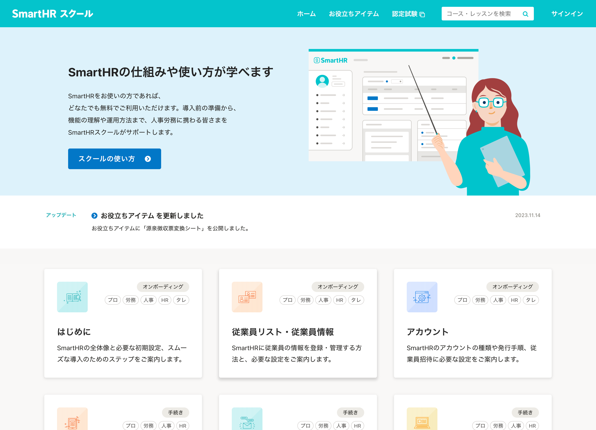
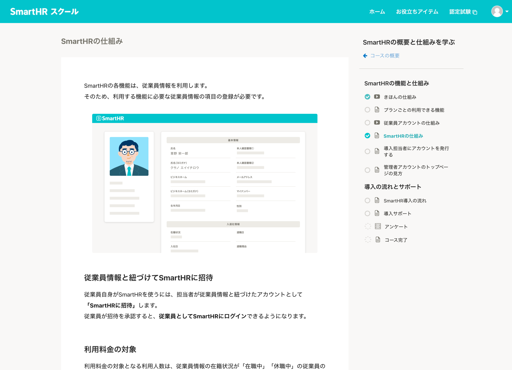
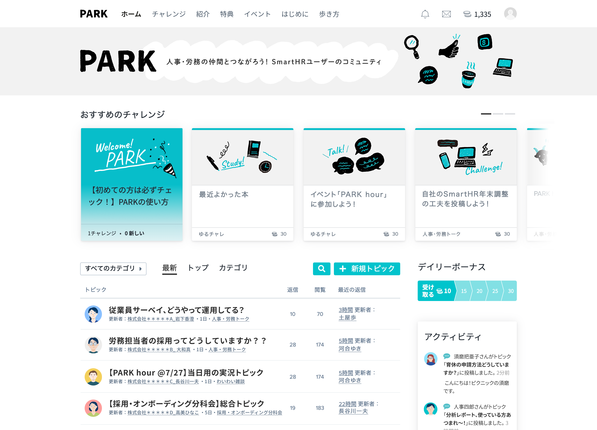
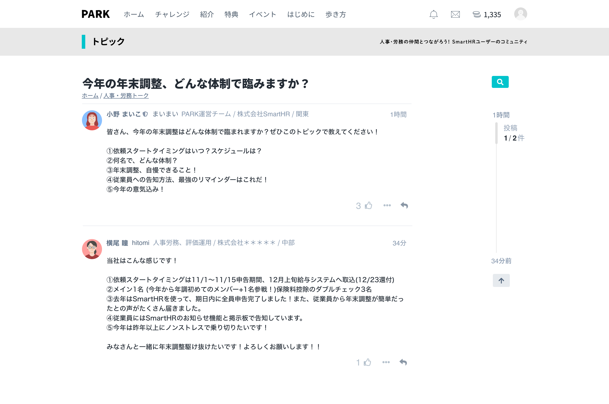
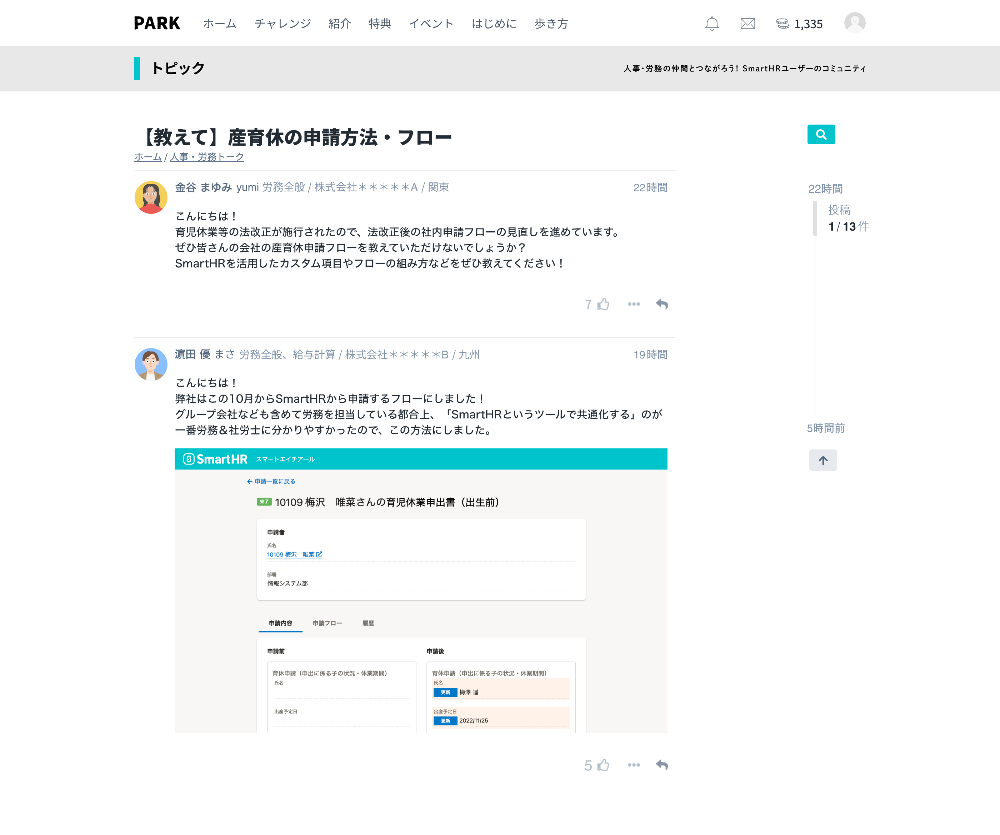
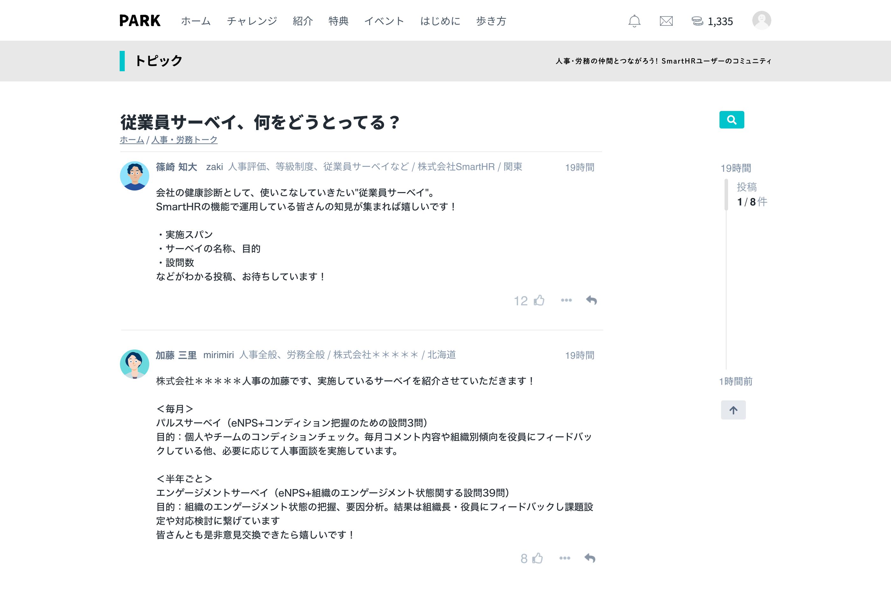

import Grid from '@/components/article/Grid.astro'
import CaptureImageWithDesc from '@/components/article/CaptureImageWithDesc.astro'

利用頻度が高いプロダクト以外の画面キャプチャを選定して掲載しています。  
未掲載を含むすべての画面キャプチャは[プロダクトキャプチャ | Google ドライブ](https://drive.google.com/drive/folders/1PT1gK4rrz8DufFkFc2r3Z_xpp03YxHwC)からアクセスできます。

サイトにアクセスするすべての人が参照できますが、利用に関しては[利用者・利用範囲](#h2-3)を確認してください。

## SmartHRスクール

### トップページ

SmartHRスクールを代表する画面です。

<Grid autoRepeat="auto-fill" size="250px">

  <CaptureImageWithDesc>

  

  </CaptureImageWithDesc>

</Grid>

### レッスンページ

SmartHRスクールの受講画面です。

<Grid autoRepeat="auto-fill" size="250px">

  <CaptureImageWithDesc>

  

  </CaptureImageWithDesc>

</Grid>

## PARK（オンラインコミュニティ）

### トップページ

PARK（オンラインコミュニティ）を代表する画面です。

<Grid autoRepeat="auto-fill" size="250px">

  <CaptureImageWithDesc>

  

  </CaptureImageWithDesc>

</Grid>

### トピックページ

<Grid autoRepeat="auto-fill" size="250px">

  <CaptureImageWithDesc description="年末調整について">

  

  </CaptureImageWithDesc>

  <CaptureImageWithDesc description="産育休の申請方法・フローについて">

  

  </CaptureImageWithDesc>

  <CaptureImageWithDesc description="従業員サーベイについて">

  

  </CaptureImageWithDesc>

</Grid>

## SmartHR Mag.
### トップページ

SmartHR Mag.を代表する画面です。

[SmartHR Mag.のキャプチャ | Google ドライブ](https://drive.google.com/drive/u/1/folders/16v9NMGRSYBzPS0mSMYhlo2Wmqv6gA9FF)

## 利用者・利用範囲

サイトにアクセスするすべての人が参照できますが、利用には一部制限があります。
画面キャプチャ（その他）の利用者と利用範囲は以下のとおりです。

  <table>
    <thead>
      <tr>
        <th>利用者</th>
        <th>名義</th>
        <th>利用可否</th>
      </tr>
    </thead>
    <tbody>
      <tr>
        <td>SmartHR従業員</td>
        <td>サービスSmartHR 株式会社SmartHR</td>
        <td><strong>◯ 利用できます</strong></td>
      </tr>
      <tr>
        <td>SmartHR従業員</td>
        <td>SmartHR Plus</td>
        <td><strong>◯ 利用できます</strong></td>
      </tr>
      <tr>
        <td>SmartHR従業員</td>
        <td>SmartHRグループ会社と その提供サービス</td>
        <td>× 利用できません</td>
      </tr>
      <tr>
        <td>SmartHR外部パートナー</td>
        <td>サービスSmartHR 株式会社SmartHR</td>
        <td><strong>◯ 利用できます</strong></td>
      </tr>
      <tr>
        <td>SmartHR Plusパートナー</td>
        <td>SmartHR Plusパートナーが 提供するアプリ</td>
        <td>× 利用できません</td>
      </tr>
      <tr>
        <td>SmartHRグループ会社 従業員</td>
        <td>SmartHRグループ会社と その提供サービス</td>
        <td>× 利用できません</td>
      </tr>
      <tr>
        <td>すべてのかた 広報担当者のかた</td>
        <td>SmartHRの広報活動</td>
        <td><strong>◯ 利用できます</strong></td>
      </tr>
    </tbody>
  </table>

ほかのコンテンツの利用範囲は[利用者のかたへ](/introduction/user/)を参照してください。

## ライセンス情報
本ページ内のコンテンツについては、[画面キャプチャのライセンス情報](/communication/capture/#h2-2)を参照のうえご利用ください。
