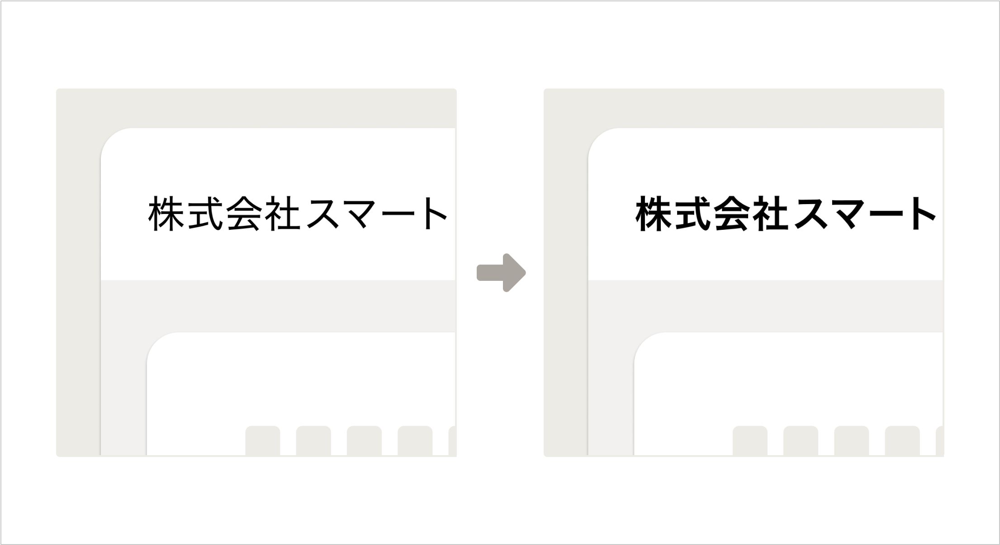

import Grid from '@/components/article/Grid.astro'
import ImgWithDesc from '@/components/article/ImgWithDesc.astro'

プロダクトの画面キャプチャや、その他ウェブサイトの画面キャプチャを作成する際のガイドラインです。
このガイドラインでは、一貫性があり、わかりやすく、見栄えのよい画面キャプチャの作成をサポートします。

## 適用範囲
- [ヘルプセンター](https://support.smarthr.jp/ja/)以外の媒体や資料に掲載する画面キャプチャ  
    - ヘルプセンターに掲載する画面キャプチャを作成するときは、[キャプチャ・加工のルール | DocBase](https://smarthr-inc.docbase.io/posts/1836257) を参照してください。

## 注意点
要素を調整するさい、実際には利用できない機能やサービスが、利用できそうに見えうる表現にはならないように注意しましょう。

## 作成方法
### ツールの選定
目的に合わせて作成するツールを選定します。静止画の場合はFigma、アニメーション制作の場合はAdobe Illustratorなど、作成する画面キャプチャの用途に合わせて選定してください。
#### Figmaでつくる
- [画面キャプチャ](https://smarthr.design/communication/capture/)に掲載しているアセットの一部は、[画面キャプチャ | Figma](https://www.figma.com/file/rQRf0ysE4Lk7tZcd2aS4rG/%E7%94%BB%E9%9D%A2%E3%82%AD%E3%83%A3%E3%83%97%E3%83%81%E3%83%A3?type=design&node-id=0%3A1&mode=design&t=LQq1M5xNr2Crd6qN-1) のデザインデータを利用できます。
- SmartHRのUIコンポーネントや色やタイポグラフィは、[SmartHR UI](https://smarthr.design/products/design-process/design-data/design-guide/#h3-0) を利用できます。
- 余白や影などの要素で迷うことがあれば、[デザイントークン](https://smarthr.design/products/design-tokens/) を参照してください。

#### Adobe IllustratorやAdobe Photoshopでつくる
- 色やタイポグラフィや余白などの要素で迷うことがあれば、[デザイントークン](https://smarthr.design/products/design-tokens/) を参照してください。

### 内容の調整
画面キャプチャに掲載するあらゆる要素から、受け手がサービスの利用シーンを想像できるようにしましょう。
そのためには、施策の訴求内容や作成する画面キャプチャがどこでどのように利用されるのかを理解する必要があります。

#### 文言や文章
パーソナリティに則り、受け手が体験するサービスや機能と一致する文言や文章にしましょう。  
文章の書き方は、[伝わる文章](https://smarthr.design/basics/text/)も参考にしてください。

#### サンプル
画面キャプチャ内の各種要素には、下記の推奨する表記を反映してください。
適用範囲を限定しない、すべての画面キャプチャで利用できる表記ルールは[サンプルテキスト](https://smarthr.design/communication/sample/text/)を参照してください。

| 要素 | 推奨する表記 | 補足 |
| --- | --- | --- |
| 氏名 | 従業員には、[ユーザー社の従業員](https://smarthr.design/basics/illustration/user-co-other/)に掲載されている氏名を利用しましょう。 |  |
| メールアドレス | 管理者・従業員ともに、`{名前.苗字}@example.com`を使用しましょう。 | 例：yamato.makoto@example.com |
| 企業名 | ユーザー社には、`株式会社スマート`を使用しましょう。|  |
| 従業員番号 | 0064など、半端な数字を使用しましょう。 | 従業員番号一桁台だと役員であるケースも多いため、二桁以上を推奨します。 |
| プロフィール画像 | モデル写真を使用してください。 | 使用する場合は、[モデル写真の注意事項・利用方法（DocBase）](https://smarthr-inc.docbase.io/posts/1933926)を参照してください。 |

### 見た目の調整

#### ウィンドウサイズ
- ウィンドウサイズは、横幅1400pxで作成しましょう。
    - よりよい見栄えになる最適なウィンドウサイズがあれば、ウィンドウサイズを変更しても構いません。
#### フォント
- 可読性を優先して、適宜ウェイトを調整しましょう。
    - 実装されているウェイトのままでは、図版として画面キャプチャを利用する際に可読性を担保できない場合があります。そのときは、読みやすいウェイトに調整しても構いません。

  <ImgWithDesc description="ウェイトの調整例（左：調整前、右：調整後）">

  

  </ImgWithDesc>

#### 色
- 視認性を優先して、色を調整しましょう。
    - 実装されている色のままでは、図版として画面キャプチャを利用する際に視認性を担保できない場合があります。そのときは、見やすい色に調整しても構いません。
- 色を調整するときは、テキストや図形といった要素自体が持つ意味や要素同士の関係性が変わらないようにしてください。

  <ImgWithDesc description="色の調整例（左：調整前、右：調整後）">

  

  </ImgWithDesc>

#### 要素の位置
- テキストや図形といった要素自体が持つ意味や要素同士の関係性が変わらないよう注意しましょう。

#### 要素の表示・非表示
- 画面キャプチャのテキストや図形などの要素を取捨選択することで、より効果的な画面キャプチャを作り上げることができます。
- ウェブサイトやアプリケーションの仕様が正しく受け手に伝わるよう、要素を取捨選択するときは慎重に意思決定しましょう。

## 相談・フィードバック先
画面キャプチャの作成ガイドラインに関する相談やフィードバック  
- 社内Slack　`#design_comm_依頼`
- SmartHR Design System 運営　smarthr-design-system@smarthr.co.jp  
