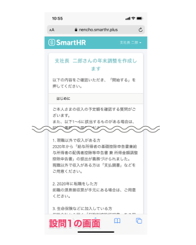
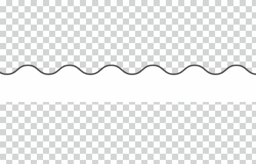
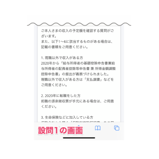
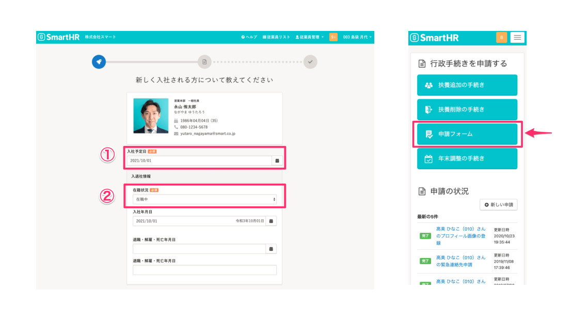

import ColorPalette, ColorPalettesWrapper from '@/components/article/ColorPalette'

import Grid from '@/components/article/shared/Grid/Grid'
import ImgWithDesc from '@/components/article/ImgWithDesc.astro'

画面キャプチャを編集するときに利用できるアイテム群です。  
サイトにアクセスするすべての人が参照できますが、利用に関しては[利用者・利用範囲](#h2-3)を確認してください。

## 端末モック
[端末モック](/communication/mock/)を参照してください。

## 省略線
画面キャプチャを一部省略する際に利用します。  
Keynoteなどで画面キャプチャの上に配置することで簡易合成できます。

| 用途 | 素材イメージ | 使用イメージ | ダウンロード |
| --- | --- | --- | --- |
| キャプチャ中央部省略用 | |　| <a href="/downloads/break-axis_personal-computer-size_center.png" download>パソコンサイズをダウンロード</a> / <a href="/downloads/break-axis_smartphone-size_center.png" download>スマートフォンサイズをダウンロード</a> |
| キャプチャ下部省略用 | |　| <a href="/downloads/break-axis_personal-computer-size_bottom.png" download>パソコンサイズをダウンロード</a> / <a href="/downloads/break-axis_smartphone-size_bottom.png" download>スマートフォンサイズをダウンロード</a> |
| キャプチャ上部省略用 | |　|<a href="/downloads/break-axis_personal-computer-size_top.png" download>パソコンサイズをダウンロード</a> / <a href="/downloads/break-axis_smartphone-size_top.png" download>スマートフォンサイズをダウンロード</a> |

## 注釈の色
画面キャプチャに、枠線やテキストなどの注釈をつける場合に推奨する色です。  

<ColorPalettesWrapper>
 <ColorPalette colorValue="#fc0c59" colorName="Annotaion" description="" />
</ColorPalettesWrapper>

### 使用イメージ

 

## 利用者・利用範囲

サイトにアクセスするすべての人が参照できますが、利用には一部制限があります。
編集キットの利用者と利用範囲は以下のとおりです。

  <table>
    <thead>
      <tr>
        <th>利用者</th>
        <th>名義</th>
        <th>利用可否</th>
      </tr>
    </thead>
    <tbody>
      <tr>
        <td>SmartHR従業員</td>
        <td>サービスSmartHR 株式会社SmartHR</td>
        <td><strong>◯ 利用できます</strong></td>
      </tr>
      <tr>
        <td>SmartHR従業員</td>
        <td>SmartHR Plus</td>
        <td><strong>◯ 利用できます</strong></td>
      </tr>
      <tr>
        <td>SmartHR従業員</td>
        <td>SmartHRグループ会社と その提供サービス</td>
        <td>× 利用できません</td>
      </tr>
      <tr>
        <td>SmartHR外部パートナー</td>
        <td>サービスSmartHR 株式会社SmartHR</td>
        <td><strong>◯ 利用できます</strong></td>
      </tr>
      <tr>
        <td>SmartHR Plusパートナー</td>
        <td>SmartHR Plusパートナーが 提供するアプリ</td>
        <td>× 利用できません</td>
      </tr>
      <tr>
        <td>SmartHRグループ会社 従業員</td>
        <td>SmartHRグループ会社と その提供サービス</td>
        <td>× 利用できません</td>
      </tr>
      <tr>
        <td>すべてのかた 広報担当者のかた</td>
        <td>SmartHRの広報活動</td>
        <td><strong>◯ 利用できます</strong></td>
      </tr>
    </tbody>
  </table>

ほかのコンテンツの利用範囲は[利用者のかたへ](/introduction/user/)を参照してください。
