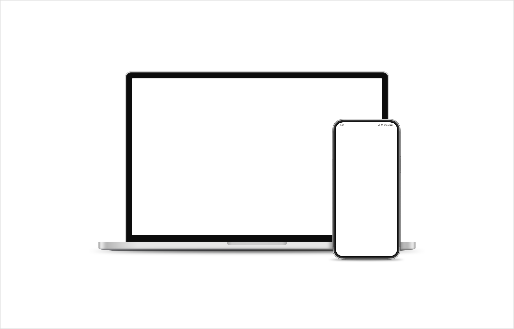
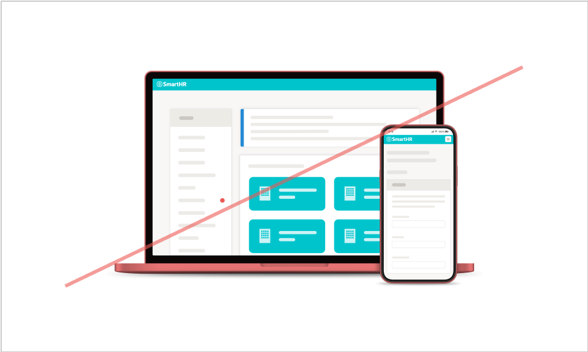
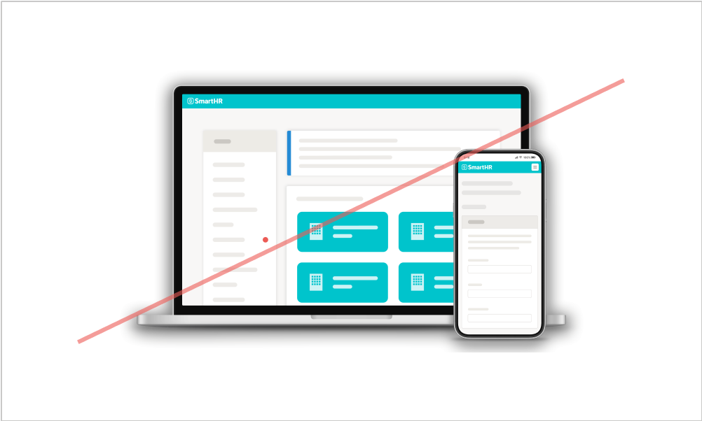

import { ColorPalette, ColorPalettesWrapper } from '@Components/ColorPalette'

import { Grid } from '@Components/shared/Grid/Grid'
import { ImgWithDesc } from '@Components/article/ImgWithDesc/ImgWithDesc'

SmartHRの端末モックです。  
画面キャプチャと合成して利用することで、実際の端末での利用イメージを想起させ、信頼感を与えます。

サイトにアクセスするすべての人が参照できますが、利用に関しては[利用者・利用範囲](#h2-2)を確認してください。

## 利用ガイドライン

端末モックを画面キャプチャと合成する方法は3つあります。  

### 1. Figmaを利用する

Fimgaのアカウントをお持ちの方は「<a href="https://www.figma.com/file/ul8bbn8p3aPIXo0DsjjsA6/%E7%AB%AF%E6%9C%AB%E3%83%A2%E3%83%83%E3%82%AF%E5%90%88%E6%88%90?node-id=723%3A121" target="_blank">端末モック合成 | Figma</a>」を利用して合成してください。  
詳細は従業員限定コンテンツとして動画で解説しています。

###  2. 端末モック透過画像を利用する

KeynoteやGoogleスライドなどのスライド資料の場合、画面キャプチャと端末モック透過画像を重ねて配置することで、簡易的な合成ができます。  
SmartHR従業員は、[端末モック| Googleドライブ](https://drive.google.com/drive/folders/1d0iTFNJZK3flSKQZv9tgkWgtG1rDlvIe?usp=drive_link) よりダウンロードできます。

###  3. コミュニケーションデザインセンターのメンバーに依頼する

社内Slackより作成を依頼してください。
- 社内Slack `#design_comm_依頼`

## 禁止事項
端末モック画像をそのまま使用し、変更を加えないでください。

<Grid>
  <ImgWithDesc description="色味を変更してはいけない">

  

  </ImgWithDesc>

  <ImgWithDesc description="シャドウを加工してはいけない">

  

  </ImgWithDesc>

  <ImgWithDesc description="傾けてはいけない">

  

  </ImgWithDesc>

  <ImgWithDesc description="反転してはいけない">

  

  </ImgWithDesc>

  <ImgWithDesc description="変形してはいけない">

  

  </ImgWithDesc>

  <ImgWithDesc description="同じ画像内で他の端末画像と組み合わせてはいけない">

  

  </ImgWithDesc>
</Grid>

## 利用者・利用範囲

サイトにアクセスするすべての人が参照できますが、利用には一部制限があります。
端末モックの利用者と利用範囲は以下のとおりです。

  <table>
    <thead>
      <tr>
        <th>利用者</th>
        <th>名義</th>
        <th>利用可否</th>
      </tr>
    </thead>
    <tbody>
      <tr>
        <td>SmartHR従業員</td>
        <td>サービスSmartHR 株式会社SmartHR</td>
        <td><strong>◯ 利用できます</strong></td>
      </tr>
      <tr>
        <td>SmartHR従業員</td>
        <td>SmartHR Plus</td>
        <td><strong>◯ 利用できます</strong></td>
      </tr>
      <tr>
        <td>SmartHR従業員</td>
        <td>SmartHRグループ会社・ 提供サービス</td>
        <td><strong>◯ 利用できます</strong></td>
      </tr>
      <tr>
        <td>SmartHR外部パートナー</td>
        <td>サービスSmartHR 株式会社SmartHR</td>
        <td><strong>◯ 利用できます</strong></td>
      </tr>
      <tr>
        <td>SmartHR Plusパートナー</td>
        <td>SmartHR Plusパートナーが 提供するアプリ</td>
        <td><strong>◯ 利用できます</strong></td>
      </tr>
      <tr>
        <td>SmartHRグループ会社 従業員</td>
        <td>SmartHRグループ会社・ 提供サービス</td>
        <td><strong>◯ 利用できます</strong></td>
      </tr>
      <tr>
        <td>すべてのかた 広報担当者のかた</td>
        <td>SmartHRの広報活動</td>
        <td>× 利用できません</td>
      </tr>
    </tbody>
  </table>

ほかのコンテンツの利用範囲は[利用者のかたへ](/introduction/user/)を参照してください。

## フィードバック先
端末モックに関する相談やフィードバック  
- 社内Slack　`#design_comm_依頼`
- SmartHR Design System 運営　smarthr-design-system@smarthr.co.jp  
