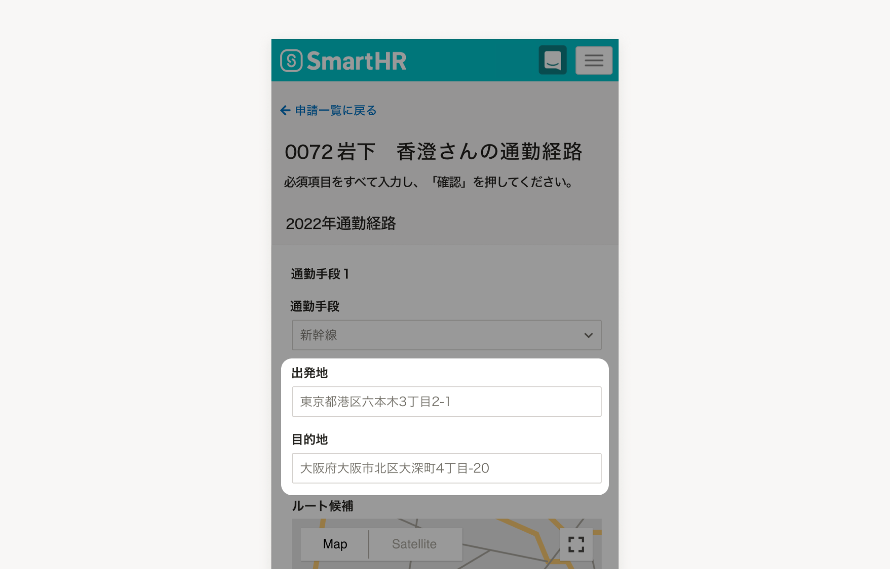

SmartHRのサービス全体で利用できるサンプルテキストです。

## ガイドライン
- SmartHRに関するさまざまなシーン、例えば営業資料・サービスサイト・ヘルプセンターなど、媒体を問わずどこでも利用できます。
- 利用シーンに応じて、情報の取捨選択や適切な表記法を選択してください。
- 必ず、サンプルテキストを利用する前に [画面キャプチャ作成時の必須事項｜DocBase](https://smarthr-inc.docbase.io/posts/3763976)を参照してください。

## 利用シーン例
- プロダクトの入力例が表示されているプレースホルダー
- 画面キャプチャのユーザー情報

## サンプルテキスト一覧

### 従業員情報

| 項目 | 推奨する表記 | 補足 |
| --- | --- | --- |
| 従業員氏名 | **[ユーザー社の従業員](https://smarthr.design/basics/illustration/user-co-other/)に掲載されている氏名を利用** |  |
| メールアドレス | **\{名前.苗字\}@example.com** | 例：yamato.makoto@example.com |
| 従業員番号 | **0064など、半端な数字を使用** | 従業員番号一桁台だと役員であるケースも多いため、二桁以上を推奨します。 |

### 企業名

import { Table, Th, Td } from 'smarthr-ui'
import TableReel from './_components/TableReel'

<TableReel>
<Table>
  <thead>
    <tr>
      <Th>シーン</Th>
      <Th style={{ minWidth: "12em" }}>推奨する表記</Th>
      <Th>補足</Th>
    </tr>
  </thead>
  <tbody>
    <tr>
        <Td>1社記載</Td>
        <Td><strong>株式会社＊＊＊＊＊</strong></Td>
        <Td>
            <ul>
                <li>「全角のアスタリスク5つ」を基本とする。</li>
                <li>スマートフォンなど横幅が短い場面ではアスタリスク3つ「株式会社＊＊＊」に短縮OK。</li>
            </ul>
        </Td>
    </tr>
    <tr>
        <Td>複数社記載</Td>
        <Td><strong>株式会社＊＊＊＊＊A 株式会社＊＊＊＊＊B 株式会社＊＊＊＊＊C</strong></Td>
        <Td>
            <ul>
                <li>「全角のアスタリスク5つ＋アルファベット」を基本とする。</li>
                <li>場面に応じて「＊」の個数および「A,B,」の表現は調整はOK。</li>
            </ul>
        </Td>
    </tr>
    <tr>
        <Td>社名を日本語表記にしたい場合</Td>
        <Td><strong>株式会社SmartHR</strong></Td>
        <Td>自社名とする</Td>
    </tr>
  </tbody>
</Table>
</TableReel>

### その他

| 項目 | 推奨する表記 | 補足 |
| --- | --- | --- |
| 住所 | **〒106-6217 東京都港区六本木3-2-1 住友不動産六本木グランドタワー** | 2つ以上掲載したい場合は、[コーポレートサイト](https://smarthr.co.jp/company/)を参照し、支社の住所を使用してください。 |
| 固定電話番号 | **03-1234-5678** | 2つ以上掲載したい場合は、先頭を「03」にして、以降は0から9までの整数を順に記載してください（例：03-2345-6789） |
| 携帯電話番号 | **080-1234-5678** | 2つ以上掲載したい場合は、先頭を「080」にして、以降は0から9までの整数を順に記載してください（例：080-2345-6789） |

## フィードバック先
サンプルテキストの利用方法に関する相談・フィードバック

- 社内Slack　`#design_system_相談`
