SmartHRのスライド・資料のKeynoteテンプレートです。

サイトにアクセスするすべての人が参照できますが、利用に関しては[利用者・利用範囲](#h2-3)を確認してください。

## 営業資料テンプレート
株式会社SmartHRの営業資料のKeynoteテンプレートです。ファイルをダウンロードして活用できます。

### 利用シーン
このテンプレートは各ページにタイトルが配置されるレイアウトで構成されているため、ページ単位で情報を共有する機会に適しています。スライド単体でも資料として機能させたいようなシーンに適しています。具体的には以下のようなシーンを想定しています。
- お客さまにお渡しする提案資料を作成するとき
- ウェビナーで使用する機能説明用のスライドを作成するとき

### テンプレートに収録されている内容

- 使用時のルール
    - レイアウトガイド、テキストのルール、画像の置き方、周囲の余白の取り方などの基本的なデザイン上のルールをまとめて記載されています。スライド作成前に一読してください。
     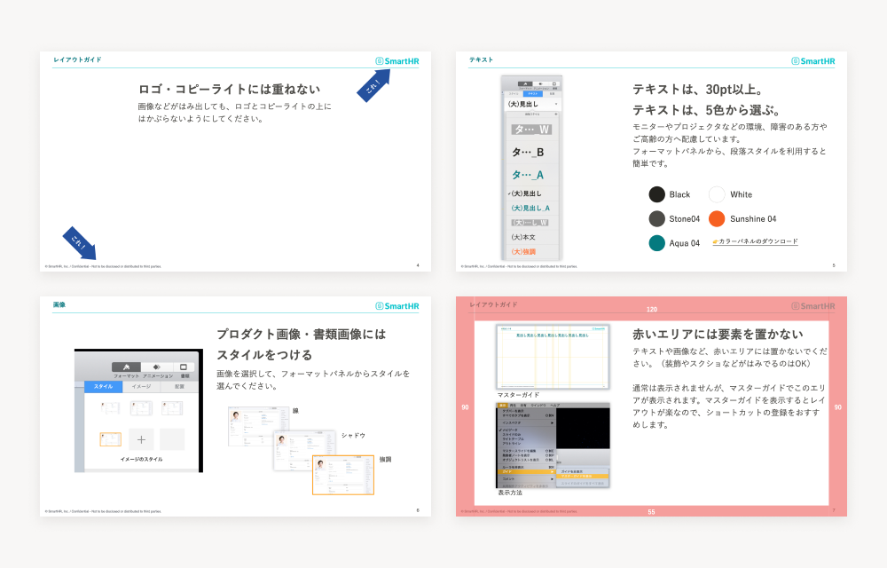

- スライドレイアウト集
    - プロダクトキャプチャを見せるレイアウトや、タイトルを目立たせたスライドなどの、複数のレイアウトのスライドを収録しています。資料の見せ方や構成に合わせて、活用してください。
    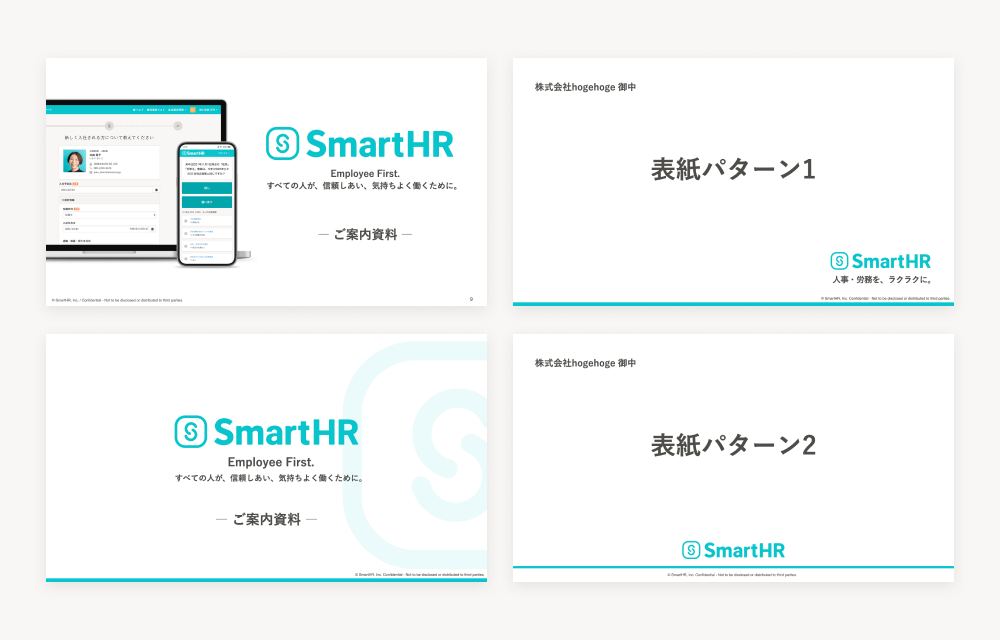

    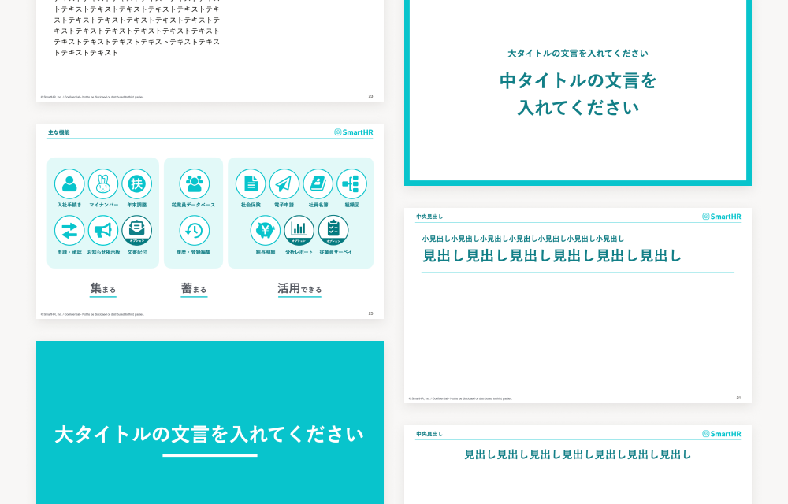

    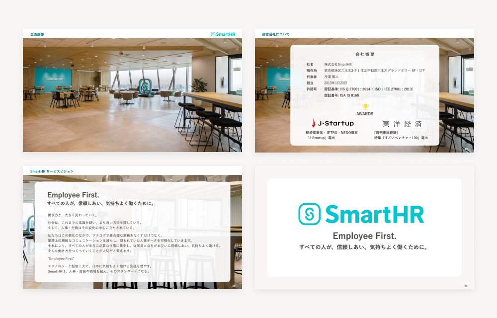

- コピーアンドペーストで使えるキット
    - スライド作成時の利用頻度が高いと想定される各種オブジェクトの素材として、コピーアンドペーストしてそのまま使えるキットが収録されています。スライドで訴求したい内容に合わせて、コピーアンドペーストして活用してください。

    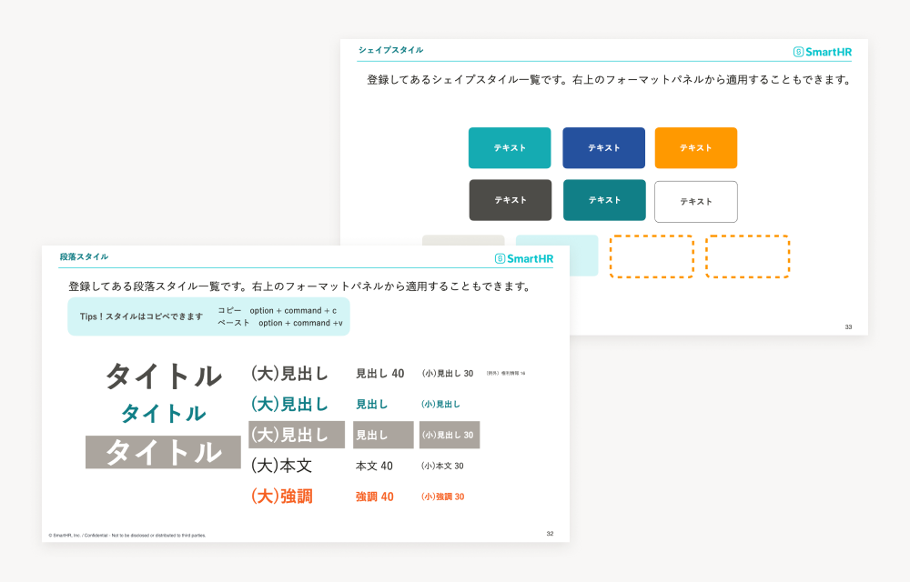

    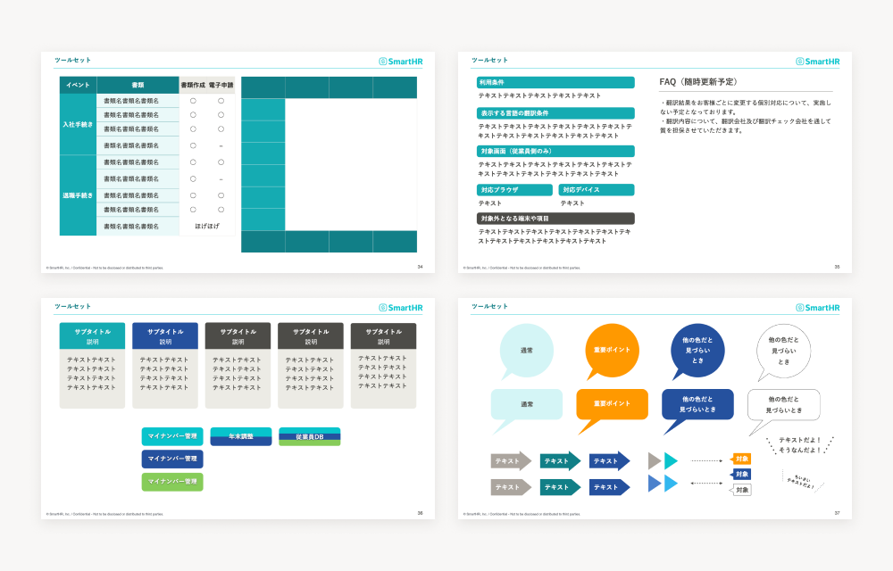

    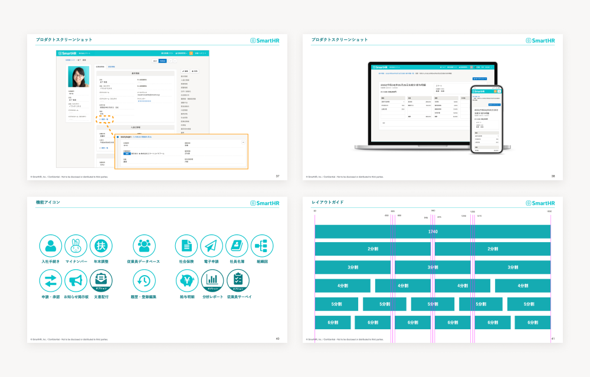

### Keynoteの効率アップTips

* Keynoteのマイテーマに保存する
    * ダウンロードして開いたスライドをマイテーマ保存しておくと、Keynoteのテーマから選べるようになります。
         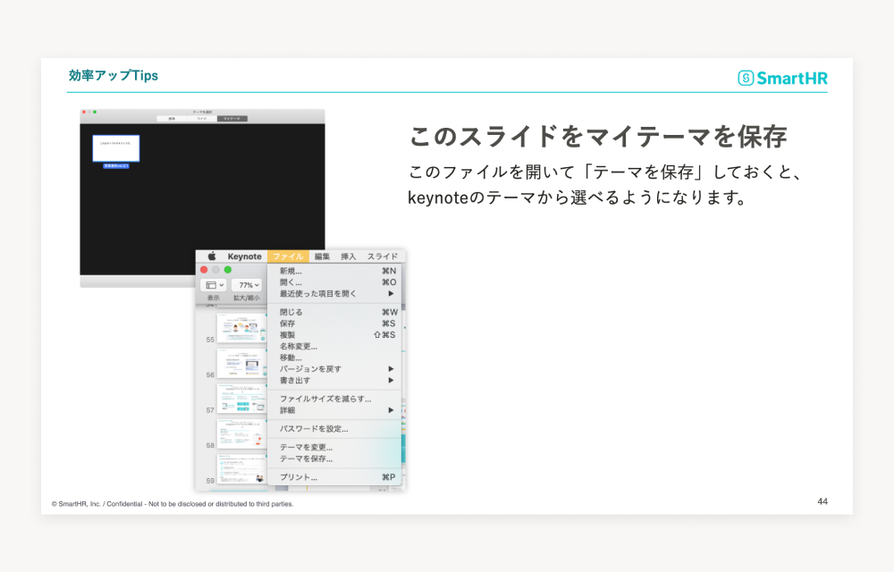

* 検索機能でテキストを一括変換
    * Keynoteの検索機能を使うと、スライド内のテキストを検索・置換できます。社名を一括変換するときなどに活用できます。
        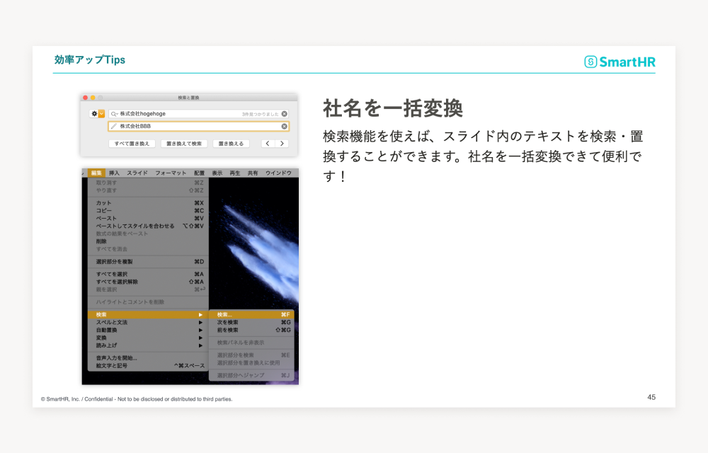

* スライドをネストする
    * ドラッグアンドドロップで、スライドをネストして整理できます。ページ数が多い資料などではこの方法で整理することでファイルが扱いやすくなります。
        

* テキストボックスに現れる十字アイコン
    * テキストエリアにテキストが入りきっていないアラートです。不要な改行・不要なテキストを削除しましょう。
        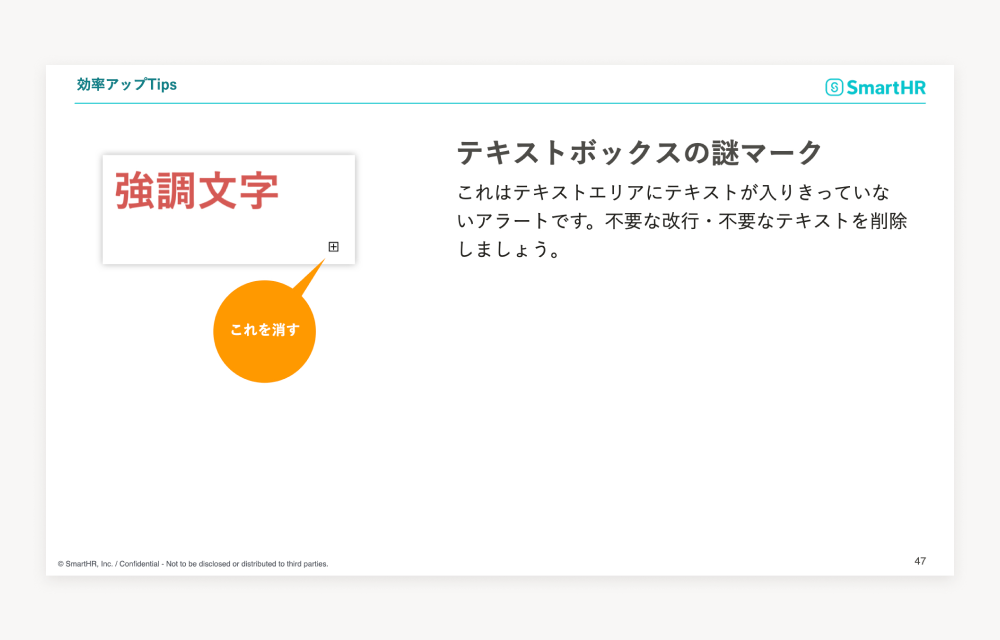

## 資料テンプレート
株式会社SmartHRの資料のKeynoteテンプレートです。ファイルをダウンロードして活用できます。Keynote、Google Slides、PowerPointの3種類があります。

### 利用シーン
このテンプレートはレイアウトの自由度が高く、情報の緩急を調整できるフォーマットになっているので、メッセージを明確に伝えるためにコピーを大きく見せたい場面や、ビジュアルを見せながらプレゼンテーションをする機会など、口頭で補足しながらプレゼンテーションをする機会に適しています。具体的には以下のようなシーンを想定しています。
- イベントの登壇で使用するスライドを作成するとき
- 社内のキックオフイベントなどメッセージ性の高い情報を多く扱うとき

### テンプレートに収録されている内容
- レイアウトテンプレート
    - スライドを構成する基本になるテンプレートが収録されています。
    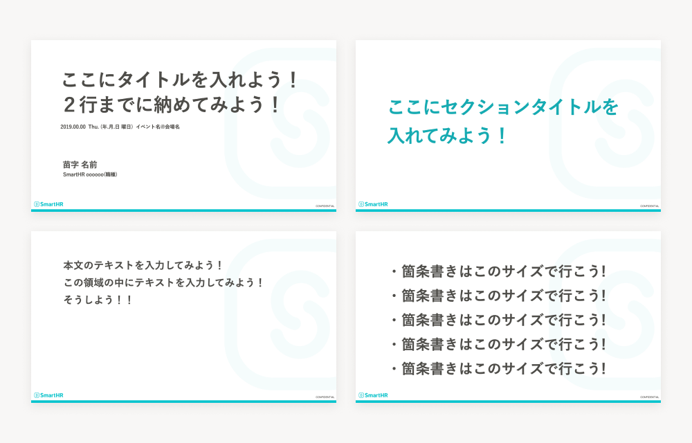

- フォント・カラーガイド
    - スライド内で使用を推奨しているフォントやカラーの規定を記載しています。
    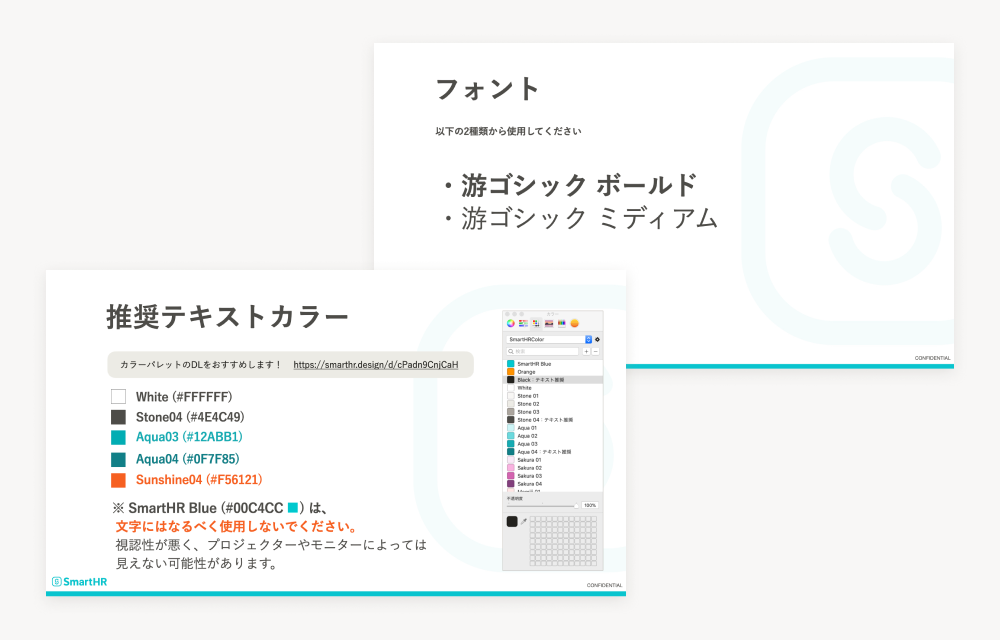

- ロゴ素材
    - 資料内でSmartHRのロゴが使いやすいように、あらかじめ配置してあります。コピーするなどして適宜活用ください。
    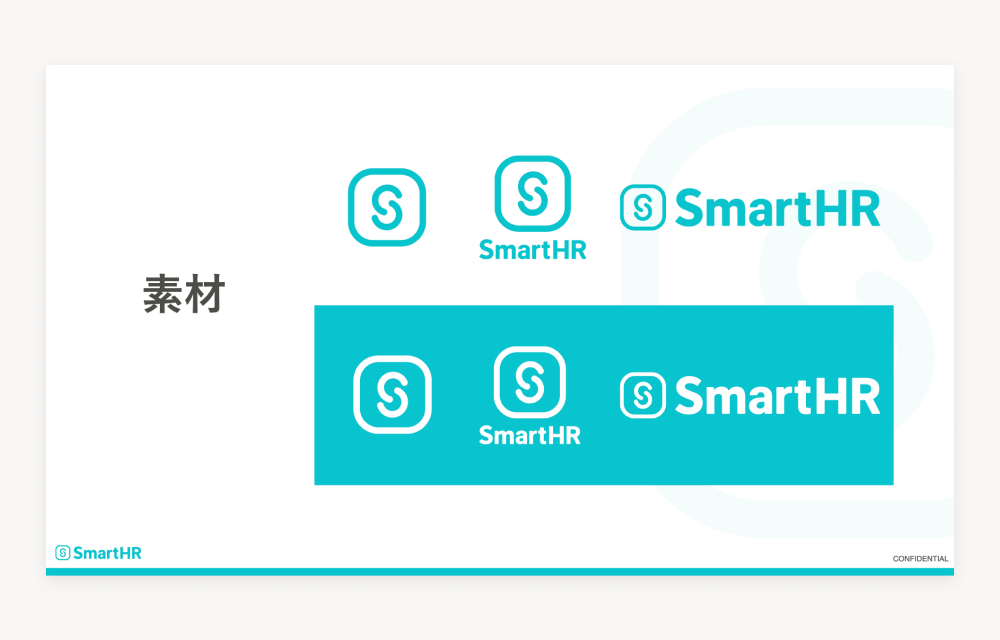

- イラスト素材
    - 公式のイラスト集へのリンクを設置しているので、表現したい場面に合わせて適宜活用してください。
    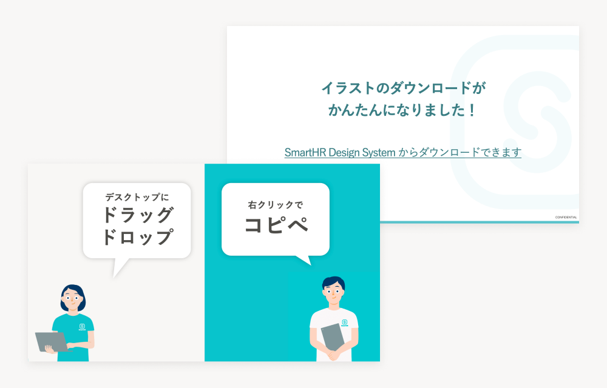

- グラフ
    - 推奨パターンと非推奨パターンそれぞれの見せ方のパターンを記載しています。カラーガイドの規定に沿って表現するにあたってグラフのカラーリングは重要になるので、非推奨にあたる表現に一度目を通し、作成してください。
    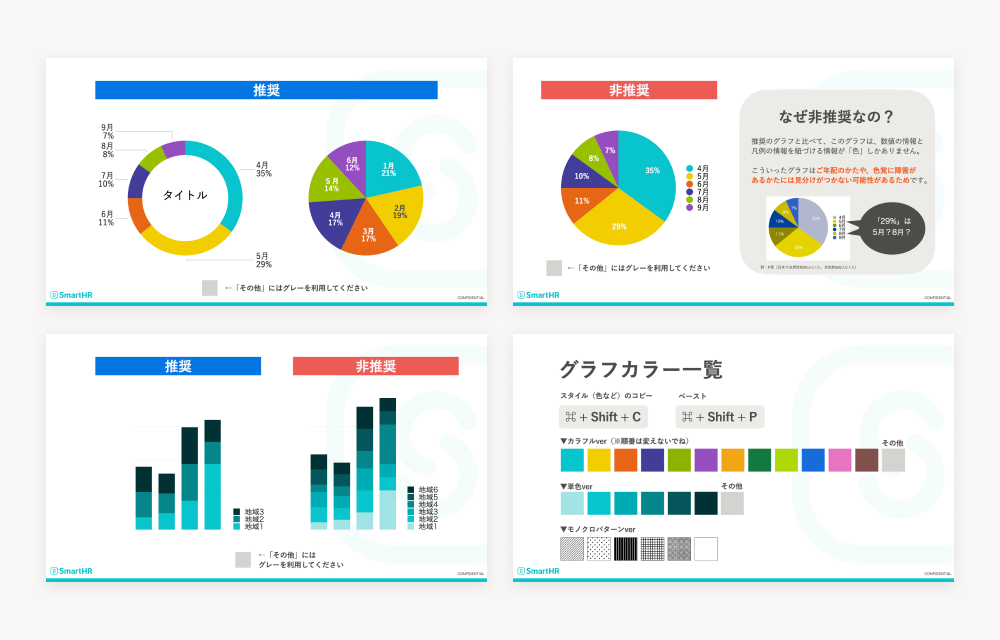

## ダウンロード
SmartHR社の方は、以下の資料テンプレートを利用できます。用途に合わせて作成されたKeynoteなどのテンプレートを用意しています。下記の一覧から利用シーンに合ったテンプレートを選択してダウンロードし、活用してください。

- <a href="https://drive.google.com/file/d/17raWuzfuL5uDfJCnrRkE3SMME6MH-b1f/view?usp=sharing" target="_blank">営業資料テンプレート（Keynote）| Google ドライブ</a>

- <a href="https://drive.google.com/drive/u/0/folders/1Ljdknsmx0pCtFxvq3jEjXhGG5Z0MYVGL" target="_blank">資料テンプレート（Keynote・Google Slides・PowerPoint）| Google ドライブ</a>

## 利用者・利用範囲

サイトにアクセスするすべての人が参照できますが、利用には一部制限があります。
スライド・資料の利用者と利用範囲は以下のとおりです。

  <table>
    <thead>
      <tr>
        <th>利用者</th>
        <th>名義</th>
        <th>利用可否</th>
      </tr>
    </thead>
    <tbody>
      <tr>
        <td>SmartHR従業員</td>
        <td>サービスSmartHR 株式会社SmartHR</td>
        <td><strong>◯ 利用できます</strong></td>
      </tr>
      <tr>
        <td>SmartHR従業員</td>
        <td>SmartHR Plus</td>
        <td><strong>◯ 利用できます</strong></td>
      </tr>
      <tr>
        <td>SmartHR従業員</td>
        <td>SmartHRグループ会社と その提供サービス</td>
        <td>× 利用できません</td>
      </tr>
      <tr>
        <td>SmartHR外部パートナー</td>
        <td>サービスSmartHR 株式会社SmartHR</td>
        <td><strong>◯ 利用できます</strong></td>
      </tr>
      <tr>
        <td>SmartHR Plusパートナー</td>
        <td>SmartHR Plusパートナーが 提供するアプリ</td>
        <td>× 利用できません</td>
      </tr>
      <tr>
        <td>SmartHRグループ会社 従業員</td>
        <td>SmartHRグループ会社と その提供サービス</td>
        <td>× 利用できません</td>
      </tr>
      <tr>
        <td>すべてのかた 広報担当者のかた</td>
        <td>SmartHRの広報活動</td>
        <td>× 利用できません</td>
      </tr>
    </tbody>
  </table>

ほかのコンテンツの利用範囲は[利用者のかたへ](/introduction/user/)を参照してください。
