SmartHRのスライド・資料のテンプレートです。

サイトにアクセスするすべての人が参照できますが、利用に関しては[利用者・利用範囲](#h2-3)を確認してください。

## テンプレートの種類
1. [全社共通テンプレート](#h3-0)
2. [営業資料テンプレート](#h3-1)

### 1. 全社共通テンプレート
社内外に向けた発信で汎用的に使用できます。

#### 利用シーン例
- 社内研修やオリエンテーション
- 人事制度や制度の説明
- 業務用資料
- キックオフ
- 社外登壇

#### 選べる表紙（任意・カスタマイズ）
タイトルとチャプタータイトルのデザインは、自由に選んで組み合わせることができます。資料の目的や内容、相手に合わせてカスタマイズすることで、よりわかりやすく、親しみやすいコミュニケーションを実現しましょう。
- 異なるテーマの表紙×中表紙を組み合わせることも可能です
- カスタマイズが不要な場合や、迷ったら「Smart Basic（基本のデザイン）」を使ってください

| テーマ | 表紙（タイトルスライド） | 中表紙（チャプタータイトル） |
| :--- | :--- | :--- |
| Smart Basic 基本のデザイン | 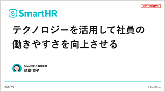 | 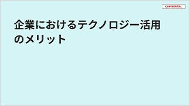 |
| Impressive 強い印象を加える | 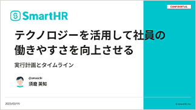 | 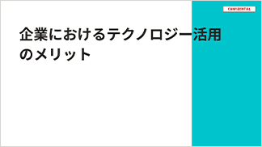 |
| Friendly 親しみやすさを増す |  | 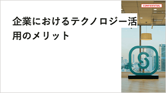 |
| Emotional 心を動かし共感を得る |  | 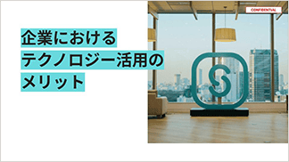 |
| Savvy 知的さを加える | 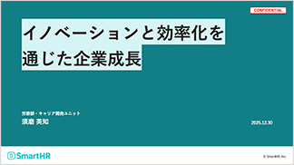 | 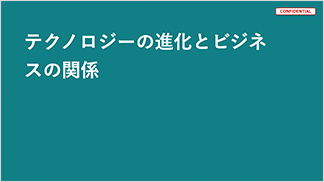 |

### 2. 営業資料テンプレート
ビジネス領域での利用を想定した営業資料のテンプレートです。社内外に向けた情報発信に幅広く使用できます。

#### 利用シーン例
- 商談
- お客さまへのフォローアップ
- ウェビナーでの製品・サービス紹介

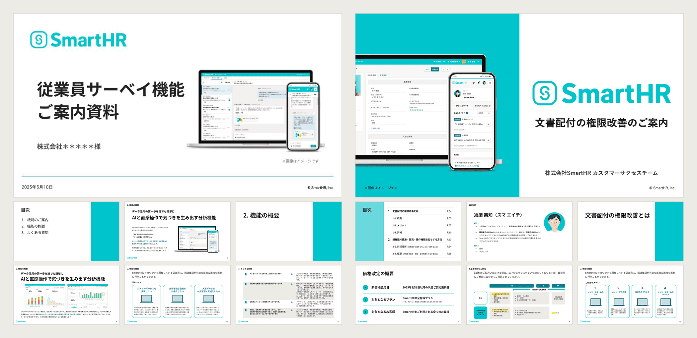

## テンプレートに収録されている内容

### サンプルスライド

### 使い方ガイド
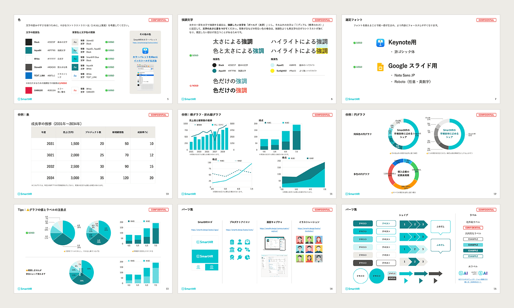
- 社外秘情報と公開情報
- 色
- 強調文字
- 選定フォント
- 表
- グラフ
- パーツ集

### スライドレイアウト
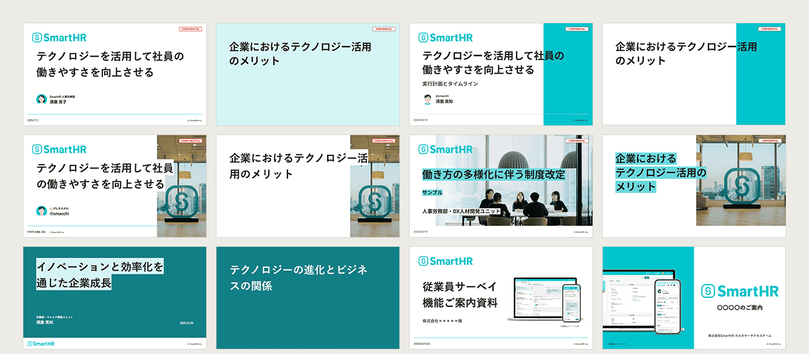
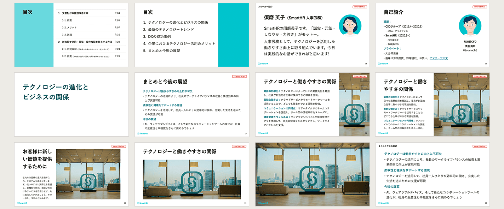
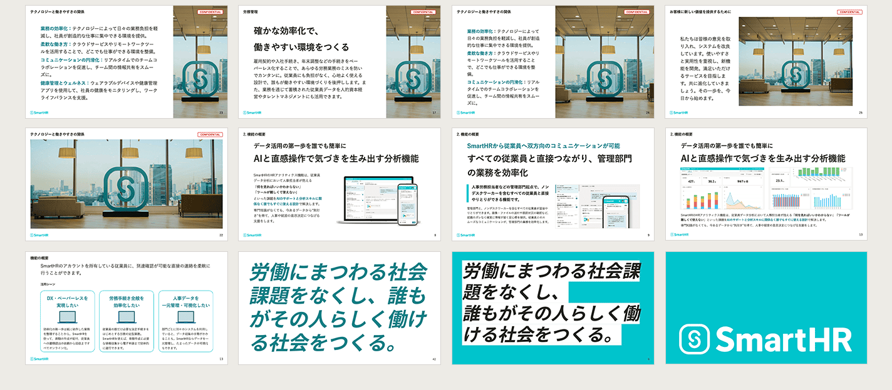

## ダウンロード
SmartHR従業員の方は、以下の資料テンプレートを利用できます。下記の一覧から利用シーンに合ったテンプレートを選択してダウンロードし、活用してください。

[スライド・資料テンプレート｜Googleドライブ](https://drive.google.com/drive/folders/1Ljdknsmx0pCtFxvq3jEjXhGG5Z0MYVGL)

### 提供フォーマット
- Googleスライド
- Keynote

## 利用者・利用範囲
サイトにアクセスするすべての人が参照できますが、利用には一部制限があります。
スライド・資料の利用者と利用範囲は以下のとおりです。

  <table>
    <thead>
      <tr>
        <th>利用者</th>
        <th>名義</th>
        <th>利用可否</th>
      </tr>
    </thead>
    <tbody>
      <tr>
        <td>SmartHR従業員</td>
        <td>サービスSmartHR 株式会社SmartHR</td>
        <td><strong>◯ 利用できます</strong></td>
      </tr>
      <tr>
        <td>SmartHR従業員</td>
        <td>SmartHR Plus</td>
        <td><strong>◯ 利用できます</strong></td>
      </tr>
      <tr>
        <td>SmartHR従業員</td>
        <td>SmartHRグループ会社と その提供サービス</td>
        <td>× 利用できません</td>
      </tr>
      <tr>
        <td>SmartHR外部パートナー</td>
        <td>サービスSmartHR 株式会社SmartHR</td>
        <td><strong>◯ 利用できます</strong></td>
      </tr>
      <tr>
        <td>SmartHR Plusパートナー</td>
        <td>SmartHR Plusパートナーが 提供するアプリ</td>
        <td>× 利用できません</td>
      </tr>
      <tr>
        <td>SmartHRグループ会社 従業員</td>
        <td>SmartHRグループ会社と その提供サービス</td>
        <td>× 利用できません</td>
      </tr>
      <tr>
        <td>すべてのかた 広報担当者のかた</td>
        <td>SmartHRの広報活動</td>
        <td>× 利用できません</td>
      </tr>
    </tbody>
  </table>

ほかのコンテンツの利用範囲は[利用者のかたへ](/introduction/user/)を参照してください。
