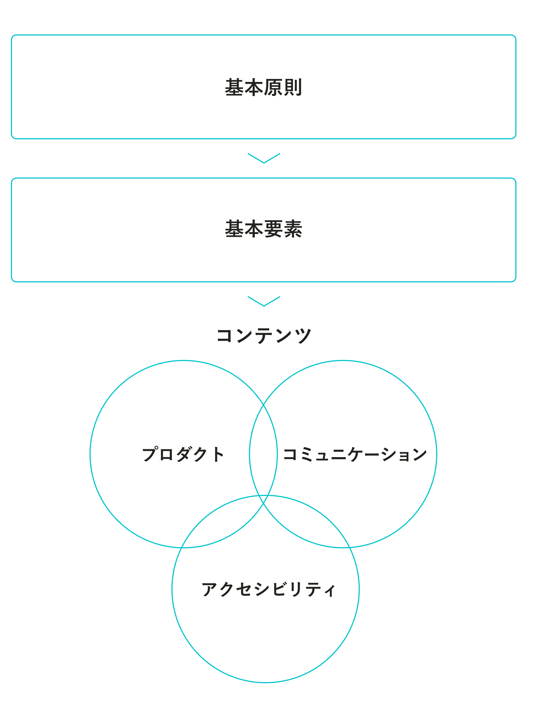

SmartHR Design Systemのコンテンツを紹介します。

それぞれのコンテンツの関係性はこちらの図のとおりです。

「基本原則」を元にした「基本要素」があり、そこから「アクセシビリティ」「プロダクト」「コミュニケーション」の3つのコンテンツカテゴリで構成されています。

## 基本原則
SmartHR Design System のすべての基本にあたるのが基本原則です。SmartHRのデザインの基本となる4つの価値観「パーソナリティ」について記載しています。  
その名前のとおりSmartHRというサービスの人格を表しており、サービスにおける「SmartHRらしさ」ともいえます。

[基本原則](/foundation/)

## 基本要素
基本原則にのっとり、SmartHRのデザインを構成しているのが「基本要素」です。デザインするために必要な基本的な要素を集約しています。
コンテンツ例：ロゴ、色、イラストレーション

[基本要素](/basics/)

## コンテンツカテゴリ
基本原則・基本要素をベースとして、アクセシビリティ、プロダクト、コミュニケーションの3つのコンテンツカテゴリがあります。

### アクセシビリティ
アクセシビリティの高いサービスを提供するためのアイテムです。品質を担保するための情報リソース、品筆を点検するためのチェックリストなどがあります。  
コンテンツ例：ウェブアクセシビリティ簡易チェックリスト、画像の代替テキスト、リンクテキスト

[アクセシビリティ](/accessibility/)

### プロダクト
スケーラブルで一貫性のあるプロダクトを設計をするためのガイドラインです。オープンソース「SmartHR UI」の利用方法も示しています。  
コンテンツ例：デザイントークン、アクセシビリティ

[プロダクト](/products/)

### コミュニケーション
一貫性のあるサービスコミュニケーションのためのアイテムとガイドラインです。マーケティング、セールス、カスタマーサクセスなどに利用します。  
コンテンツ例：アイコン、スライド資料

[コミュニケーション](/communication/)