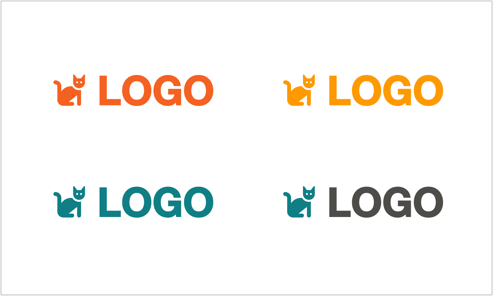
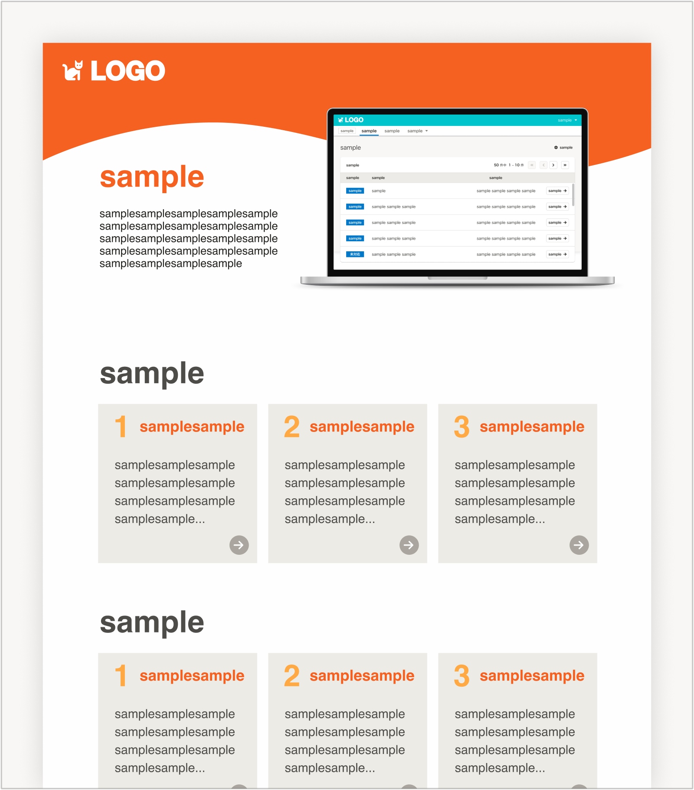
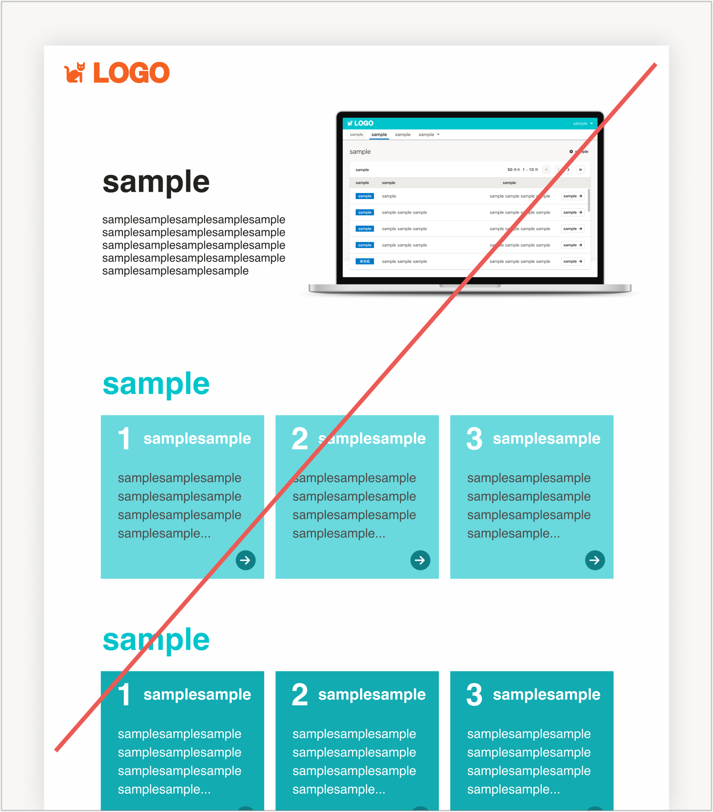
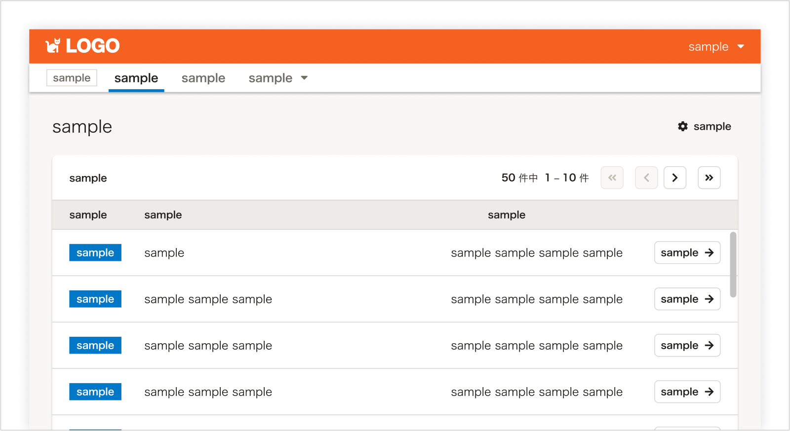

import { Grid } from '@Components/shared/Grid/Grid'
import { ImgWithDesc } from '@Components/article/ImgWithDesc/ImgWithDesc'

**SmartHRグループ会社の従業員**に向けて、利用方法を掲載したページです。  
役員・正社員・業務委託・派遣などの雇用形態は問いません。

## 対象者

以下、全SmartHRグループ会社従業員を対象としています。

- 株式会社Looper
- 株式会社Smart相談室
- 株式会社BYARD
- Nstock株式会社
- 株式会社AIRVISA

## 利用できるコンテンツ

公開されているすべてのコンテンツを参照できます。

SmartHRグループ会社と、その提供サービスの名義で利用する場合、利用できるアセットは以下のとおりです。  
これらの制限は、それぞれの企業・サービスブランドがSmartHRブランドと不要に混同されずに適切に認知され、お互いのブランドを守るために設定しているものです。

| カテゴリ | コンテンツ | 利用可否 |
| :-- | :-- | :-- |
| 基本要素 | [ロゴ](/basics/logos/) | × 利用できません (※1) |
| 基本要素 | [色](/basics/colors/) | × 利用できません(※2 注意事項(色について)参考) |
| 基本要素 | [アイコン](/basics/icons/) | × 利用できません |
| 基本要素 | [イラストレーション](/basics/illustration/) | × 利用できません |
| **[プロダクト](/products/)** | **すべてのコンテンツ** | **<strong>◯ 利用できます</strong>** |
| コミュニケーション | [写真・動画](/communication/photography/) | × 利用できません |
| コミュニケーション | [アイキャッチ](/communication/eye-catching-images/) | × 利用できません |
| コミュニケーション | [スライド・資料](/communication/slides/) | × 利用できません |
| コミュニケーション | [画面キャプチャ](/communication/capture/) | × 利用できません |
| **コミュニケーション** | **[端末モック](/communication/mock/)** | **<strong>◯ 利用できます</strong>** |

※1 SmartHRグループ会社名義、つまり「グループ会社のロゴ」としての利用はできませんが、「株式会社SmartHR」の説明として、SmartHRロゴを利用することは問題ありません。

### 対象になるアウトプットの例
- SmartHRグループ会社名義
    - 各社のコーポレートサイト
- SmartHRグループ会社の提供サービス名義
    - 提供サービスのサービスサイト
    - 提供サービスのUI
    - 提供サービスの営業資料
    - 提供サービスの広告

### 注意事項(色について)

グループ会社とその提供サービスでは、**SmartHRのPrimary Brand Color「[SmartHR Blue](https://smarthr.design/basics/colors/#h3-1)」とその近似色をメインカラーとして利用しないでください。**  
これは、それぞれの企業・サービスブランドがSmartHRブランドと不要に混同されずに適切に認知され、SmartHRブランドと不要に混同されることなく、適切に認知され、お互いのブランドを守るためです。

以下の配色の例を参考にしてくだい。

#### ロゴのOK・NG例

<Grid>
  <ImgWithDesc description="OK例：メインカラーにはSmartHR Blueを利用しない">

  

  </ImgWithDesc>

  <ImgWithDesc description="NG例：メインカラーにSmartHR Blueを利用する">

  

  </ImgWithDesc>
</Grid>

#### LPやチラシなどのOK・NG例

<Grid>
  <ImgWithDesc description="OK例：提供アプリのブランドカラーをメインとした配色">

  

  </ImgWithDesc>

  <ImgWithDesc description="OK例：提供アプリのブランドカラーをメインとし、部分的にSmartHR Blueを利用する">

  

  </ImgWithDesc>

</Grid>

<Grid>
  <ImgWithDesc description="NG例：SmartHR Blueをメインとした配色">

  

  </ImgWithDesc>

  <ImgWithDesc description="NG例：SmartHR Blueの近似色をメインとした配色">

  

  </ImgWithDesc>
</Grid>

### プロダクトのUI例

  <ImgWithDesc description="SmartHR UIを利用できます。配色をそのまま利用してもよいです。">

  

  </ImgWithDesc>

  <ImgWithDesc description="SmartHR UIを利用できます。配色を変更してもよいです。">

  

  </ImgWithDesc>

  <ImgWithDesc description="SmartHR UIの利用を推奨しますが、利用しなくてもよいです。">

  

  </ImgWithDesc>
