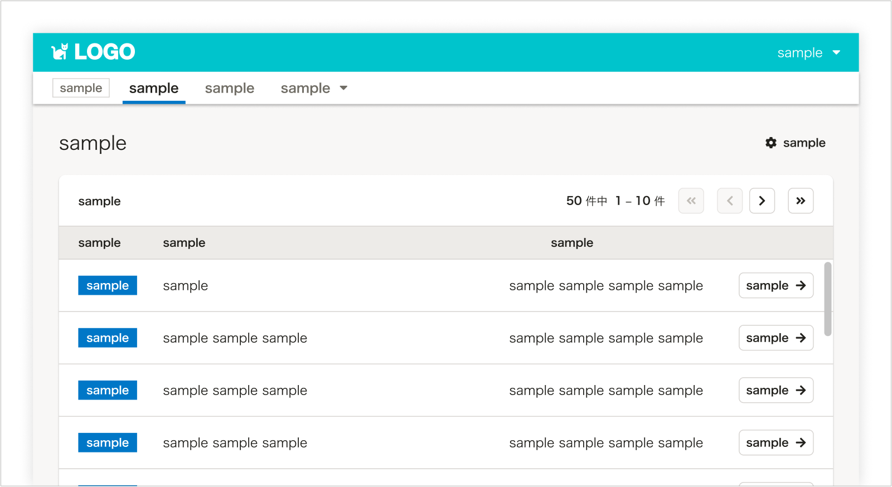
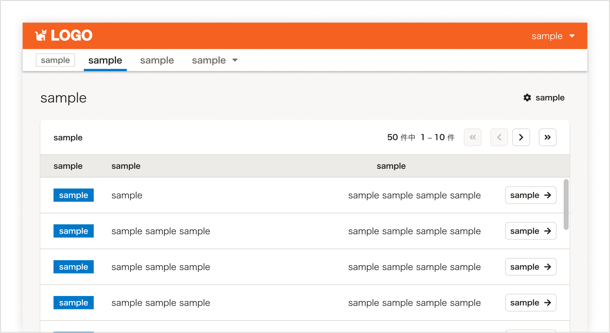
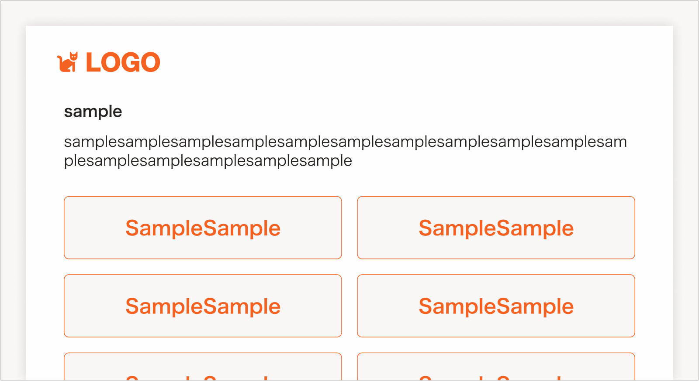
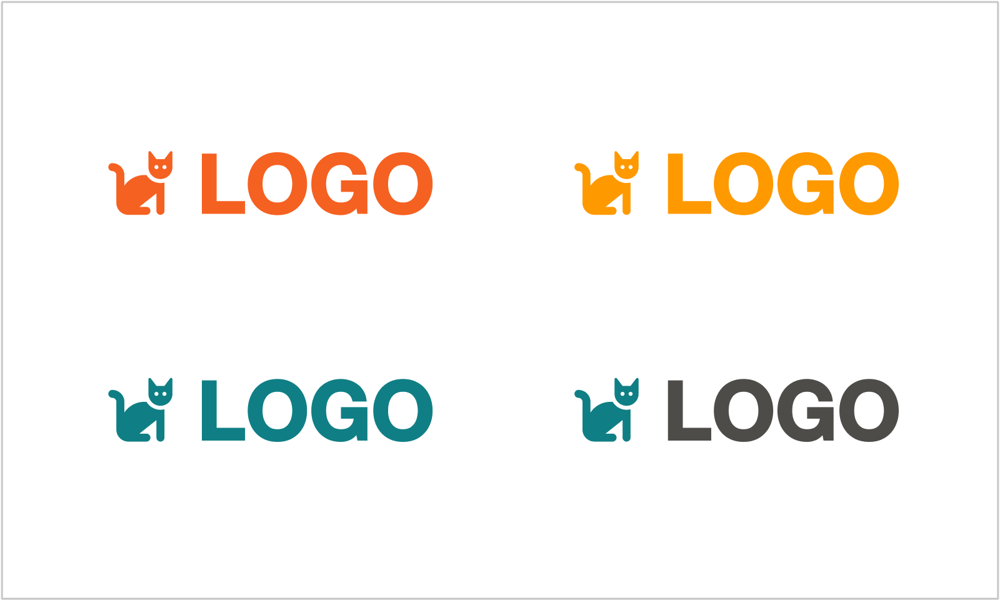
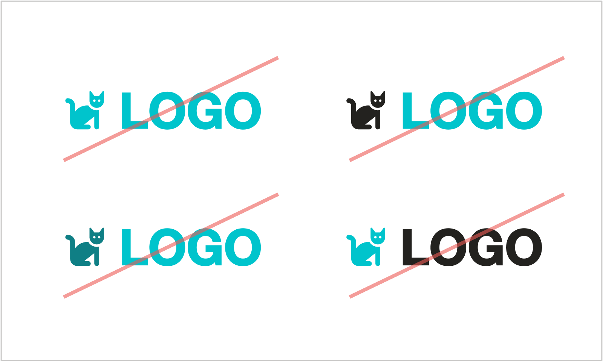
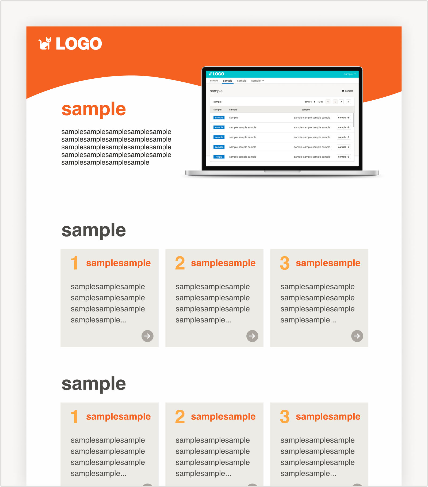
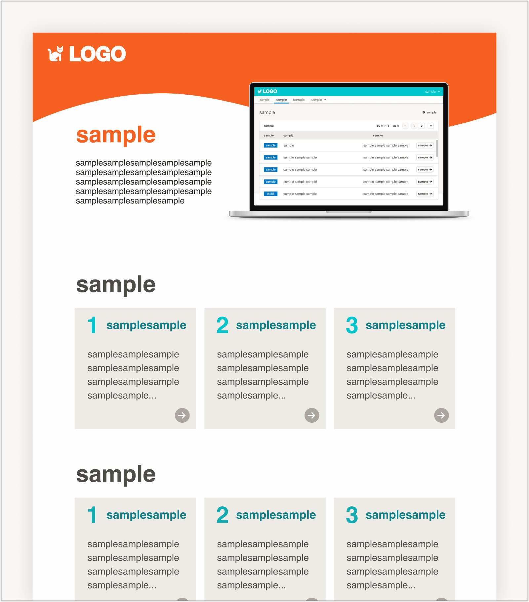
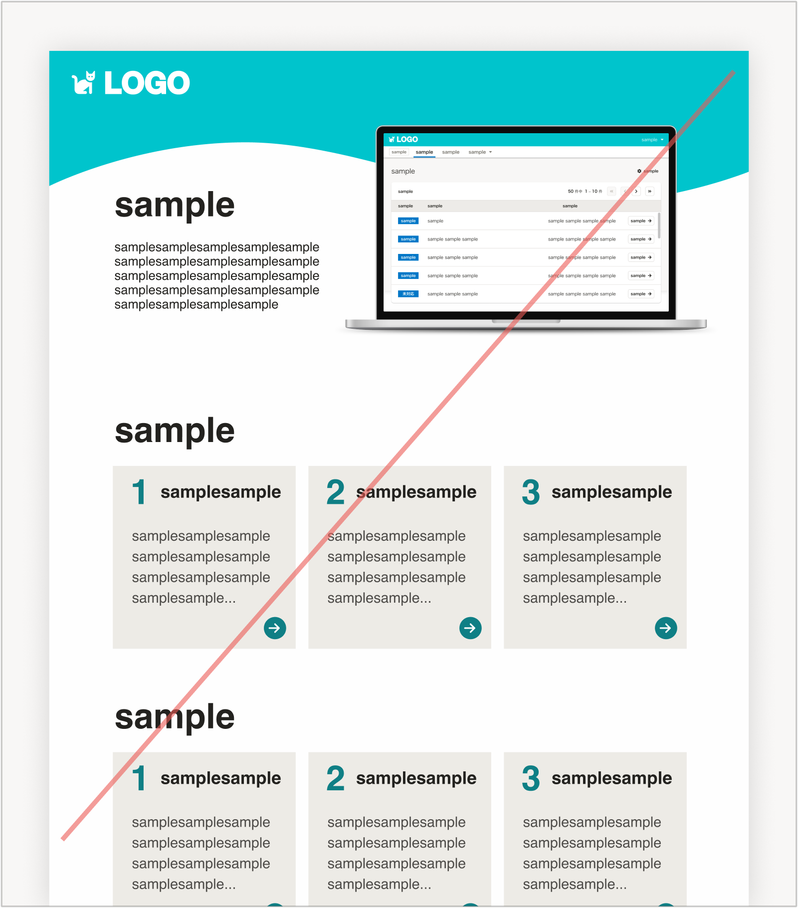
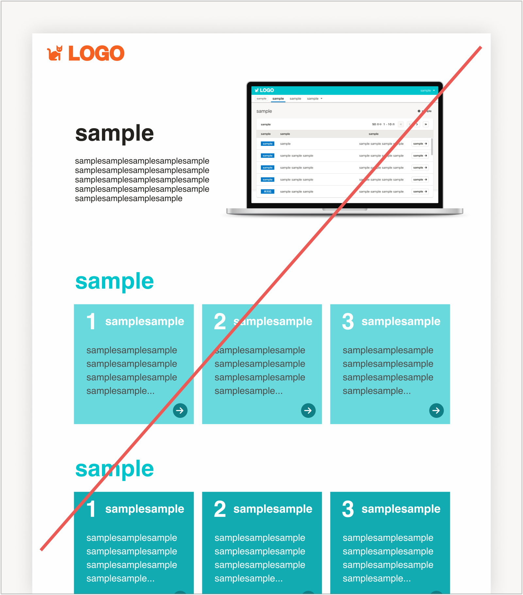

import Grid from '@/components/article/shared/Grid/Grid'
import ImgWithDesc from '@/components/article/ImgWithDesc.astro'

**SmartHR Plus パートナー(アプリ事業者)**のみなさまに向けて、利用方法を掲載したページです。  

提供アプリに関するガイドラインを掲載しますので、かならずご確認ください。

## 1. アプリ(プロダクト)

**SmartHR Plusパートナー(アプリ事業者)が提供するアプリに、UIの制限はありません。**  

ただし、SmartHR のUIコンポーネント「SmartHR UI」を利用を推奨しています。これは一貫したUIを提供することで、ユーザーの学習コストが少ないプロダクトを提供できるためです。また、同Reactコンポーネントライブラリはアクセシビリティに配慮しているため、多様な環境で利用してもらえる可能性が高まります。  
プロダクトカテゴリのコンテンツはすべて利用できます。  
https://smarthr.design/products

### プロダクトのUI例

  <ImgWithDesc description="SmartHR UIを利用できます。配色をそのまま利用してもよいです。">

  

  </ImgWithDesc>

  <ImgWithDesc description="SmartHR UIを利用できます。配色を変更してもよいです。">

  

  </ImgWithDesc>

  <ImgWithDesc description="SmartHR UIの利用を推奨しますが、利用しなくてもよいです。">

  

  </ImgWithDesc>

## 2. アプリ(プロダクト)以外

アプリ(プロダクト)においてはシームレスな体験を提供するため制限がありませんが、それ以外の要素については、以下のガイドラインを設定しています。  
これは、提供するアプリ・サービスがSmartHRブランドと不要に混同されることなく、適切に認知され、お互いのブランドと権利を守るために設定しているものです。

### 対象範囲

提供アプリ名義での、アプリ本体(プロダクト)以外のすべての要素  
(例)
- アプリのロゴ
- アプリのサービスサイトやLP
- 資料
- チラシ
- バナー

### 利用できるコンテンツ

アプリ(プロダクト)以外では、以下のコンテンツ・アセットが利用できます。

#### 1. SmartHRロゴ

「株式会社SmartHR」または「サービスSmartHR」の説明として、SmartHRロゴを利用できます。
[ロゴの利用ガイドライン](https://smarthr.design/basics/logos/)を守ってご利用ください。  

#### 2. 機能・仕様をあらわすアイコン

SmartHRでは、機能・仕様に関するアイコンをオリジナルで作成し、サービス全体で利用しています。アプリ・アプリ以外ともに、同じ特定の意味を示すアイコンとして利用できます。  
[アイコンの利用ガイドライン](https://smarthr.design/basics/icons/#h3-0)を守ってご利用ください。  

#### 3. 端末モック

スマートフォン・パソコンのモック画像を利用できます。  
利用ガイドラインを守ってご利用ください。  
https://smarthr.design/communication/mock/

### 利用できないコンテンツ

アプリ(プロダクト)以外で、以下のコンテンツ・アセットは利用できません。
- [イラストレーション](/basics/illustration/)
- [写真・動画](/communication/photography/)
- [アイキャッチ](/communication/eye-catching-images/)
- [スライド・資料](/communication/slides/)
- [画面キャプチャ](/communication/capture/)

### 注意事項(色について)

アプリ(プロダクト)以外では、**SmartHRのPrimary Brand Color「[SmartHR Blue](https://smarthr.design/basics/colors/#h3-1)」とその近似色をメインカラーとして利用しないでください。**  
これは、提供するアプリ・サービスがSmartHRブランドと不要に混同されることなく、適切に認知され、お互いのブランドと権利を守るためです。

#### ロゴのOK・NG例

<Grid>
  <ImgWithDesc description="OK例：メインカラーにはSmartHR Blueを利用しない">

  

  </ImgWithDesc>

  <ImgWithDesc description="NG例：メインカラーにSmartHR Blueを利用する">

  

  </ImgWithDesc>
</Grid>

#### LPやチラシなどのOK・NG例

<Grid>
  <ImgWithDesc description="OK例：提供アプリのブランドカラーをメインとした配色">

  

  </ImgWithDesc>

  <ImgWithDesc description="OK例：提供アプリのブランドカラーをメインとし、部分的にSmartHR Blueを利用する">

  

  </ImgWithDesc>

</Grid>

<Grid>
  <ImgWithDesc description="NG例：SmartHR Blueをメインとした配色">

  

  </ImgWithDesc>

  <ImgWithDesc description="NG例：SmartHR Blueの近似色をメインとした配色">

  

  </ImgWithDesc>
</Grid>
