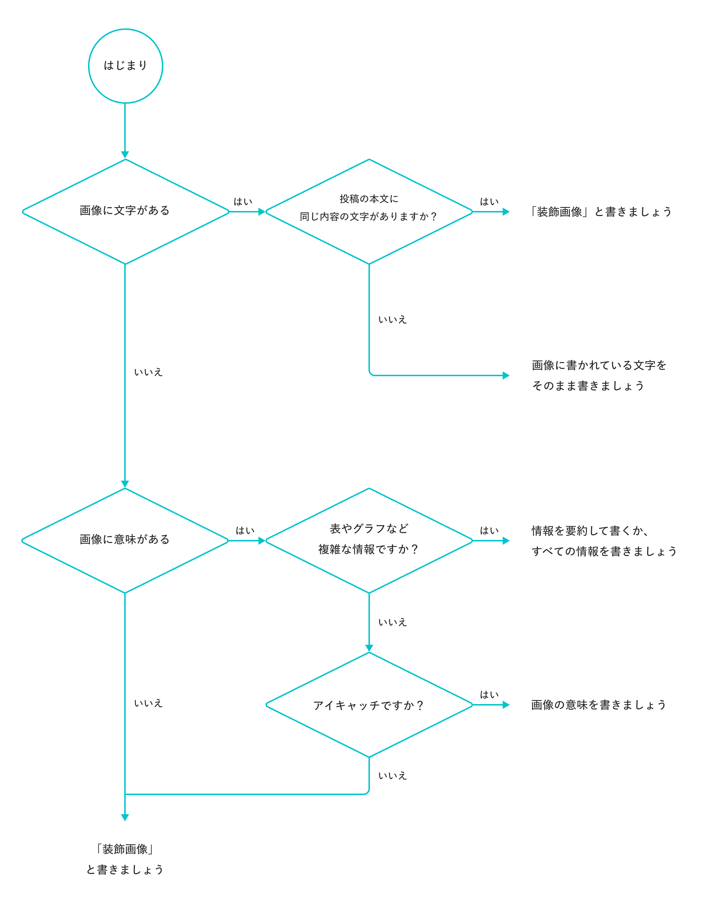

## アカウント
https://twitter.com/SHRDesignSystem

## 投稿する人
「SmartHR Design System」の運営メンバーなら誰でも投稿できます。

## 投稿フロー
特にありません。

ただし、運用してみて調整していきましょう。

## 投稿頻度
前回の投稿から、1時間以上時間を空けてから投稿しましょう。

万一、投稿が重なった場合は一方を一度削除し、タイミングをみて再投稿しましょう。

## 投稿タイミング
業務時間内に投稿しましょう。

特に、通勤時間やお昼など、Xに人が集まっていそうな時間がおすすめです。

## 投稿内容
このアカウントは「SmartHR」「デザイン」「デザインシステム」に興味のある方々からフォローされていると考え、**「フォロワーにとってプラスになる情報」**を投稿しましょう。

### 例
- リリース情報
- SmartHR Design Systemに関する情報
- SmartHRのデザインに関する情報・コメント
- デザインシステムに関する情報・コメント

### ボイスアンドトーン

実際の運営メンバーそれぞれの人格をそのまま表現するのではなく、**「SmartHR Design Systemの運用メンバー」という1つの人格**を意識してください。
この人格は「[パーソナリティ](/foundation/)」を体現しています。
[パーソナリティ](/foundation/)を意識した言葉づかいにしましょう。

emojiを使ってもOKです。

### 画像の代替テキスト

投稿に画像を添付する場合は、必ず画像に代替テキストを設定しましょう。  
代替テキストを設定することで、視覚障害のあるユーザーなど視覚情報に依存しない閲覧をするユーザーに限らず、視覚的に困難な状況のユーザーにも広く画像の意図を伝えることができます。

代替テキストの内容は、以下の考え方に沿って決めてください。

- 画像に文字がある場合
	- 投稿本文に同じ内容の文字がある場合は、「装飾画像」と書きましょう
	- 投稿本文に同じ内容の文字がない場合は、画像に書かれている文字をそのまま書きましょう
- 画像に文字はないが、意味がある場合
	- 表やグラフなど複雑な情報の場合は、情報を要約して書くか、すべての情報を書きましょう
	- アイキャッチの場合は、画像の意味を書きましょう
- 画像に文字や意味がない場合
	- 「装飾画像」と書きましょう

下図は、上記内容のフローチャートです。

より詳しく知りたい場合は、[画像の代替テキスト](/accessibility/alternative-text/)も参照できます。

### NG
- **アルコールを摂取したとき。酔っていないと思っていても投稿してはいけません。**
- **サービスにインシデントが発生しているとき。**

また、以下のような内容は控えましょう。
- 批判、批評
- ネガティブな内容
- SmartHR公式アカウント[@SmartHR_jp](https://twitter.com/smarthr_jp")が使わなさそうな言葉づかい
    - 最高w
    - マジかよ
- 個人的な思想
    - NG例：lightning design systemはhogeだと思います。
    - OK例：この項目は、lightning design systemのhoge項目を参考にしています。
- 最後に（samemaru）といった個人名をつけること
- その他、SmartHRパーソナリティに沿わない口調・内容

## フォロー
フォローリストは、本棚と同じで人間性や思考が表れます。  
[SmartHR公式アカウント](https://twitter.com/smarthr_jp)以外はフォローせずに運用をスタートします。

## もしツイート・アカウントが過剰に話題になったら
- リプライがきた場合
    - **独断で返信せず、社内Slack`#design_system`チャンネルで運営メンバーに知らせましょう。会社として対策を検討します。**
- **ツイート削除はしないでください。会社として「当該ツイートを削除する」という判断が出るまで、独断で削除してはいけません。**
