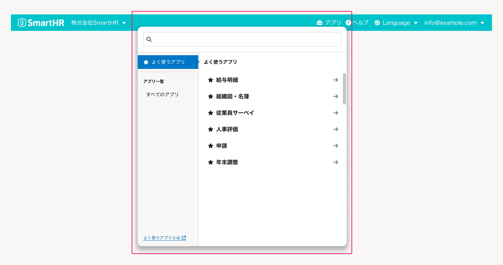
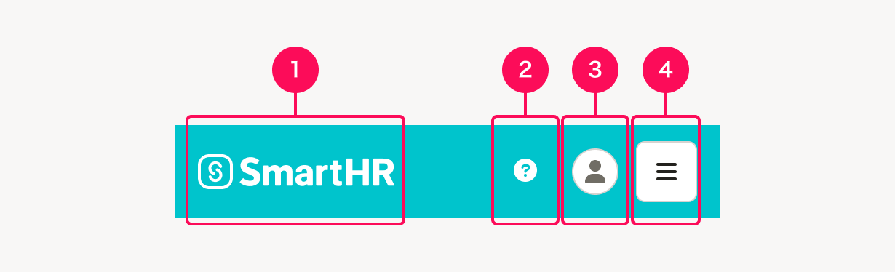

import ComponentPropsTable from '@/components/article/ComponentPropsTable.astro'
import ComponentStory from '@/components/article/ComponentStory.astro'

ページ上部に配置されるヘッダーです。横断的な機能やナビゲーションを提供します。各プロダクトでの表示を共通化するために、[Header](/products/components/header/)と[AppNavi](/products/components/app-navi/)を結合し表示要素を固定化したコンポーネントです。

<ComponentStory name="AppHeader" />

## レイアウト（デスクトップ）

デスクトップ環境で表示されるAppHeaderは、[Header](#h3-0)と[AppNavi](#h3-1)によって構成されます。

### Header

Headerは、アカウントやシステムの設定、およびSmartHR内の他のアプリケーションへの横断的なアクセスを提供します。

Headerは以下の要素で構成されています。

1. [SmartHRロゴ](#h4-0)
2. [企業アカウント切替ボタン](#h4-1)
3. [アプリランチャー](#h4-2)（任意）
5. [ヘルプセンターへのリンク](#h4-3)（任意）
6. [言語選択ボタン](#h4-4)（任意）
7. [ユーザーアカウントボタン](#h4-5)

#### 1. SmartHRロゴ

SmartHRのホーム（`/`）へ移動するためのリンクです。

#### 2. 企業アカウント切替ボタン

SmartHRを利用する企業アカウントを切り替えるための[DropdownMenuButton](/products/components/dropdown/dropdown-menu-button/)です。

企業アカウントの切り替え機能を提供しない場合は、単にユーザーが所属している企業アカウント名を表示します。

#### 3. アプリランチャー（任意）

ユーザーが利用できるSmartHR内の他のアプリケーションへ移動するためのボタンです。

アプリランチャーを押すと、アプリケーションのリンクが一覧表示されたドロップダウンが表示されます。

#### 4. ヘルプセンターへのリンク（任意）

SmartHRの[ヘルプセンター](https://support.smarthr.jp/ja/)へ移動するためのリンクです。

#### 5. 言語選択ボタン（任意）

SmartHRを利用する言語を切り替えるための[DropdownMenuButton](/products/components/dropdown/dropdown-menu-button/)です。

#### 6. ユーザーアカウントボタン

ユーザーに関する操作やリンクを提供するための[DropdownMenuButton](/products/components/dropdown/dropdown-menu-button/)です。（例：個人設定へのリンク, ログアウトボタン）

ユーザーに関する操作やリンクを提供しない場合は、単にユーザーのアカウント名を表示します。

### AppNavi

AppNaviは、アクセスしているアプリケーション内のページや設定など、アプリケーションに閉じた横断的なアクセスを提供します。

AppNaviは以下の要素で構成されています。

1. [機能名](#h4-6)
2. [アプリナビゲーションボタン](#h4-7)
3. [データ同期ボタン](#h4-8)（任意）
4. [リリースノートボタン](#h4-9)（任意）

#### 1. 機能名

現在アクセスしている機能名を表示します。

#### 2. アプリナビゲーションボタン

現在アクセスしている機能内のページへ移動するためのボタンです。

ページの構成が階層構造になっている場合は、ドロップダウンメニューで階層内のページを一覧表示します。

#### 3. データ同期ボタン（任意）

現在アクセスしている機能で必要なSmartHR基本機能や他機能に登録されているデータを、現在アクセスしている機能のデータベースへ能動的に同期するためのボタンです。

原則として、ユーザーが現在の同期が最新状態かを判断できるようにするため、前回同期した日時を`最終同期：yyyy/MM/dd H:mm`の形式で併記しますが、スペースに余裕がない場合は省略できます。

#### 4. リリースノートボタン（任意）

現在アクセスしているアプリケーションのリリースノートを確認するためのボタンです。

原則として、リリースノートはホーム画面などユーザーの利用開始の起点となる画面のコンテンツとして配置します。
ただし、ホーム画面がない機能や、どの画面からもリリースノートにアクセスする可能性がある場合に限り、例外的に配置を検討します。

リリースノートボタンを押すと、最新5件分の日付を含むリリースノートへのリンクと、対応するアプリケーションのリリースノートの一覧画面へ移動するリンクが表示されます。

## レイアウト（モバイル）

モバイル環境で表示されるAppHeaderでは機能や情報が省略されたHeaderのみ表示されます。省略された機能や情報には各ボタンからアクセスできるようにします。

### Header

モバイル環境で表示されるHeaderは以下の要素で構成されています。

1. [SmartHRロゴ](#h4-10)
2. [ヘルプボタン](#h4-11)
3. [ユーザーアカウントボタン](#h4-12)
2. [メニューボタン](#h4-13)

#### 1. SmartHRロゴ

SmartHRのホーム（`/`）へ移動するためのリンクです。デスクトップ環境と同様に表示されます。

#### 2. ヘルプボタン

ヘルプセンター等へのリンクを提供する[DropdownMenuButton](/products/components/dropdown/dropdown-menu-button/)です。

#### 3. ユーザーアカウントボタン

ユーザーに関する操作やリンクを提供するためのボタンです。ユーザーアカウントボタンを押すとドロップダウンが表示されます。

デスクトップ環境とは異なり、ユーザーのアカウント名の表示と言語選択ボタンもこのドロップダウンに含まれます。

#### 4. メニューボタン

その他の省略された要素にアクセスするためのメニューを開くボタンです。

メニューは以下の要素で構成されています。

1. [企業アカウント切替ボタン](#h5-0)
2. [アプリランチャー](#h5-1)
3. [アプリナビゲーションボタン](#h5-2)
4. [データ同期ボタン](#h5-3)（任意）
5. [リリースノートボタン](#h5-4)（任意）

##### 4-a. 企業アカウント切替ボタン

企業アカウントを切り替えるための[DropdownMenuButton](/products/components/dropdown/dropdown-menu-button/)です。デスクトップ環境と同様に表示されます。

企業アカウントの切り替え機能を提供しない場合は、単にユーザーが所属している企業アカウント名を表示します。

##### 4-b. アプリランチャー

ユーザーが利用できるSmartHR内の他のアプリケーションへ移動するためのボタンです。

アプリランチャーを押すと、アプリケーションのリンクが一覧表示された画面が表示されます。

##### 4-c. アプリナビゲーションボタン

現在アクセスしている機能内のページへ移動するためのボタンです。それらの見出しとして機能名も表示します。

ページの構成が階層構造になっている場合は、画面を切り替えて階層内のページを一覧表示します。

##### 4-d. データ同期ボタン（任意）

現在アクセスしている機能で必要なSmartHR基本機能や他機能に登録されているデータを、現在アクセスしている機能のデータベースへ能動的に同期するためのボタンです。

原則として、ユーザーが現在の同期が最新状態かを判断できるようにするため、前回同期した日時を`最終同期：yyyy/MM/dd H:mm`の形式で併記します。

##### 4-e. リリースノートボタン（任意）

現在アクセスしているアプリケーションのリリースノートを確認するためのボタンです。

原則として、リリースノートはホーム画面などユーザーの利用開始の起点となる画面のコンテンツとして配置します。
ただし、ホーム画面がない機能や、どの画面からもリリースノートにアクセスする可能性がある場合に限り、例外的に配置を検討します。

リリースノートボタンを押すと、最新5件分の日付を含むリリースノートへのリンクと、対応するアプリケーションのリリースノートの一覧画面へ移動するリンクが表示されます。 

## props

<ComponentPropsTable name="AppNavi" />