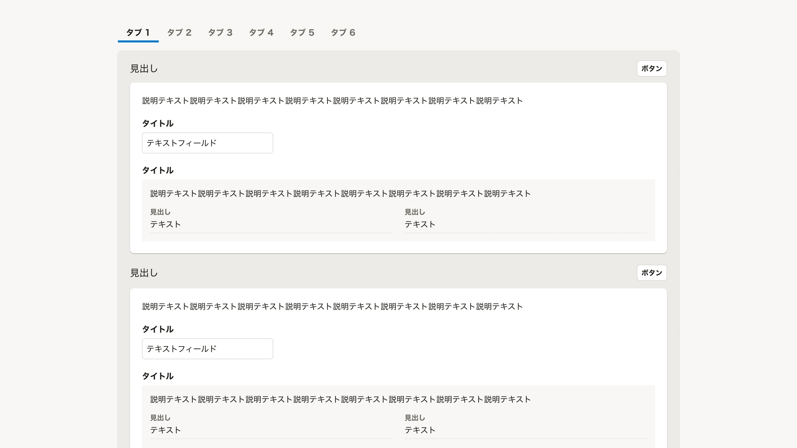

import ComponentPropsTable from '@/components/article/ComponentPropsTable.astro'
import ComponentStory from '@/components/article/ComponentStory.astro'

import { Image } from 'astro:assets'
import { Text, Cluster } from 'smarthr-ui'
import DoAndDont from '@/components/article/DoAndDont.astro'

import imageUrlLayerDo from './images/layer-do.png'
import imageUrlLayerDont from './images/layer-dont.png'

[矩形](/products/design-patterns/visual-grouping/#h3-3)で視覚的に要素をグルーピングするコンポーネントです。

主に[視覚的グルーピングにおけるセクション](/products/design-patterns/visual-grouping/#h3-5)の表現に使います。

<ComponentStory name="Base" />

## 使用上の注意

### レイヤー順序に注意する

Baseの[レイヤー順序](/products/design-tokens/shadow/#h2-1)は`1`です。レイヤー順序が`2`以上の要素（[InformationPanel](/products/components/information-panel/)など）をBaseの上に配置しないでください、

Baseの上にBaseを重ねることもレイヤー順序を把握しづらくさせます。Baseの上で矩形によるグルーピングをする場合は基本的に[BaseColumn](/products/components/base/base-column/)を使ってください。

<Cluster gap={{ row: 0, column: 1 }}>
    <DoAndDont type="dont" width="calc(50% - 8px)">
    <Image slot="img" src={imageUrlLayerDont} alt="Dont" />
    <Text slot="label">Base上にInformationPanelとBaseが配置されており、レイヤー順序が把握しづらい。</Text>
    </DoAndDont>

    <DoAndDont type="do" width="calc(50% - 8px)">
    <Image slot="img" src={imageUrlLayerDo} alt="Do" />
    <Text slot="label">Base上のグルーピングにBaseColumnが使われており、レイヤー順序が把握しやすい。</Text>
    </DoAndDont>
</Cluster>

レイアウト上Baseを重ねる必要がある場合は、背景色を[OVER_BACKGROUND](/products/design-tokens/color/#h3-3)などに変更してレイヤー順序を表現してください。（例：[複数のセクションを内包するグループ](/products/design-patterns/visual-grouping/#h3-7)）

## Props

<ComponentPropsTable name="Base" />

## 関連リンク

* [レイヤー順序](/products/design-tokens/z-index/)

## 参考文献

* https://design-system.service.gov.uk/components/panel/
