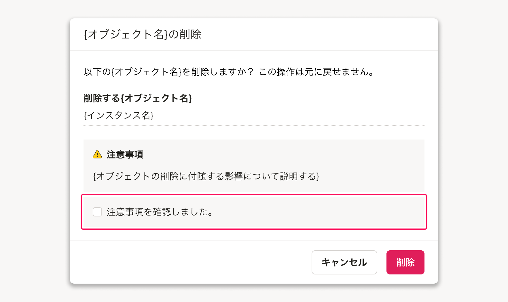

import { Image } from 'astro:assets'
import ComponentStory from '@/components/article/ComponentStory.astro'
import ComponentPropsTable from '@/components/article/ComponentPropsTable.astro'
import DoAndDont from '@/components/article/DoAndDont.astro'
import { Cluster, Text } from 'smarthr-ui'

import checkBoxDo from './images/check-box-do.png';
import checkBoxDont from './images/check-box-dont.png';
import checkBoxDo2 from './images/check-box-do2.png';
import checkBoxDont2 from './images/check-box-dont2.png';

ユーザーに「true/false」といった正反対の状態を入力させるコンポーネントです。
`input[type='checkbox']`の代わりとして使用します。

<ComponentStory name="Checkbox" />

## 使用上の注意

### ユースケースに応じてコンポーネントを使い分ける

#### 選択肢が複数選択できる場合に使用する

チェックボックスは選択肢を複数選択できる場合に使用します。

- 複数の選択肢から単一選択しかできず、表示領域に余裕がある場合は原則として[RadioButton](/products/components/radio-button/)を検討してください。
- 選択肢が多い場合や表示領域が狭い場合は、[MultiCombobox](/products/components/combo-box/multi-combo-box/)を検討してください。

```tsx editable
<>
  <Fieldset
    title="タイトル"
    innerMargin={0.5}
  >
    <Cluster gap={{ row: 1, column: 1.5 }}>
        <Checkbox name="sample">選択肢 1</Checkbox>
        <Checkbox name="sample">選択肢 2</Checkbox>
        <Checkbox name="sample">選択肢 3</Checkbox>
        <Checkbox name="sample">選択肢 4</Checkbox>
        <Checkbox name="sample">選択肢 5</Checkbox>
    </Cluster>
  </Fieldset>
</>
```

#### ビューの切り替えを操作するUIとして使用しない

チェックボックスは入力後に、`送信`や`保存`といったtype属性が`submit`のボタンなどを押すことで入力内容が反映される場合に使用してください。  
チェックボックスは1クリックで状態が正反対の結果となるため、誤入力によって意図しない結果が反映されてしまう可能性あります。

よくあるテーブルで「表示/非表示」を切り替える場合や、表示領域上`submit`のボタンの配置が難しい場合など、即時反映を前提とする箇所では[TabBar](/products/components/tab-bar/)や[SegmentedControl](/products/components/segmented-control/)、または[Switch](/products/components/switch/)を使用してください。

### 「ON/OFF」といった2択の切り替え入力に使用しない

チェックボックスは、「ON/OFF」「有効/無効」「はい/いいえ」といった2択の切り替え入力には原則として使用しないでください。  

「ON/OFF」などのブール値で制御できる項目にチェックボックスを使用した場合、一方の選択肢が暗黙的になりチェック状態から現在の選択状態が認識しづらくなる場合があります。
こうした場合には、選択肢を明示的に表示できる[RadioButton](/products/components/radio-button/)を使用してください。

<Cluster gap={{ row: 0, column: 1 }}>
  <DoAndDont type="do" width="calc(50% - 8px)">
    <Image slot="img" src={checkBoxDo} alt="Do" />
    <Text slot="label">すべての選択肢が明示的に表示されているため、現在の状態が把握しやすい</Text>
  </DoAndDont>
  <DoAndDont type="dont" width="calc(50% - 8px)">
    <Image slot="img" src={checkBoxDont} alt="Dont" />
    <Text slot="label">「無効」という選択肢が暗黙的であり、現在の状態をラベルとチェック状態から推測しなければならない</Text>
  </DoAndDont>
</Cluster>

例外として、以下のようにユーザーに操作内容の確認を促す手段としてチェックボックスを単独で使用することがあります。

- 利用規約などユーザーに許諾を得る必要がある内容の確認を促す場合
- [削除ダイアログ](/products/design-patterns/delete-dialog/#h3-5)など、重要な操作を行なう場合でユーザーに注意事項の確認を促す場合



### チェックボックス内に操作可能な要素を含めない

チェックボックス内には、ヘルプページへのリンクやフォームなど、ユーザーが値を選択する以外の操作可能な要素は配置しないでください。
これらを配置してしまうと、ユーザーがフォーム入力するための操作難易度が上がり、誤操作などにつながるためです。（[※1](#h2-5)）

チェックボックスの操作に関連するリンクを置きたい場合は、[Fieldset](/products/components/fieldset/)の`helpMessage` propsなどを使用してください。

<Cluster gap={1}>
  <DoAndDont type="do" width="calc(50% - 8px)">
    <Image slot="img" src={checkBoxDo2} alt="Do" width="346" />
    <Text slot="label">ユーザーは選択する操作に集中でき、それ以外の操作と区別しやすい</Text>
  </DoAndDont>

  <DoAndDont type="dont" width="calc(50% - 8px)">
    <Image slot="img" src={checkBoxDont2} alt="Dont" width="346" />
    <Text slot="label">ユーザーが選択操作に集中できず、操作難易度が上がる</Text>
  </DoAndDont>
</Cluster>

## 状態

### デフォルト
どの選択肢もチェックされていない状態をデフォルトとしてください。

ユーザーの入力作業が向上したり、ミスを減らせる場合にはデフォルトで選択肢にチェックを入れることを検討します。（参考：[デフォルト値](/products/design-patterns/default_value/)）

### 混在（mixed）

[テーブル内の一括操作](/products/design-patterns/table-bulk-action/)の「一括選択するチェックボックス」など、複数のチェックボックスの状態をまとめて示す必要があるチェックボックスにおいて、選択状態と未選択状態が混ざっている状態を示す場合には、混在選択状態（`mixed=true`）を採用します。


## デザインパターン

### 選択肢のグルーピング

例えば設定画面などで、チェックボックスやラジオボタンのように複数の選択肢を持つ項目を、いくつも並べて表示する場合は、ラベルがかかる範囲や設定項目ごとの選択肢を区別しやすくするために[BaseColumn](/products/components/base/base-column/)でグルーピングする場合があります。

[共通設定の操作権限項目](/products/design-patterns/access-control-setting-pattern-core-features/)のデザインパターンもあわせて参考にしてください。

```tsx editable
<>
  <Fieldset
      title="設定項目"
      innerMargin={0.5}
  >
      <BaseColumn>
          <Cluster gap={{ row: 1, column: 1.5 }}>
              <Checkbox name="sample">選択肢 1</Checkbox>
              <Checkbox name="sample">選択肢 2</Checkbox>
              <Checkbox name="sample">選択肢 3</Checkbox>
              <Checkbox name="sample">選択肢 4</Checkbox>
              <Checkbox name="sample">選択肢 5</Checkbox>
          </Cluster>
      </BaseColumn>
  </Fieldset>
</>
```


## Props

<ComponentPropsTable name="Checkbox" />

## 関連リンク

- [デザインパターン（基本機能）/共通設定の操作権限項目](/products/design-patterns/access-control-setting-pattern-core-features/)

## 参考文献

※1. [\<label\\>: The Label element - HTML: HyperText Markup Language | MDN](https://developer.mozilla.org/en-US/docs/Web/HTML/Element/label#interactive_content)
