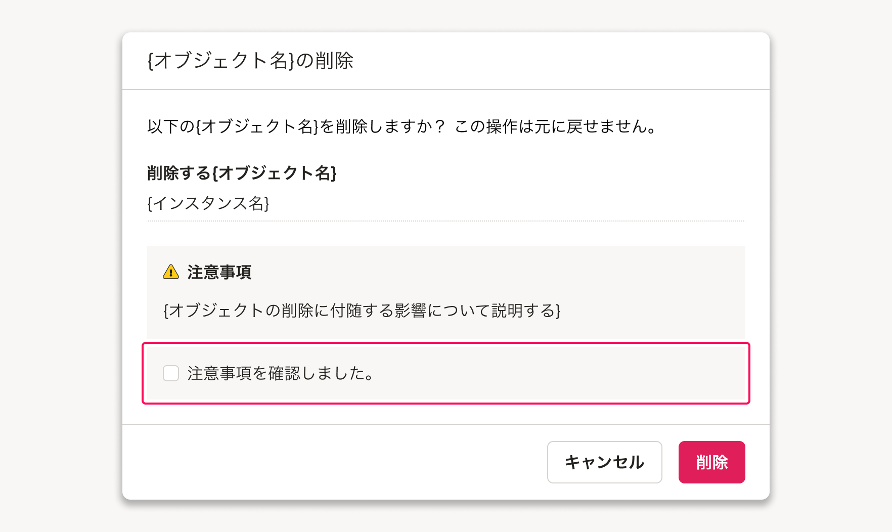
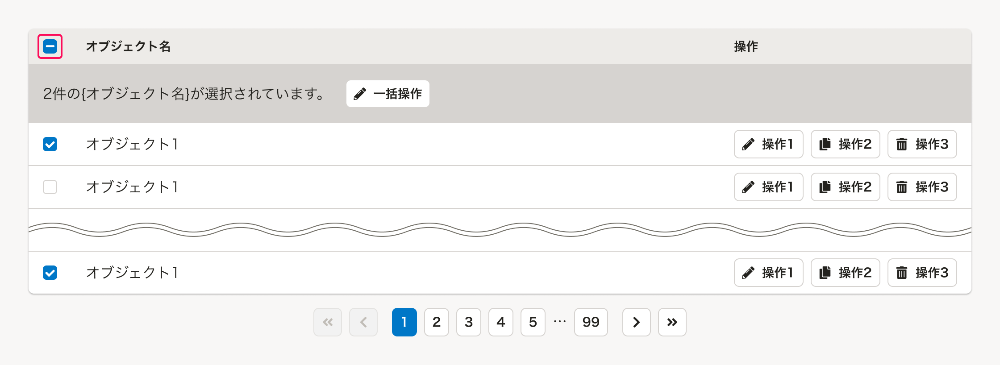

import { Image } from 'astro:assets'
import ComponentStory from '@/components/article/ComponentStory.astro'
import ComponentPropsTable from '@/components/article/ComponentPropsTable.astro'
import DoAndDont from '@/components/article/DoAndDont.astro'
import { Cluster, Text } from 'smarthr-ui'

`input[type="checkbox"]`要素の代替としてオン/オフや真偽の状態を入力させるコンポーネントです。5個以下の選択肢から複数の値を選択させるときに使います。

<ComponentStory name="Checkbox" />

## 使用上の注意

### ユースケースに応じてコンポーネントを使い分ける

#### 選択肢が複数選択できる場合に使用する

チェックボックスは選択肢を複数選択できる場合に使用します。

- 複数の選択肢から単一選択しかできず、表示領域に余裕がある場合は原則として[RadioButton](/products/components/radio-button/)を検討してください。
- 選択肢が多い場合や表示領域が狭い場合は、[MultiCombobox](/products/components/combo-box/multi-combo-box/)を検討してください。

選択操作に関わるコンポーネントの使い分けは[選択コンポーネントの使い分け](/products/design-patterns/selection-component-usage/)を参照してください。

```tsx editable
<Fieldset
  legend="タイトル"
  innerMargin={0.5}
>
  <Cluster gap={{ row: 1, column: 1.5 }}>
    <Checkbox name="sample">選択肢 1</Checkbox>
    <Checkbox name="sample">選択肢 2</Checkbox>
    <Checkbox name="sample">選択肢 3</Checkbox>
    <Checkbox name="sample">選択肢 4</Checkbox>
    <Checkbox name="sample">選択肢 5</Checkbox>
  </Cluster>
</Fieldset>
```

#### ビューの切り替えを操作するUIとして使用しない

チェックボックスは入力後に、`送信`や`保存`といったtype属性が`submit`のボタンなどを押すことで入力内容が反映される場合に使用してください。  
チェックボックスは1クリックで状態が正反対の結果となるため、誤入力によって意図しない結果が反映されてしまう可能性あります。

よくあるテーブルで「表示/非表示」を切り替える場合や、表示領域上`submit`のボタンの配置が難しい場合など、即時反映を前提とする箇所では[TabBar](/products/components/tab-bar/)や[SegmentedControl](/products/components/segmented-control/)、または[Switch](/products/components/switch/)を使用してください。

#### チェックボックスの並び順

横幅に十分なスペースがある場合は、基本的に横並びにすることで縦幅が長くなりすぎることを防ぎます。

<Cluster gap={{ row: 0, column: 1 }}>
  <DoAndDont type="do" width="calc(50% - 8px)">
    <Text slot="label">横幅に十分なスペースがある場合は、基本的に横並びにします。</Text>
    <div slot="img">
```tsx editable canvas=480 background=BACKGROUND hideCode
<Base padding={1.5} className="shr-w-full">
  <Fieldset
    legend="タイトル"
    innerMargin={0.5}
  >
    <BaseColumn className="shr-w-fit">
      <Cluster gap={{ row: 1, column: 1.5 }}>
        <Checkbox name="sample">選択肢 1</Checkbox>
        <Checkbox name="sample">選択肢 2</Checkbox>
        <Checkbox name="sample">選択肢 3</Checkbox>
      </Cluster>
    </BaseColumn>
  </Fieldset>
</Base>
```
    </div>
  </DoAndDont>

  <DoAndDont type="dont" width="calc(50% - 8px)">
    <Text slot="label">縦並びにすると、親項目の幅に対して要素の配置が偏ってしまい、視認性が低下する恐れがあります。</Text>
    <div slot="img">
```tsx editable canvas=480 background=BACKGROUND hideCode
<Base padding={1.5} className="shr-w-full">
  <Fieldset
    legend="タイトル"
    innerMargin={0.5}
  >
    <BaseColumn className="shr-w-fit">
      <Stack gap={1}>
        <Checkbox name="sample">選択肢 1</Checkbox>
        <Checkbox name="sample">選択肢 2</Checkbox>
        <Checkbox name="sample">選択肢 3</Checkbox>
      </Stack>
    </BaseColumn>
  </Fieldset>
</Base>
```
    </div>
  </DoAndDont>
</Cluster>

ただし、選択肢の文字が長くなる場合は縦並びを検討します。

<DoAndDont type="do" width="calc(50% - 8px)">
  <Text slot="label">選択肢の文字が長い場合は縦並びにしても要素の配置が偏らず、視認性が低下しません。</Text>
  <div slot="img">
```tsx editable canvas=480 background=BACKGROUND hideCode
<Base padding={1.5} className="shr-w-full">
<Fieldset
  legend="タイトル"
  innerMargin={0.5}
>
  <BaseColumn className="shr-w-fit">
    <Stack gap={1}>
      <Checkbox name="sample">比較的長いテキストの選択肢 1</Checkbox>
      <Checkbox name="sample">比較的長いテキストの選択肢 2</Checkbox>
      <Checkbox name="sample">比較的長いテキストの選択肢 3</Checkbox>
    </Stack>
  </BaseColumn>
</Fieldset>
</Base>
```
  </div>
</DoAndDont>

### 2択の切り替えに使う場合の注意

原則として「ON/OFF」「有効/無効」「はい/いいえ」といった2択の切り替え入力には[RadioButton](/products/components/radio-button/)の利用を検討してください。
ただし状況に応じてチェックボックスを2択の切り替え入力に使用できます。 

#### チェックボックスを2択の切り替え入力に使用できない場合
「ON/OFF」などのブール値で制御できる項目にチェックボックスを使用した際に、一方の選択肢が暗黙的になりチェック状態から現在の選択状態が認識しづらくなる場合があります。 
こうした場合には、選択肢を明示的に表示できる[RadioButton](/products/components/radio-button/)を使用してください。

<Cluster gap={{ row: 0, column: 1 }}>
  <DoAndDont type="do" width="calc(50% - 8px)">
    <Text slot="label">すべての選択肢が明示的に表示されているため、現在の状態が把握しやすい</Text>
    <div slot="img">
```tsx editable canvas=480 background=BACKGROUND hideCode
<Base padding={1.5} className="shr-w-full">
  <Fieldset
    legend="従業員に表示"
    innerMargin={0.5}
    helpMessage="オンにすると、従業員にも表示されます。"
  >
    <Cluster gap={{ row: 1, column: 1.5 }}>
      <RadioButton name="sample" defaultChecked>オン</RadioButton>
      <RadioButton name="sample">オフ（管理者にのみ表示）</RadioButton>
    </Cluster>
  </Fieldset>
</Base>
```
    </div>
  </DoAndDont>

  <DoAndDont type="dont" width="calc(50% - 8px)">
    <Text slot="label">「従業員に表示しない」という選択肢が暗黙的であり、現在の状態をラベルとチェック状態から推測しなければならない</Text>
    <div slot="img">
```tsx editable canvas=480 background=BACKGROUND hideCode
<Base padding={1.5} className="shr-w-full">
  <Fieldset
    legend="従業員に表示"
    innerMargin={0.5}
    helpMessage={<p>通常は管理者にのみ表示されます。<br />従業員にも表示する場合は、チェックしてください。</p>}
  >
    <Cluster gap={{ row: 1, column: 1.5 }}>
      <Checkbox name="sample">従業員にも表示する</Checkbox>
    </Cluster>
  </Fieldset>
</Base>
```
    </div>
  </DoAndDont>
</Cluster>

#### チェックボックスを2択の切り替え入力に使用できる場合
ラベルや説明文、ほかの設定項目など、前後のコンテキストによりもう一方の選択肢が明示的な場合は、チェックボックスを使用できます。

<DoAndDont type="do">
  <Text slot="label">2択の切り替えの入力だが、前後のコンテキストから両方の選択肢が明示的であり現在の状態が把握しやすい。</Text>
  <div slot="img">
```tsx editable background=BACKGROUND hideCode
<Base padding={1.5} className="shr-w-full">
  <Fieldset
    legend="氏名の表示設定"
    innerMargin={0.5}
    helpMessage="ビジネスネームが登録されていない場合には本名が表示されます。"
  >
    <Cluster gap={{ row: 1, column: 1.5 }}>
      <Checkbox name="sample" defaultChecked>ビジネスネームを優先的に表示する</Checkbox>
    </Cluster>
  </Fieldset>
</Base>
```
  </div>
</DoAndDont>

利用規約への同意や、[削除ダイアログ](/products/design-patterns/delete-dialog/#h3-5)での重要な操作に対する注意事項の確認など、ユーザーに対して明示的な許諾や確認を求める場合にチェックボックスを使用できます。



実装例：

```tsx editable background=BACKGROUND hideCode
<>
  <RemoteDialogTrigger targetId="delete-dialog">
    <Button>&#123;オブジェクト名&#125;を削除</Button>
  </RemoteDialogTrigger>
  <FormDialog
    id="delete-dialog"
    heading="{オブジェクト名}の削除"
    actionButton={{ text: '削除', theme: 'danger' }}
  >
  <Stack gap={1.5}>
      <p>以下の&#123;オブジェクト名&#125;を削除しますか？　この操作は元に戻せません。</p>
      <DefinitionList>
        <DefinitionListItem term={{ text: '削除する{オブジェクト名}', styleType: 'blockTitle' }}>
          &#123;インスタンス名&#125;
        </DefinitionListItem>
      </DefinitionList>
      <Stack gap={0.5}>
        <BaseColumn>
          <Stack>
            <Heading type="blockTitle" icon={<WarningIcon />}>注意事項</Heading>
            <p>オブジェクトを削除すると起きる影響についての説明</p>
          </Stack>
        </BaseColumn>
        <BaseColumn>
          <Checkbox name="confirm" required>注意事項を確認しました。</Checkbox>
        </BaseColumn>
      </Stack>
    </Stack>
  </FormDialog>
</>
```

### チェックボックス内に操作可能な要素を含めない

チェックボックス内には、ヘルプページへのリンクやフォームなど、ユーザーが値を選択する以外の操作可能な要素は配置しないでください。
これらを配置してしまうと、ユーザーがフォーム入力するための操作難易度が上がり、誤操作などにつながるためです。（[※1](#h2-5)）

チェックボックスの操作に関連するリンクを置きたい場合は、[Fieldset](/products/components/fieldset/)の`helpMessage` propsなどを使用してください。

<Cluster gap={1}>
  <DoAndDont type="do" width="100%">
    <Text slot="label">ユーザーは選択する操作に集中でき、それ以外の操作と区別しやすい</Text>
    <div slot="img">
```tsx editable background=BACKGROUND hideCode
<Base padding={1.5} className="shr-w-full">
  <Fieldset
    legend="利用規約への同意"
    innerMargin={0.5}
    helpMessage={<p><TextLink target="_blank" href="#">利用規約</TextLink>を確認し、同意する場合はチェックしてください。</p>}
  >
    <Cluster gap={{ row: 1, column: 1.5 }}>
      <Checkbox name="agreement">利用規約に同意します</Checkbox>
    </Cluster>
  </Fieldset>
</Base>
```
    </div>
  </DoAndDont>

  <DoAndDont type="dont" width="100%">
    <Text slot="label">ユーザーが選択操作に集中できず、操作難易度が上がる</Text>
    <div slot="img">
```tsx editable background=BACKGROUND hideCode
<Base padding={1.5} className="shr-w-full">
  <Fieldset
    legend="利用規約への同意"
    innerMargin={0.5}
  >
    <Cluster gap={{ row: 1, column: 1.5 }}>
      <Checkbox name="agreement"><TextLink target="_blank" href="#">利用規約</TextLink>に同意します</Checkbox>
    </Cluster>
  </Fieldset>
</Base>
```
    </div>
  </DoAndDont>
</Cluster>

## 状態

### デフォルト
どの選択肢もチェックされていない状態をデフォルトとしてください。

ユーザーの入力作業が向上したり、ミスを減らせる場合にはデフォルトで選択肢にチェックを入れることを検討します。（参考：[デフォルト値](/products/design-patterns/default_value/)）

### 混在（mixed）

[テーブル内の一括操作](/products/design-patterns/table-bulk-action/)の「一括選択するチェックボックス」など、複数のチェックボックスの状態をまとめて示す必要があるチェックボックスにおいて、選択状態と未選択状態が混ざっている状態を示す場合には、混在選択状態（`mixed=true`）を採用します。



## デザインパターン

### 選択肢のグルーピング

例えば設定画面などで、チェックボックスやラジオボタンのように複数の選択肢を持つ項目を、いくつも並べて表示する場合は、ラベルがかかる範囲や設定項目ごとの選択肢を区別しやすくするために[BaseColumn](/products/components/base/base-column/)でグルーピングする場合があります。

[共通設定の操作権限項目](/products/design-patterns/access-control-setting-pattern-core-features/)のデザインパターンもあわせて参考にしてください。

```tsx editable hideCode
<Fieldset
    legend="設定項目"
    innerMargin={0.5}
>
  <BaseColumn>
    <Cluster gap={{ row: 1, column: 1.5 }}>
      <Checkbox name="sample">選択肢 1</Checkbox>
      <Checkbox name="sample">選択肢 2</Checkbox>
      <Checkbox name="sample">選択肢 3</Checkbox>
      <Checkbox name="sample">選択肢 4</Checkbox>
      <Checkbox name="sample">選択肢 5</Checkbox>
    </Cluster>
  </BaseColumn>
</Fieldset>
```

## モバイル
モバイル表示時は、画面の幅が狭いため基本的に縦並びにします。誤操作を防ぐために、[小さい要素間のマージン](/products/design-patterns/spacing-layout-pattern/#h5-4)に従って十分なマージンを確保してください。

<Cluster gap={1}>
  <DoAndDont type="do" width="calc(50% - 8px)">
    <Text slot="label">ラベルテキストの長さによらず、整列されていて操作しやすい</Text>
    <div slot="img">
```tsx editable canvas=400 background=DOT hideCode
<EnvironmentProvider environment={{ mobile: true }}>
  <div className="shr-w-full shr-bg-background">
    <AppHeader
      appName="すごいアプリ"
      currentTenantId="tenant-1"
      features={[
        {
          favorite: false,
          id: 'feature-1',
          name: '従業員リスト',
          position: null,
          url: 'https://example.com'
        },
      ]}
      navigations={[
        {
          children: 'ホーム',
          href: 'https://example.com'
        },
      ]}
      helpPageUrl="https://example.com"
      schoolUrl="https://example.com"
      userInfo={{
        accountUrl: 'https://example.com',
        email: 'smarthr@example.com',
        empCode: '001',
        firstName: '須磨',
        lastName: '栄子'
      }}
    />
    <Container>
      <Stack gap={2}>
        <Stack>
          <PageHeading>見出し</PageHeading>
          <p>テキストテキストテキストテキストテキストテキストテキストテキストテキストテキストテキスト</p>
        </Stack>
        <Base padding={{ block: 1.5, inline: 1}}>
         <Fieldset
            legend="タイトル"
          >
            <Stack>
              <Checkbox name="sample" defaultChecked>ラベル</Checkbox>
              <Checkbox name="sample">ラベルテキスト</Checkbox>
              <Checkbox name="sample">ラベル123</Checkbox>
              <Checkbox name="sample">ラベルテキスト123</Checkbox>
              <Checkbox name="sample">長いラベルテキスト長いラベルテキスト</Checkbox>
            </Stack>
          </Fieldset>
        </Base>
      </Stack>
    </Container>
  </div>
</EnvironmentProvider>
```
    </div>
  </DoAndDont>

  <DoAndDont type="dont" width="calc(50% - 8px)">
    <Text slot="label">折り返しによって不揃いなレイアウトになる上、隣り合う要素の誤タップも起きやすい</Text>
    <div slot="img">
```tsx editable canvas=400 background=DOT hideCode
<EnvironmentProvider environment={{ mobile: true }}>
  <div className="shr-w-full shr-bg-background">
    <AppHeader
      appName="すごいアプリ"
      currentTenantId="tenant-1"
      features={[
        {
          favorite: false,
          id: 'feature-1',
          name: '従業員リスト',
          position: null,
          url: 'https://example.com'
        },
      ]}
      navigations={[
        {
          children: 'ホーム',
          href: 'https://example.com'
        },
      ]}
      helpPageUrl="https://example.com"
      schoolUrl="https://example.com"
      userInfo={{
        accountUrl: 'https://example.com',
        email: 'smarthr@example.com',
        empCode: '001',
        firstName: '須磨',
        lastName: '栄子'
      }}
    />
    <Container>
      <Stack gap={2}>
        <Stack>
          <PageHeading>見出し</PageHeading>
          <p>テキストテキストテキストテキストテキストテキストテキストテキストテキストテキストテキスト</p>
        </Stack>
        <Base padding={{ block: 1.5, inline: 1}}>
         <Fieldset
            legend="タイトル"
          >
            <Cluster gap={{ row: 1, column: 1.5 }}>
              <Checkbox name="sample" defaultChecked>ラベル</Checkbox>
              <Checkbox name="sample">ラベルテキスト</Checkbox>
              <Checkbox name="sample">ラベル123</Checkbox>
              <Checkbox name="sample">ラベルテキスト123</Checkbox>
              <Checkbox name="sample">長いラベルテキスト長いラベルテキスト</Checkbox>
            </Cluster>
          </Fieldset>
        </Base>
      </Stack>
    </Container>
  </div>
</EnvironmentProvider>
```
    </div>
  </DoAndDont>
</Cluster>

## Props

<ComponentPropsTable name="Checkbox" />

## 関連リンク

- [デザインパターン（基本機能）/共通設定の操作権限項目](/products/design-patterns/access-control-setting-pattern-core-features/)

## 参考文献

※1. [\<label\\>: The Label element - HTML: HyperText Markup Language | MDN](https://developer.mozilla.org/en-US/docs/Web/HTML/Element/label#interactive_content)
