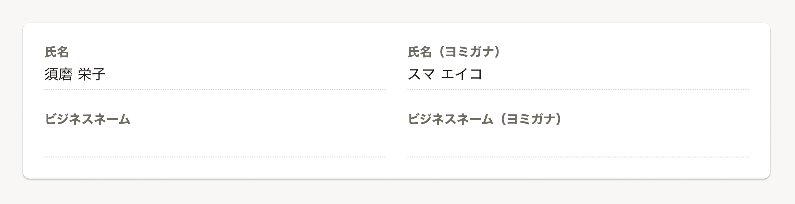
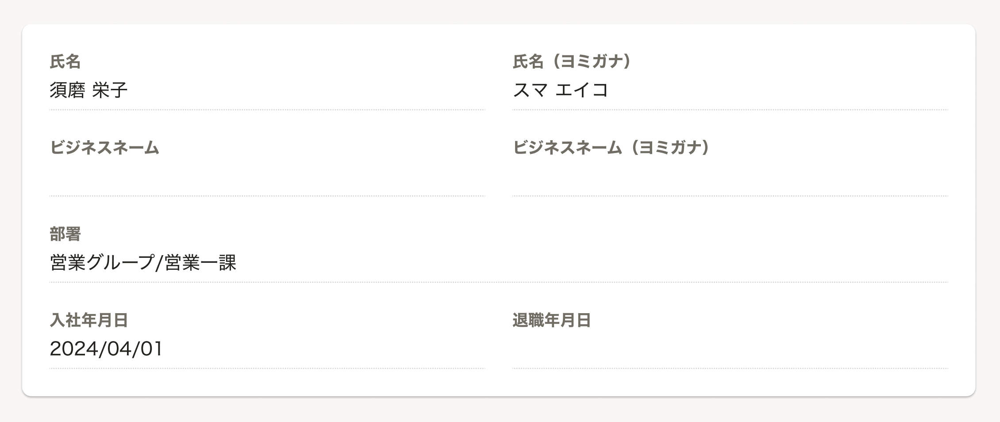
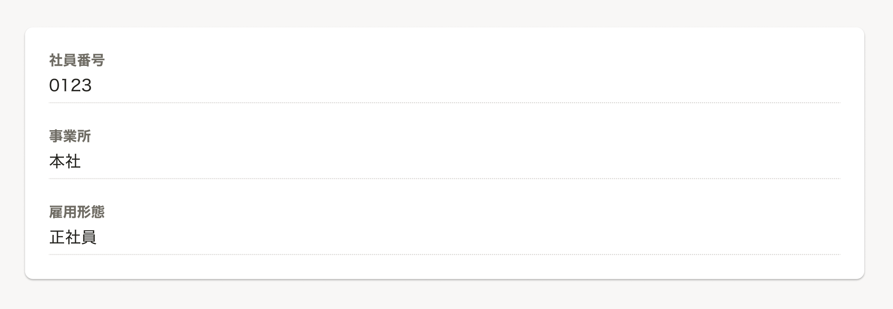
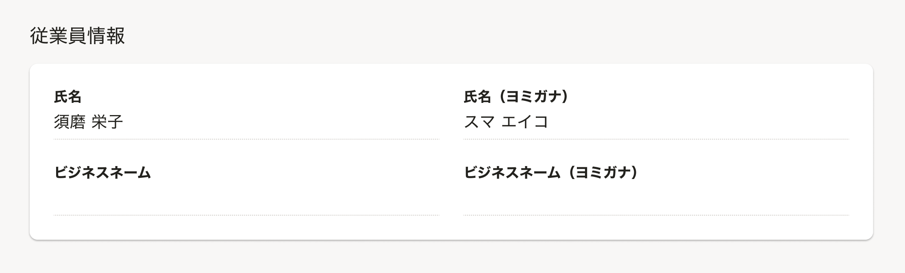

import ComponentPropsTable from '@/components/article/ComponentPropsTable/ComponentPropsTable.astro'
import ComponentStory from '@/components/article/ComponentStory.astro'

見出しと説明がセットになった定義リストです。特定のデータを一覧して参照させたいときに使います。

<ComponentStory name="DefinitionList" />

## 使用上の注意

原則としてデータの編集や送信を伴わない画面においてデータを表示する場合は、DefinitionListを使用することを推奨します。  
ただし、利用シーンに応じて他のコンポーネントの使用も検討してください。

### Inputの意匠を残してデータを表示したいときはreadOnlyのInputを検討する

フォームに入力した内容の確認画面など、Inputの意匠を残してデータを表示したい場合は、readOnlyの[Input](/products/components/input/)の利用を検討してください。

## レイアウト

### カラム数の指定

`maxColumns` propsを指定することで、最大列数を指定できます。表示したいデータの内容に合わせて、適切な列数を指定してください。

列数を指定しない場合、各アイテムは最低幅12emを保ちながら余った領域を埋めていきます。

#### 関連性のある項目がある場合

氏名とヨミガナなど、関連性のある項目は横に並べて表示することで、その関連性をユーザーに伝えることができます。  
この場合、`maxColumns` propsには `2` など、横並びにしたい項目の数を指定してください。

なお、`maxColumns` propsに `2` 以上の数字を指定している場合でも、あらかじめ長い文字列が入る想定があるDefinitionListItemに `fullWidth` propsを指定することで、その項目のみ一列で表示できます。

#### 意図的に項目を一列で表示したい場合

2以上の列数が指定されている場合や、列数が指定されていない場合、画面幅や項目の文字数によって列数が変動する可能性があります。

画面幅や項目の文字数にかかわらず見た目を統一したい場合など、意図的に項目を一列で表示したい場合は、`maxColumns` propsに `1` を指定することで、画面幅や項目の文字数にかかわらず一列で表示できます。

### 見出しの種類

`termStyleType` propsを指定することで、見出しの種類を変更できます。

見出しはコンテンツのアウトラインに沿って[順に使用することを想定している](/products/components/heading/#h2-0)ため、DefinitionListにおいても適切な見出しレベルを指定してください。  
例えば、DefinitionListを含むコンテンツの見出しが[sectionTitle](/products/components/heading/#h3-1)の場合、`termStyleType` propsに `blockTitle` を指定してください。

何も指定しない場合、見出しは `subBlockTitle` となります。

### 値がない項目の表示

descriptionが値を持っていない場合の表示については、[値がない項目の表示](/products/design-patterns/empty-data/)を参照してください。

## Props

<ComponentPropsTable name="DefinitionList" showTitle />
<ComponentPropsTable name="DefinitionListItem" showTitle />
