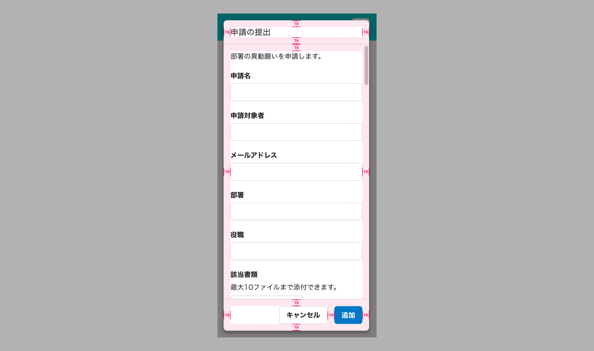
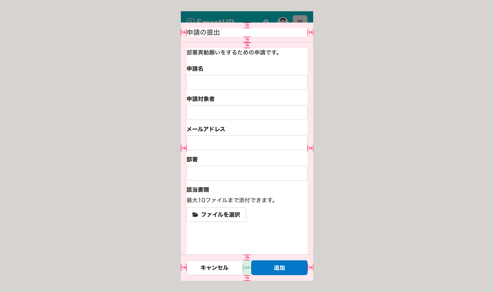
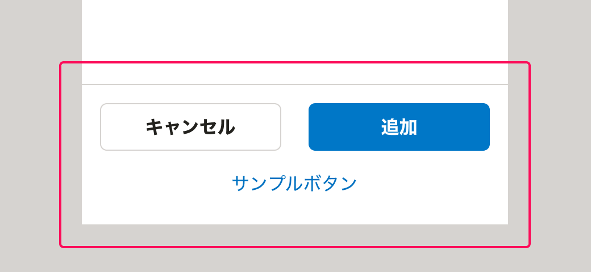

import ComponentPropsTable from '@/components/article/ComponentPropsTable.astro'
import ComponentStory from '@/components/article/ComponentStory.astro'
import MultipleModalWarning from '../_components/MultipleModalWarning.mdx'
import DialogBaseSize from '../_components/DialogBaseSize.mdx'
import ExpandedDialogUsecase from '../_components/ExpandedDialogUsecase.mdx'
import ExpandedDialogPadding from '../_components/ExpandedDialogPadding.mdx'
import { BaseColumn, Cluster, ResponseMessage, Text } from 'smarthr-ui'
import imageActionDialog from '../images/action_dialog_mobile.png'
import imageExpandedActionDialog from '../images/expanded_action_dialog_mobile.png'
import DoAndDont from '@/components/article/DoAndDont.astro'
import { Image } from 'astro:assets'

ユーザーに入力や選択などの操作を求めるためのダイアログです。ユーザーは操作内容をシステムに送信できます。

モーダルなダイアログです。ダイアログの表示中、ダイアログの裏側の領域はスクリム（幕）で隠され、操作を受け付けません。

<ComponentStory name="ActionDialog" />

## 使用上の注意

[モーダルなUIの使いどころ](/products/design-patterns/modal-ui/#h3-0)もあわせて参照してください。

### ダイアログを乱用しない

ActionDialogの表示中、ユーザーの操作範囲は強制的に制限されます。

ダイアログが表示されることによってユーザーの操作を妨げてしまわないか、ダイアログとして表示する・操作させるべき内容なのか、慎重にユースケースを定義し、使用を検討してください。

### 複数のモーダルダイアログを同時に表示しない

<MultipleModalWarning />

## レイアウト

### 基準サイズ

<DialogBaseSize />

### 表示位置

表示位置は、画面の天地左右中央に表示されます。

## アクセシビリティ

### キーボード操作

`ESC`キーを押すことでダイアログを閉じることができます。

## デザインパターン

削除操作をする際の確認のダイアログについては、[削除ダイアログ](/products/design-patterns/delete-dialog/)を参照してください。

それ以外のパターンについては、[モーダルなUI](/products/design-patterns/modal-ui/)を参照してください。

## モバイル

<BaseColumn className="shr-mt-1">
  <ResponseMessage type="info">拡大したActionDialogはsmarthr-uiに実装予定です。</ResponseMessage>
</BaseColumn>

モバイルでは、通常のダイアログに加えて、拡大したダイアログを使用できます。

### 表示する情報量に応じて拡大したダイアログの採用を検討する

<ExpandedDialogUsecase />

<Cluster gap={1}>
  <DoAndDont type="do" width="calc(50% - 8px)">
    <Image slot="img" src={imageActionDialog} alt="Do" />
    <Text slot="label">通常のダイアログで表示する</Text>
  </DoAndDont>

  <DoAndDont type="do" width="calc(50% - 8px)">
    <Image slot="img" src={imageExpandedActionDialog} alt="Do" />
    <Text slot="label">情報量が多い場合に拡大したダイアログで表示する</Text>
  </DoAndDont>
</Cluster>

### レイアウト

#### 余白

モバイルで通常のダイアログを使用する場合、余白は以下の通りです。

<ExpandedDialogPadding />

#### フッターエリアのレイアウト

［キャンセル］ボタンと[Primaryボタン](/products/components/button/#h3-1)を[Cluster](/products/components/layout/cluster/)で横いっぱいに並べます。

`SubActionArea`（任意）は、上記のButton群の下部に配置します。

## Props

<ComponentPropsTable name="ActionDialog" showTitle />
<ComponentPropsTable name="FormDialog" showTitle />
