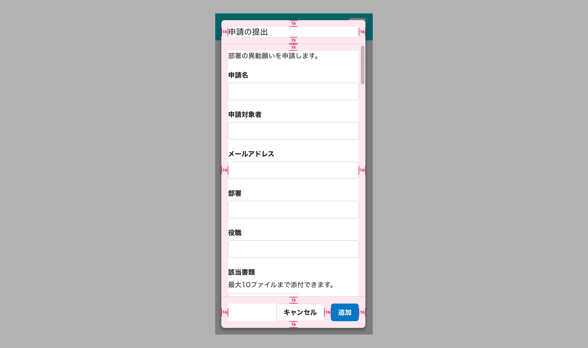
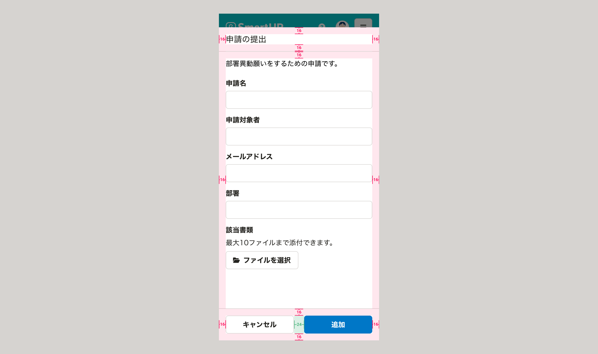
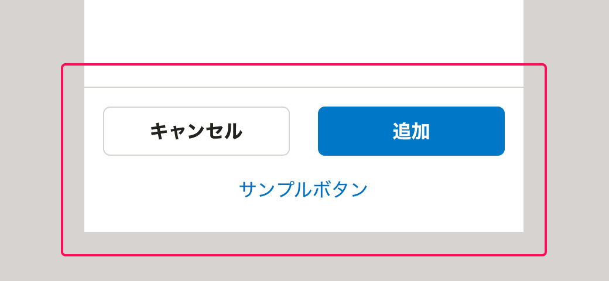

import ComponentPropsTable from '@/components/article/ComponentPropsTable.astro'
import Checklist from '@/components/article/Checklist/Checklist.astro'
import ComponentStory from '@/components/article/ComponentStory.astro'
import MultipleModalWarning from '../_components/MultipleModalWarning.mdx'
import ExpandedDialogUsecase from '../_components/ExpandedDialogUsecase.mdx'
import ExpandedDialogPadding from '../_components/ExpandedDialogPadding.mdx'
import { BaseColumn, Cluster, ResponseMessage, Text } from 'smarthr-ui'
import imageActionDialog from '../images/action_dialog_mobile.png'
import imageExpandedActionDialog from '../images/expanded_action_dialog_mobile.png'
import DoAndDont from '@/components/article/DoAndDont.astro'
import { Image } from 'astro:assets'

ユーザーに確認や単純な操作を求めるためのダイアログコンポーネントです。フォーム要素を含まない確認・実行のダイアログを表示するときに使います。

モーダルなダイアログです。ダイアログの表示中、ダイアログの裏側の領域はスクリム（幕）で隠され、操作を受け付けません。

<ComponentStory name="ActionDialog" />

## 使用上の注意

[モーダルなUIの使いどころ](/products/design-patterns/modal-ui/#h3-0)もあわせて参照してください。

### ダイアログを乱用しない

ActionDialogの表示中、ユーザーの操作範囲は強制的に制限されます。

ダイアログが表示されることによってユーザーの操作を妨げてしまわないか、ダイアログとして表示する・操作させるべき内容なのか、慎重にユースケースを定義し、使用を検討してください。

### 複数のモーダルダイアログを同時に表示しない

<MultipleModalWarning />

### ダイアログコンテンツにフォームが含まれている場合は、FormDialogの使用を検討する

ダイアログコンテンツにフォーム要素を含む場合にはFormDialogの使用を検討します。  
詳しくは[FormDialog](/products/components/dialog/form-dialog/)を参照してください。

## レイアウト

### 基準サイズ

SmartHR UIでは、ダイアログの横幅をサイズ（`size`props）で指定できます。各サイズの基準値は[幅のセマンティックトークン](/products/design-tokens/width/#h3-2)を参照しています。

大きさ | 幅トークン | 値（px）
:--- | :--- | :---
`XS` | `col3` | 424px
`S` | `col4` | 576px
`M` | `col5` | 728px
`L` | `col6` | 880px
`XL` | `col7` | 1032px
`XXL` | `col8` | 1184px
`FULL` | - | `width: 100%`

#### `XS`

入力要素を1つだけ持つダイアログなど、内容が極めて少ないダイアログに使います。

#### `S`

要素が少なく、要素が垂直方向に並ぶ、広い横幅を必要としないダイアログに使います。

#### `M`

数行に渡るテキストを表示したり、水平方向に要素を並べて表示したりする標準的なダイアログに使います。

#### `L`

テーブルを表示したり、ダイアログを複数カラムに分割するなど、広い横幅が必要なダイアログに使います。

#### `XL`

テーブルを表示したり、ダイアログを複数カラムに分割するなど、広い横幅が必要なダイアログに使います。`L`ではどうしてもコンテンツが収まりきらない場合に使います。

#### `XXL`

テーブルを表示したり、ダイアログを複数カラムに分割するなど、広い横幅が必要なダイアログに使います。`XL`ではどうしてもコンテンツが収まりきらない場合に使います。

#### `FULL`

テーブルを表示したり、ダイアログを複数カラムに分割するなど、広い横幅が必要なダイアログに使います。`XXL`ではどうしてもコンテンツが収まりきらない場合に使います。

### 表示位置

表示位置は、画面の上下左右中央に表示されます。

## アクセシビリティ

### キーボード操作

`ESC`キーを押すことでダイアログを閉じることができます。

## デザインパターン

削除操作をする際の確認のダイアログについては、[削除ダイアログ](/products/design-patterns/delete-dialog/)を参照してください。

それ以外のパターンについては、[モーダルなUI](/products/design-patterns/modal-ui/)を参照してください。

## モバイル

<BaseColumn className="shr-mt-1">
  <ResponseMessage status="info">拡大したActionDialogはsmarthr-uiに実装予定です。</ResponseMessage>
</BaseColumn>

モバイルでは、通常のダイアログに加えて、拡大したダイアログを使用できます。

### 表示する情報量に応じて拡大したダイアログの採用を検討する

<ExpandedDialogUsecase />

<Cluster gap={1}>
  <DoAndDont type="do" width="calc(50% - 8px)">
    <Image slot="img" src={imageActionDialog} alt="Do" />
    <Text slot="label">通常のダイアログで表示する</Text>
  </DoAndDont>

  <DoAndDont type="do" width="calc(50% - 8px)">
    <Image slot="img" src={imageExpandedActionDialog} alt="Do" />
    <Text slot="label">拡大したダイアログで表示する</Text>
  </DoAndDont>
</Cluster>

### レイアウト

#### 余白

モバイルで通常のダイアログを使用する場合、余白は以下の通りです。

<ExpandedDialogPadding />

#### フッターエリアのレイアウト

［キャンセル］ボタンと[Primaryボタン](/products/components/button/#h3-1)を[Cluster](/products/components/layout/cluster/)で横いっぱいに並べます。

`SubActionArea`（任意）は、上記のButton群の下部に配置します。

## 使い方チェックリスト

<Checklist name="ActionDialog" />

## Props

<ComponentPropsTable name="ActionDialog" showTitle />
<ComponentPropsTable name="ControlledActionDialog" showTitle />
