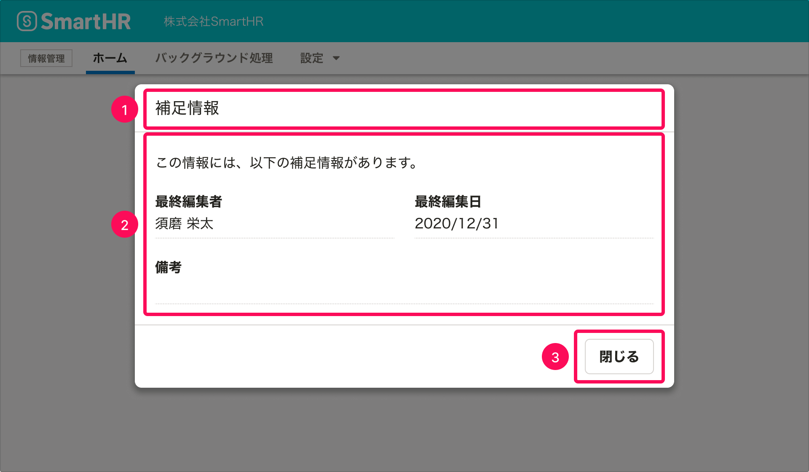

import { ComponentPropsTable } from '@Components/ComponentPropsTable'
import { ComponentStory } from '@Components/ComponentStory'

ユーザーに情報を提示するためのダイアログです。

モーダルなダイアログです。ダイアログの表示中、ダイアログの裏側の領域はスクリム（幕）で隠され、操作を受け付けません。

<ComponentStory name="MessageDialog" />

## 使用上の注意

[モーダルなUIの使いどころ](/products/design-patterns/modal-ui/#h3-0)もあわせて参照してください。

### ダイアログを乱用しない

MessageDialogの表示中、ユーザーの操作範囲は強制的に制限されます。

ダイアログが表示されることによってユーザーの操作を妨げてしまわないか、ダイアログとして表示する・操作させるべき内容なのか、慎重にユースケースを定義し、使用を検討してください。

### 複数のモーダルダイアログを同時に表示しない

モーダルダイアログ（ActionDialogやMessageDialog）を1つの操作で複数個表示したり、モーダルダイアログ上の操作によって2つ目のモーダルダイアログを表示したりすることは、原則として推奨されません。3つの画面が重なり、画面どうしの関係性や、どんな操作をすれば何が起こるのかが予測しづらくなるためです。

なお、モーダルダイアログ上の操作によってModelessDialogを表示したり、ModelessDialogが開いている状態でモーダルダイアログを開いたりすることは問題ありません。

### フィードバックとして使わない

MessageDialogは、表示したままダイアログ外の操作ができず、以下の理由で処理結果のフィードバックには不適切なため、原則としてフィードバックとしては使いません。

- 処理が成功した場合、ユーザーは次の操作をする前にダイアログを閉じる一手間が発生する
- 処理が失敗した場合、表示されたエラーメッセージを参照しながら操作できない

フィードバックには[NotificationBar](/products/components/notificationbar/)や[ResponseMessage](/products/components/responsemessage/)などを使います。詳しくは、[フィードバック](/products/design-patterns/feedback/)を参照してください。

## レイアウト

### 基準サイズ

ダイアログの横幅サイズの基準値は以下のとおりです。  
サイズに意図がない場合は、下記の値から想定に近い値を選択してください。

#### デスクトップ、タブレット（`TABLET`）

| サイズ | 値 | 補足説明 |
| :--- | :--- | :--- |
| `XS` | 480px（30rem） | 幅の最小値として使います。 |
| `S` | 560px（35rem） |  |
| `M` | 640px（40rem） |  |
| `L` | 880px（55rem） |  |
| `XL` | 1120px（70rem） |  |
| `MAX` | calc(100vw - 16px) | 幅の最大値として使います。 |

#### スマートフォン（`SP`）

スマートフォンは表示領域が狭いため、サイズの最大値/最小値は同じとします。

| サイズ | 値 | 補足説明 |
| :--- | :--- | :--- |
| 標準 | calc(100vw - 16px) | 幅の最大値/最小値として使います。 |

### 表示位置

`top` `bottom` `left` `right` propsで表示位置を指定できます。指定しない場合、画面の天地左右中央に表示されます。

- モーダルなダイアログ（`ActionDialog`と`MessageDialog`）の場合、意図的な場合を除き位置を指定せず、天地左右中央とします。

## アクセシビリティ

### キーボード操作

`ESC`キーを押すことでダイアログを閉じることができます。

## 構成

MessageDialogは以下の要素で構成されます。

1. タイトル
2. 本文
3. アクションボタン

### 1. タイトル

このダイアログで表示する情報を簡潔に表現するタイトルをつけます。

なお、サブタイトルは基本的に使いません。

### 2. 本文

ユーザーに提示したい情報を表示します。

通常、FormControlなどの入力要素が含まれることはありません。入力要素を含めたい場合は[ActionDialog](../action-dialog/)を使用してください。

### 3. アクションボタン

ダイアログを閉じるボタンを配置し、ラベルは`閉じる`とします。

## Props

<ComponentPropsTable name="MessageDialog" />
