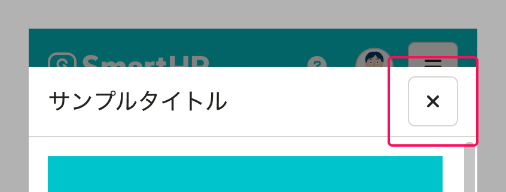
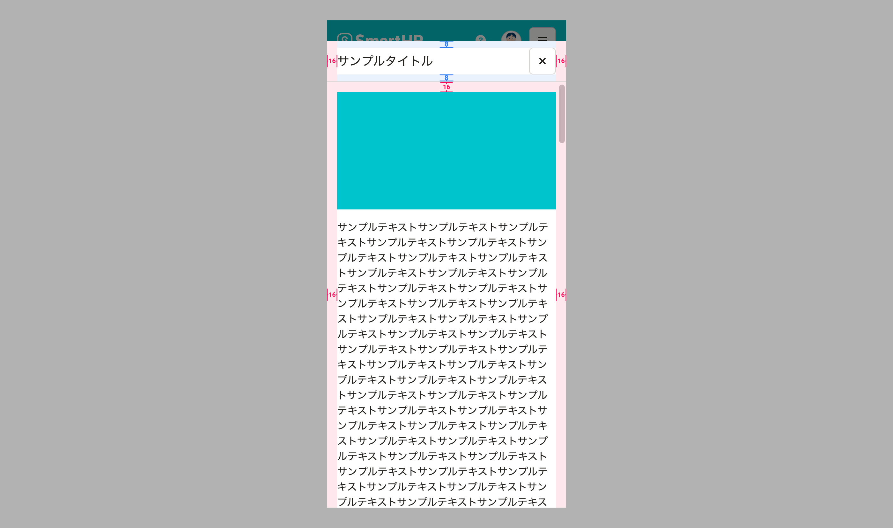
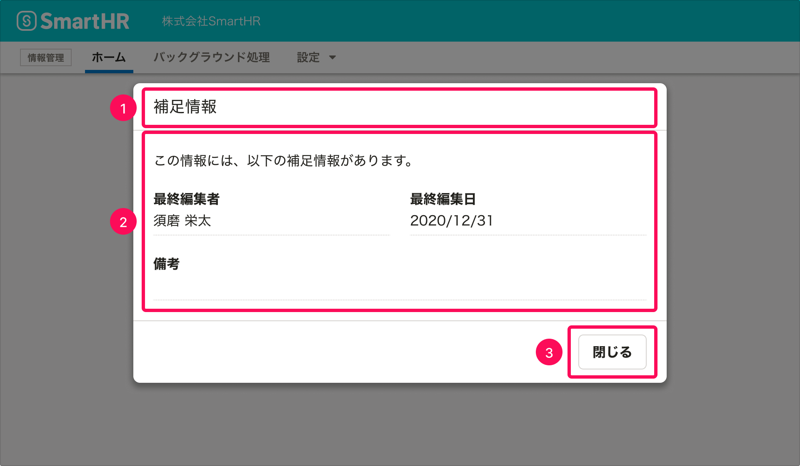

import ComponentPropsTable from '@/components/article/ComponentPropsTable.astro'
import ComponentStory from '@/components/article/ComponentStory.astro'
import MultipleModalWarning from '../_components/MultipleModalWarning.mdx'
import DialogBaseSize from '../_components/DialogBaseSize.mdx'
import ExpandedDialogUsecase from '../_components/ExpandedDialogUsecase.mdx'
import ExpandedDialogPadding from '../_components/ExpandedDialogPadding.mdx'
import { BaseColumn, Cluster, ResponseMessage, Text } from 'smarthr-ui'
import imageMessageDialog from '../images/message_dialog_mobile.png'
import imageExpandedMessageDialog from '../images/expanded_message_dialog_mobile.png'
import DoAndDont from '@/components/article/DoAndDont.astro'
import { Image } from 'astro:assets'

ユーザーに情報を提示するためのダイアログです。

モーダルなダイアログです。ダイアログの表示中、ダイアログの裏側の領域はスクリム（幕）で隠され、操作を受け付けません。

<ComponentStory name="MessageDialog" />

## 使用上の注意

[モーダルなUIの使いどころ](/products/design-patterns/modal-ui/#h3-0)もあわせて参照してください。

### ダイアログを乱用しない

MessageDialogの表示中、ユーザーの操作範囲は強制的に制限されます。

ダイアログが表示されることによってユーザーの操作を妨げてしまわないか、ダイアログとして表示する・操作させるべき内容なのか、慎重にユースケースを定義し、使用を検討してください。

### 複数のモーダルダイアログを同時に表示しない

<MultipleModalWarning />

### フィードバックとして使わない

MessageDialogは、表示したままダイアログ外の操作ができず、以下の理由で処理結果のフィードバックには不適切なため、原則としてフィードバックとしては使いません。

- 処理が成功した場合、ユーザーは次の操作をする前にダイアログを閉じる一手間が発生する
- 処理が失敗した場合、表示されたエラーメッセージを参照しながら操作できない

フィードバックには[NotificationBar](/products/components/notificationbar/)や[ResponseMessage](/products/components/responsemessage/)などを使います。詳しくは、[フィードバック](/products/design-patterns/feedback/)を参照してください。

## レイアウト

### 基準サイズ

<DialogBaseSize />

### 表示位置

表示位置は、画面の天地左右中央に表示されます。

## モバイル

<BaseColumn>
  <ResponseMessage type="info">ExpandedActionDialogは、propsに追加する形でsmarthr-uiに実装予定です。</ResponseMessage>
</BaseColumn>

モバイルでは、通常のメッセージダイアログに加えて、拡大メッセージダイアログを使用できます。

### 表示する情報量に応じて拡大メッセージダイアログが使用できる

<ExpandedDialogUsecase />

<Cluster gap={1}>
  <DoAndDont type="do" width="calc(50% - 8px)">
    <Image slot="img" src={imageMessageDialog} alt="Do" />
    <Text slot="label">通常のメッセージダイアログで表示する</Text>
  </DoAndDont>

  <DoAndDont type="do" width="calc(50% - 8px)">
    <Image slot="img" src={imageExpandedMessageDialog} alt="Do" />
    <Text slot="label">モバイルで表示する情報量が多い場合に拡大メッセージダイアログで表示する</Text>
  </DoAndDont>
</Cluster>

### レイアウト
［閉じる］ボタンはTitleAreaの右端に配置します。

#### 余白

<ExpandedDialogPadding />

## アクセシビリティ

### キーボード操作

`ESC`キーを押すことでダイアログを閉じることができます。

## 構成

MessageDialogは以下の要素で構成されます。

1. タイトル
2. 本文
3. アクションボタン

### 1. タイトル

このダイアログで表示する情報を簡潔に表現するタイトルをつけます。

なお、サブタイトルは基本的に使いません。

### 2. 本文

ユーザーに提示したい情報を表示します。

通常、FormControlなどの入力要素が含まれることはありません。入力要素を含めたい場合は[ActionDialog](../action-dialog/)を使用してください。

### 3. アクションボタン

ダイアログを閉じるボタンを配置し、ラベルは`閉じる`とします。

## Props

<ComponentPropsTable name="MessageDialog" />
