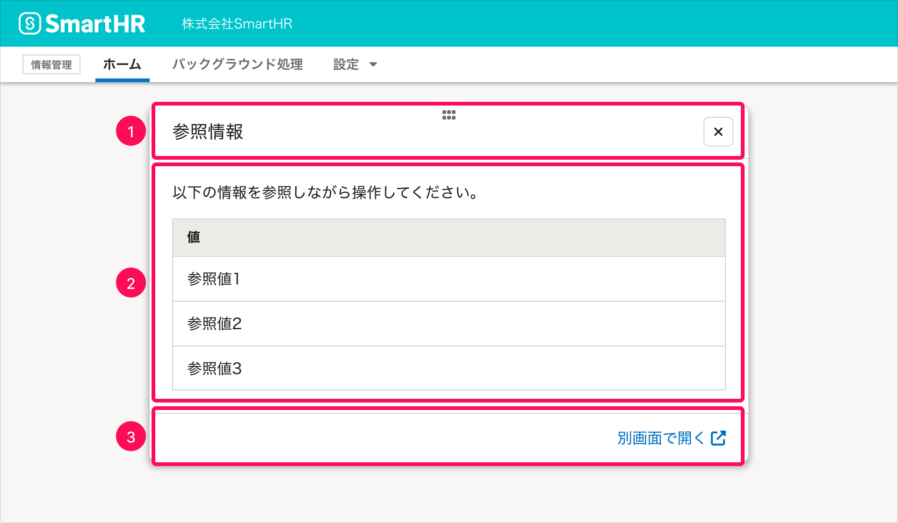

import ComponentPropsTable from '@/components/article/ComponentPropsTable.astro'
import ComponentStory from '@/components/article/ComponentStory.astro'
import DialogBaseSize from '../_components/DialogBaseSize.mdx'

モードレスなダイアログです。ダイアログを表示したまま、ダイアログの裏側の画面も操作できます。

基本的に、ダイアログと裏側の画面を同時並行で閲覧・操作する場合に使います。

<ComponentStory name="ModelessDialog" />

## 使用上の注意

### ダイアログを乱用しない

ModelessDialogは、ユーザーが直前まで見ていた画面の一部を覆い隠します。

ダイアログが表示されることによってユーザーの操作を妨げてしまわないか、ダイアログとして表示する・操作させるべき内容なのか、慎重にユースケースを定義し、使用を検討してください。

## レイアウト

### 基準サイズ

<DialogBaseSize />

### 表示位置

`top` `bottom` `left` `right` propsで表示位置を指定できます。指定しない場合、画面の天地左右中央に表示されます。

- `ModelessDialog`の場合は、ダイアログを開く操作をした箇所の付近に表示します。
  - モーダルなダイアログと違って、ダイアログの裏側の画面がスクリム（幕）で隠されないため、開く操作をした箇所から遠い位置に表示すると、ユーザーがダイアログを見つけにくいためです。

### モバイル

モバイルでは画面の表示領域が狭いため、ダイアログを表示しながら背景の画面を操作することが困難です。

そのため、モバイルでは`ModelessDialog`の代わりに[MessageDialog](../messsage-dialog/index.mdx)を利用してください。

## アクセシビリティ

### キーボード操作

`ESC`キーを押すことでダイアログを閉じることができます。

## 構成

ModelessDialogは以下の要素で構成されます。

1. ヘッダーエリア
2. 本文
3. フッターエリア（任意）

### 1. ヘッダーエリア

ヘッダーエリアの左端にはダイアログのタイトルが、右側にはダイアログを閉じるボタンが配置されます。

- ダイアログのタイトルは、表示する情報を簡潔に表現するものをつけます。
- ヘッダーエリアをドラッグしてダイアログの位置を移動できます。

### 2. 本文

ユーザーに提示したい情報を表示します。

### 3. フッターエリア（任意）

必要に応じてアクションボタンやリンクなどを配置します。

## Props

<ComponentPropsTable name="ModelessDialog" />
