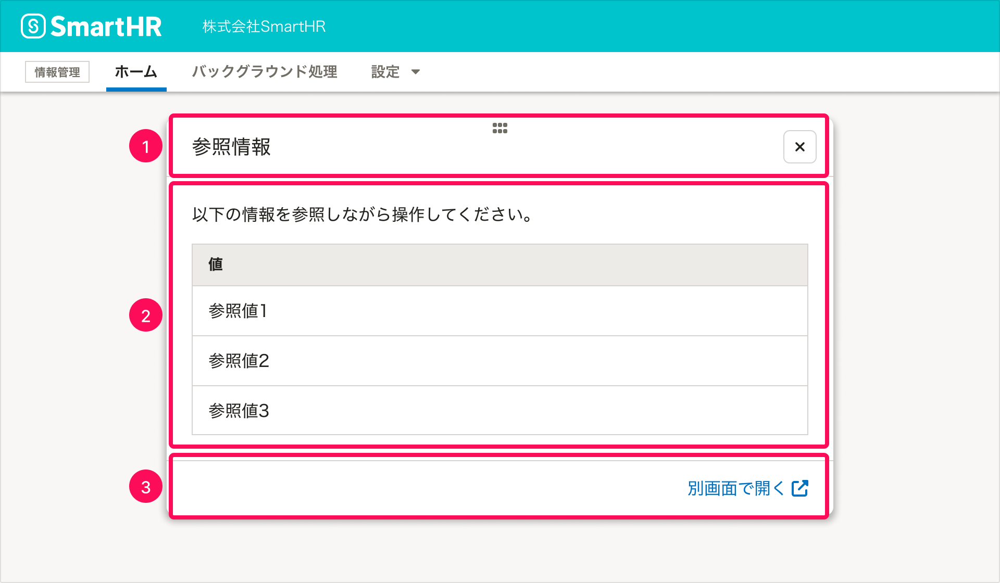
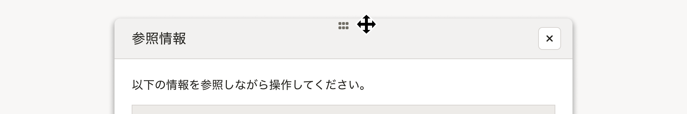

import ComponentPropsTable from '@/components/article/ComponentPropsTable.astro'
import Checklist from '@/components/article/Checklist/Checklist.astro'
import ComponentStory from '@/components/article/ComponentStory.astro'

背面の画面操作を妨げないモードレスダイアログコンポーネントです。ダイアログと背面の画面を同時並行で閲覧・操作するときに使います。

<ComponentStory name="ModelessDialog" />

## 使用上の注意

### ダイアログを乱用しない

ModelessDialogは、ユーザーが直前まで見ていた画面の一部を覆い隠します。

ダイアログが表示されることによってユーザーの操作を妨げてしまわないか、ダイアログとして表示する・操作させるべき内容なのか、慎重にユースケースを定義し、使用を検討してください。

## レイアウト

### 基準サイズ

SmartHR UIでは、ダイアログの横幅をサイズ（`size`props）で指定できます。各サイズの基準値は[幅のセマンティックトークン](/products/design-tokens/width/#h3-2)を参照しています。

大きさ | 幅トークン | 値（px）
:--- | :--- | :---
`XS` | `col3` | 424px
`S` | `col4` | 576px
`M` | `col5` | 728px
`L` | `col6` | 880px
`XL` | `col7` | 1032px
`XXL` | `col8` | 1184px
`FULL` | - | `width: 100%`

#### `XS`

入力要素を1つだけ持つダイアログなど、内容が極めて少ないダイアログに使います。

#### `S`

要素が少なく、要素が垂直方向に並ぶ、広い横幅を必要としないダイアログに使います。

#### `M`

数行に渡るテキストを表示したり、水平方向に要素を並べて表示したりする標準的なダイアログに使います。

#### `L`

テーブルを表示したり、ダイアログを複数カラムに分割するなど、広い横幅が必要なダイアログに使います。

#### `XL`

テーブルを表示したり、ダイアログを複数カラムに分割するなど、広い横幅が必要なダイアログに使います。`L`ではどうしてもコンテンツが収まりきらない場合に使います。

#### `XXL`

テーブルを表示したり、ダイアログを複数カラムに分割するなど、広い横幅が必要なダイアログに使います。`XL`ではどうしてもコンテンツが収まりきらない場合に使います。

#### `FULL`

テーブルを表示したり、ダイアログを複数カラムに分割するなど、広い横幅が必要なダイアログに使います。`XXL`ではどうしてもコンテンツが収まりきらない場合に使います。

### 表示位置

`top` `bottom` `left` `right` propsで表示位置を指定できます。指定しない場合、画面の上下左右中央に表示されます。

- `ModelessDialog`の場合は、ダイアログを開く操作をした箇所の付近に表示します。
  - モーダルなダイアログと違って、ダイアログの裏側の画面がスクリム（幕）で隠されないため、開く操作をした箇所から遠い位置に表示すると、ユーザーがダイアログを見つけにくいためです。

## アクセシビリティ

### キーボード操作

`ESC`キーを押すことでダイアログを閉じることができます。

## 構成

ModelessDialogは以下の要素で構成されます。

1. ヘッダーエリア
2. 本文
3. フッターエリア（任意）

### 1. ヘッダーエリア

ヘッダーエリアの左端にはダイアログのタイトルが、右側にはダイアログを閉じるボタンが配置されます。

- ダイアログのタイトルは、表示する情報を簡潔に表現するものをつけます。
- ヘッダーエリアをドラッグしてダイアログの位置を移動できます。

### 2. 本文

ユーザーに提示したい情報を表示します。

### 3. フッターエリア（任意）

必要に応じてアクションボタンやリンクなどを配置します。

## モバイル

モバイルでは画面の表示領域が狭いため、ダイアログを表示しながら背景の画面を操作することが困難です。
そのため、モバイルではModelessDialogの代わりに[MessageDialog](/products/components/dialog/message-dialog/)を利用してください。

## 使い方チェックリスト

<Checklist name="ModelessDialog" />

## Props

<ComponentPropsTable name="ModelessDialog" />
