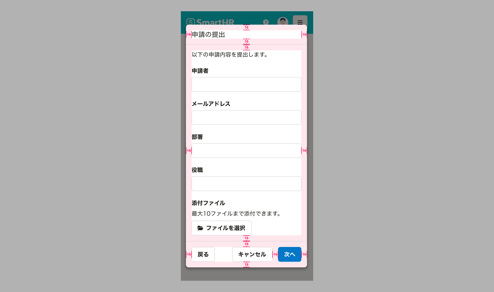
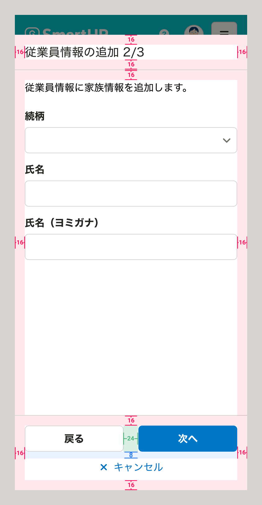
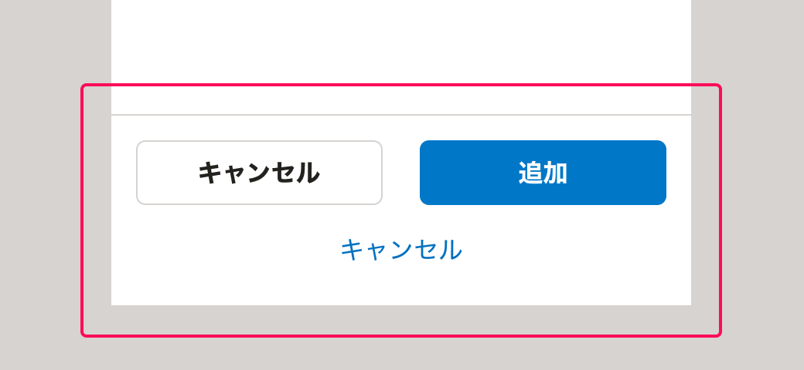

import ComponentPropsTable from '@/components/article/ComponentPropsTable.astro'
import ComponentStory from '@/components/article/ComponentStory.astro'
import ExpandedDialogUsecase from '../_components/ExpandedDialogUsecase.mdx'
import ExpandedDialogPadding from '../_components/ExpandedDialogPadding.mdx'
import { BaseColumn, Cluster, ResponseMessage, Text } from 'smarthr-ui'
import imageStepFormDialog from '../images/step_form_dialog_mobile.png'
import imageExpandedStepFormDialog from '../images/expanded_step_form_dialog_mobile.png'
import DoAndDont from '@/components/article/DoAndDont.astro'
import { Image } from 'astro:assets'

ステップを複数に分けたダイアログです。タスクの完了に複数の操作が必要な場合に使います。

モーダルなダイアログです。ダイアログの表示中、ダイアログの裏側の領域はスクリム（幕）で隠され、操作を受け付けません。

詳しくは[ウィザード](/products/design-patterns/wizard/)を参照してください。

<ComponentStory name="StepFormDialog" />

## モバイル

<BaseColumn className="shr-mt-1">
  <ResponseMessage type="info">拡大したStepFormDialogはsmarthr-uiに実装予定です。</ResponseMessage>
</BaseColumn>

モバイルでは、通常のダイアログに加えて、拡大したダイアログを使用できます。

### 表示する情報量に応じて拡大したダイアログの採用を検討する

<ExpandedDialogUsecase />

<Cluster gap={1}>
  <DoAndDont type="do" width="calc(50% - 8px)">
    <Image slot="img" src={imageStepFormDialog} alt="Do" />
    <Text slot="label">通常のダイアログで表示する</Text>
  </DoAndDont>

  <DoAndDont type="do" width="calc(50% - 8px)">
    <Image slot="img" src={imageExpandedStepFormDialog} alt="Do" />
    <Text slot="label">拡大したダイアログで表示する</Text>
  </DoAndDont>
</Cluster>

### レイアウト

#### 余白

モバイルで通常のダイアログを使用する場合、余白は以下の通りです。

<ExpandedDialogPadding />

#### フッターエリアのレイアウト

［戻る］ボタンと[Primaryボタン](/products/components/button/#h3-1)を[Cluster](/products/components/layout/cluster/)で横いっぱいに並べます。

［キャンセル］ボタンは、上記のButton群の下部に配置します。

## Props

<ComponentPropsTable name="StepFormDialog" />
