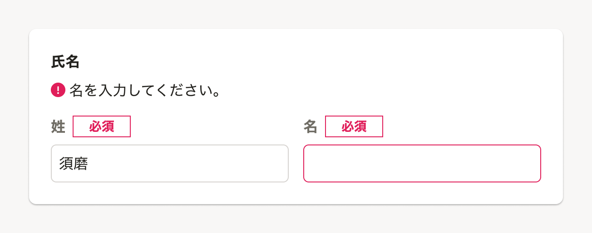

import ComponentPropsTable from '@/components/article/ComponentPropsTable.astro'
import ComponentStory from '@/components/article/ComponentStory.astro'

Fieldsetコンポーネントは、フォームにおける複数の入力要素をグルーピングするためのコンポーネントです。

姓名や期間の開始・終了のように値を分割して入力する場合や、CheckboxやRadioButtonといった複数の入力要素を持つフォームに対してラベルやメッセージテキストを表示したい場合に適しています。

<ComponentStory name="Fieldset" />

## 使用上の注意

### 入力要素が2つ以上の場合にのみ使用する

Fieldsetは、2つ以上の入力要素を持つフォームをグループ化し、タイトルやラベル、メッセージテキストを表示したい場合に使用します。

また、タイトルでは、まとめた入力要素がどんなグループであるかを明確に示しましょう。

入力要素が1つだけの場合は、[FormControl](/products/components/form-control/)を使用してください。

## レイアウト

Fieldsetには、複数の入力要素のグループの目的を明確にするタイトルをつけます。

Fieldsetに内包されるフォーム要素のタイトルは、グルーピングしているFieldsetのタイトルよりも低い見出しレベルになるようにします。見出しに関する詳細は[Heading](/products/components/heading/)を参照してください。

また、FormControlと同様に、ステータスラベルやメッセージテキストの有無で、コンポーネント内のレイアウトにバリエーションがあります。詳細は[FormControlのレイアウト](/products/components/form-control/#h2-1)を参照してください。

```tsx editable
<Fieldset
    legend="ユーザー情報"
    helpMessage="登録するユーザー情報を入力してください。"
>
    <Stack gap={1.25}>
        <Cluster gap={0.5}>
            <FormControl
                label="姓"
                titleType="subBlockTitle"
            >
                <Input name="lastName" />
            </FormControl>
            <FormControl
                label="名"
                titleType="subBlockTitle"
            >
                <Input name="firstName" />
            </FormControl>
        </Cluster>
        <Fieldset
            legend="住所"
            titleType="subBlockTitle"
        >
            <Stack>
                <FormControl
                    label="郵便番号"
                    titleType="subSubBlockTitle"
                >
                    <Input name="address_postalCode" />
                </FormControl>
                <FormControl
                    label="都道府県"
                    titleType="subSubBlockTitle"
                >
                    <Select
                        name="address_prefecture"
                        options={[
                            { label: '都道府県を選択してください', value: '' },
                            { label: '選択肢1', value: 'value1' },
                            { label: '選択肢2', value: 'value2' },
                            { label: '選択肢3', value: 'value3' },
                        ]}
                    />
                </FormControl>
                <FormControl
                    label="市区町村"
                    titleType="subSubBlockTitle"
                >
                    <Input name="address_city" />
                </FormControl>
                <FormControl
                    label="番地"
                    titleType="subSubBlockTitle"
                >
                    <Input name="address_streetNumber" />
                </FormControl>
                <FormControl
                    label="建物名・部屋番号"
                    titleType="subSubBlockTitle"
                >
                    <Input name="address_buildingName" />
                </FormControl>
            </Stack>
        </Fieldset>
        <Fieldset
            legend="電話番号"
            titleType="subBlockTitle"
            innerMargin={0.5}
        >
            <Cluster gap={0.5}>
                <Input width="100px" name="phone_number1" />
                <Input width="100px" name="phone_number2" />
                <Input width="100px" name="phone_number3" />
            </Cluster>
        </Fieldset>
        <Fieldset
            legend="性別"
            titleType="subBlockTitle"
            innerMargin={0.5}
        >
            <Cluster gap={1.25}>
                <RadioButton name="gender">男性</RadioButton>
                <RadioButton name="gender">女性</RadioButton>
                <RadioButton name="gender">回答しない</RadioButton>
            </Cluster>
        </Fieldset>
        <FormControl
            label="職業"
            titleType="subBlockTitle"
            innerMargin={0.5}
        >
            <Select
                name="occupation"
                options={[
                    { label: '職業を選択してください', value: '' },
                    { label: '選択肢1', value: 'value1' },
                    { label: '選択肢2', value: 'value2' },
                    { label: '選択肢3', value: 'value3' },
                ]}
            />
        </FormControl>
    </Stack>
</Fieldset>
```

### エラーの表示方法

Fieldsetに含まれる入力要素にエラーがある場合、エラーメッセージをそれぞれのFormControlではなくFieldsetのタイトルの下に表示できます。これによって、入力要素の組み合わせによって発生する複合的なエラーを表示したり、FormControlを横に並べたときのレイアウト崩れを防いだりできます。  

このとき、エラーメッセージには該当のFormControlのタイトルを含めてください。



※現時点ではFieldsetで出しているエラーメッセージと、エラー発生中のInputの紐づけができません。（実装予定）

## 状態

### 無効（disabled）

フォームの操作ができない状態を表現したスタイルです。

Fieldsetに`disabled`を適用すると、内包するフォーム要素にも自動で`disabled`が適用されるため、個別に設定する必要はありません。

ユーザーはなぜ無効になっているのかわからないことがあります。[権限による表示制御](/products/design-patterns/access-control-pattern/)のデザインパターンを参考にして、そもそも無効ではなくフォーム自体を非表示にしたり、無効状態の理由を付近に表示することを検討してください。

```tsx editable
<Fieldset
    legend="ユーザー情報"
    helpMessage="登録するユーザー情報を入力してください。"
    disabled
>
    <Stack gap={1.25}>
        <Cluster gap={0.5}>
            <FormControl
                label="姓"
                titleType="subBlockTitle"
            >
                <Input name="lastName" />
            </FormControl>
            <FormControl
                label="名"
                titleType="subBlockTitle"
            >
                <Input name="firstName" />
            </FormControl>
        </Cluster>
        <Fieldset
            legend="住所"
            titleType="subBlockTitle"
        >
            <Stack>
                <FormControl
                    label="郵便番号"
                    titleType="subSubBlockTitle"
                >
                    <Input name="address_postalCode" />
                </FormControl>
                <FormControl
                    label="都道府県"
                    titleType="subSubBlockTitle"
                >
                    <Select
                        name="address_prefecture"
                        options={[
                            { label: '都道府県を選択してください', value: '' },
                            { label: '選択肢1', value: 'value1' },
                            { label: '選択肢2', value: 'value2' },
                            { label: '選択肢3', value: 'value3' },
                        ]}
                    />
                </FormControl>
                <FormControl
                    label="市区町村"
                    titleType="subSubBlockTitle"
                >
                    <Input name="address_city" />
                </FormControl>
                <FormControl
                    label="番地"
                    titleType="subSubBlockTitle"
                >
                    <Input name="address_streetNumber" />
                </FormControl>
                <FormControl
                    label="建物名・部屋番号"
                    titleType="subSubBlockTitle"
                >
                    <Input name="address_buildingName" />
                </FormControl>
            </Stack>
        </Fieldset>
        <Fieldset
            legend="電話番号"
            titleType="subBlockTitle"
            innerMargin={0.5}
        >
            <Cluster gap={0.5}>
                <Input width="100px" name="phone_number1" />
                <Input width="100px" name="phone_number2" />
                <Input width="100px" name="phone_number3" />
            </Cluster>
        </Fieldset>
        <Fieldset
            legend="性別"
            titleType="subBlockTitle"
            innerMargin={0.5}
        >
            <Cluster gap={1.25}>
                <RadioButton name="gender">男性</RadioButton>
                <RadioButton name="gender">女性</RadioButton>
                <RadioButton name="gender">回答しない</RadioButton>
            </Cluster>
        </Fieldset>
        <FormControl
            label="職業"
            titleType="subBlockTitle"
            innerMargin={0.5}
        >
            <Select
                name="occupation"
                options={[
                    { label: '職業を選択してください', value: '' },
                    { label: '選択肢1', value: 'value1' },
                    { label: '選択肢2', value: 'value2' },
                    { label: '選択肢3', value: 'value3' },
                ]}
            />
        </FormControl>
    </Stack>
</Fieldset>
```

### 読み取り専用

Fieldset自体には、読み取り専用の状態は存在しません。

入力内容の確認時など、すでに入力済みの書き換えできない値として表示する際は、[Input](/products/components/input/)の`readOnly`を使用してください。

ただし、値をテキストとしてコピーして利用したいユーザーにとっては、分割されているフォームの値をそれぞれコピーする必要があり、手間になってしまうことに注意してください。

```tsx editable
<Fieldset
    legend="電話番号"
    titleType="subBlockTitle"
    innerMargin={0.5}
>
    <Cluster gap={0.5}>
        <Input
            width="100px"
            name="phoneNumber1"
            value="00"
            readOnly
        />
        <Input
            width="100px"
            name="phoneNumber2"
            value="0000"
            readOnly
        />
        <Input
            width="100px"
            name="phoneNumber3"
            value="0000"
            readOnly
        />
    </Cluster>
</Fieldset>
```

## Props

<ComponentPropsTable name="Fieldset" />

