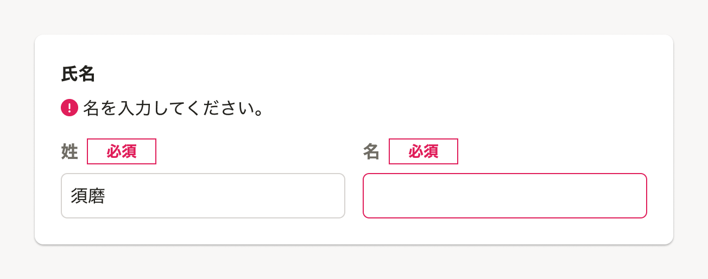

import ComponentPropsTable from '@/components/article/ComponentPropsTable.astro'
import Checklist from '@/components/article/Checklist/Checklist.astro'
import ComponentStory from '@/components/article/ComponentStory.astro'

`fieldset`要素の代替として複数の入力要素をグルーピングするコンポーネントです。関連する入力欄を1つの見出しでまとめるときに使います。

姓名や期間の開始・終了のように値を分割して入力する場合や、[Checkbox](/products/components/check-box/)や[RadioButton](/products/components/radio-button/)といった複数の入力要素を持つフォームに対してラベルやメッセージテキストを表示したい場合に適しています。

<ComponentStory name="Fieldset" />

## 使用上の注意

### 入力要素が2つ以上の場合にのみ使用する

Fieldsetは、2つ以上の入力要素を持つフォームをグループ化し、タイトルやラベル、メッセージテキストを表示したい場合に使用します。

また、タイトルでは、まとめた入力要素がどんなグループであるかを明確に示しましょう。

入力要素が1つだけの場合は、[FormControl](/products/components/form-control/)を使用してください。

## レイアウト

Fieldsetには、複数の入力要素のグループの目的を明確にするタイトルをつけます。

Fieldsetに内包されるフォーム要素のタイトルは、グルーピングしているFieldsetのタイトルよりも低い見出しレベルになるようにします。見出しに関する詳細は[Heading](/products/components/heading/)を参照してください。

また、FormControlと同様に、ステータスラベルやメッセージテキストの有無で、コンポーネント内のレイアウトにバリエーションがあります。詳細は[FormControlのレイアウト](/products/components/form-control/#h2-1)を参照してください。

```tsx editable
<Fieldset
    legend="ユーザー情報"
    helpMessage="登録するユーザー情報を入力してください。"
>
    <Stack gap={1.25}>
        <Cluster gap={0.5}>
            <FormControl
                label={{ text: "姓", styleType: "subBlockTitle" }}
            >
                <Input name="lastName" />
            </FormControl>
            <FormControl
                label={{ text: "名", styleType: "subBlockTitle" }}
            >
                <Input name="firstName" />
            </FormControl>
        </Cluster>
        <Fieldset
            legend={{ text: "住所", styleType: "subBlockTitle" }}
        >
            <Stack>
                <FormControl
                    label={{ text: "郵便番号", styleType: "subSubBlockTitle" }}
                >
                    <Input name="address_postalCode" />
                </FormControl>
                <FormControl
                    label={{ text: "都道府県", styleType: "subSubBlockTitle" }}
                >
                    <Select
                        name="address_prefecture"
                        options={[
                            { label: '都道府県を選択してください', value: '' },
                            { label: '選択肢1', value: 'value1' },
                            { label: '選択肢2', value: 'value2' },
                            { label: '選択肢3', value: 'value3' },
                        ]}
                    />
                </FormControl>
                <FormControl
                    label={{ text: "市区町村", styleType: "subSubBlockTitle" }}
                >
                    <Input name="address_city" />
                </FormControl>
                <FormControl
                    label={{ text: "番地", styleType: "subSubBlockTitle" }}
                >
                    <Input name="address_streetNumber" />
                </FormControl>
                <FormControl
                    label={{ text: "建物名・部屋番号", styleType: "subSubBlockTitle" }}
                >
                    <Input name="address_buildingName" />
                </FormControl>
            </Stack>
        </Fieldset>
        <Fieldset
            legend={{ text: "電話番号", styleType: "subBlockTitle" }}
            innerMargin={0.5}
        >
            <Cluster gap={0.5}>
                <FormControl label={{ text: "電話番号1", unrecommendedHide: true }}>
                    <Input width="100px" name="phone_number1" />
                </FormControl>
                <FormControl label={{ text: "電話番号2", unrecommendedHide: true }}>
                    <Input width="100px" name="phone_number2" />
                </FormControl>
                <FormControl label={{ text: "電話番号3", unrecommendedHide: true }}>
                    <Input width="100px" name="phone_number3" />
                </FormControl>
            </Cluster>
        </Fieldset>
        <Fieldset
            legend={{ text: "性別", styleType: "subBlockTitle" }}
            innerMargin={0.5}
        >
            <Cluster gap={1.25}>
                <RadioButton name="gender">男性</RadioButton>
                <RadioButton name="gender">女性</RadioButton>
                <RadioButton name="gender">回答しない</RadioButton>
            </Cluster>
        </Fieldset>
        <FormControl
            label={{ text: "職業", styleType: "subBlockTitle" }}
            innerMargin={0.5}
        >
            <Select
                name="occupation"
                options={[
                    { label: '職業を選択してください', value: '' },
                    { label: '選択肢1', value: 'value1' },
                    { label: '選択肢2', value: 'value2' },
                    { label: '選択肢3', value: 'value3' },
                ]}
            />
        </FormControl>
    </Stack>
</Fieldset>
```

### エラーの表示方法

Fieldsetに含まれる入力要素にエラーがある場合、エラーメッセージをそれぞれのFormControlではなくFieldsetのタイトルの下に表示できます。これによって、入力要素の組み合わせによって発生する複合的なエラーを表示したり、FormControlを横に並べたときのレイアウト崩れを防いだりできます。  

このとき、エラーメッセージには該当のFormControlのタイトルを含めてください。



※現時点ではFieldsetで出しているエラーメッセージと、エラー発生中のInputの紐づけができません。（実装予定）

## 状態

### 無効（disabled）

フォームの操作ができない状態を表現したスタイルです。

Fieldsetに`disabled`を適用すると、内包するフォーム要素にも自動で`disabled`が適用されるため、個別に設定する必要はありません。

ユーザーはなぜ無効になっているのかわからないことがあります。[権限による表示制御](/products/design-patterns/access-control-pattern/)のデザインパターンを参考にして、そもそも無効ではなくフォーム自体を非表示にしたり、無効状態の理由を付近に表示することを検討してください。

```tsx editable
<Fieldset
    legend="ユーザー情報"
    helpMessage="登録するユーザー情報を入力してください。"
    disabled
>
    <Stack gap={1.25}>
        <Cluster gap={0.5}>
            <FormControl
                label={{ text: "姓", styleType: "subBlockTitle" }}
            >
                <Input name="lastName" />
            </FormControl>
            <FormControl
                label={{ text: "名", styleType: "subBlockTitle" }}
            >
                <Input name="firstName" />
            </FormControl>
        </Cluster>
        <Fieldset
            legend={{ text: "住所", styleType: "subBlockTitle" }}
        >
            <Stack>
                <FormControl
                    label={{ text: "郵便番号", styleType: "subSubBlockTitle" }}
                >
                    <Input name="address_postalCode" />
                </FormControl>
                <FormControl
                    label={{ text: "都道府県", styleType: "subSubBlockTitle" }}
                >
                    <Select
                        name="address_prefecture"
                        options={[
                            { label: '都道府県を選択してください', value: '' },
                            { label: '選択肢1', value: 'value1' },
                            { label: '選択肢2', value: 'value2' },
                            { label: '選択肢3', value: 'value3' },
                        ]}
                    />
                </FormControl>
                <FormControl
                    label={{ text: "市区町村", styleType: "subSubBlockTitle" }}
                >
                    <Input name="address_city" />
                </FormControl>
                <FormControl
                    label={{ text: "番地", styleType: "subSubBlockTitle" }}
                >
                    <Input name="address_streetNumber" />
                </FormControl>
                <FormControl
                    label={{ text: "建物名・部屋番号", styleType: "subSubBlockTitle" }}
                >
                    <Input name="address_buildingName" />
                </FormControl>
            </Stack>
        </Fieldset>
        <Fieldset
            legend={{ text: "電話番号", styleType: "subBlockTitle" }}
            innerMargin={0.5}
        >
            <Cluster gap={0.5}>
                <FormControl label={{ text: "電話番号1", unrecommendedHide: true }}>
                    <Input width="100px" name="phone_number1" />
                </FormControl>
                <FormControl label={{ text: "電話番号2", unrecommendedHide: true }}>
                    <Input width="100px" name="phone_number2" />
                </FormControl>
                <FormControl label={{ text: "電話番号3", unrecommendedHide: true }}>
                    <Input width="100px" name="phone_number3" />
                </FormControl>
            </Cluster>
        </Fieldset>
        <Fieldset
            legend={{ text: "性別", styleType: "subBlockTitle" }}
            innerMargin={0.5}
        >
            <Cluster gap={1.25}>
                <RadioButton name="gender">男性</RadioButton>
                <RadioButton name="gender">女性</RadioButton>
                <RadioButton name="gender">回答しない</RadioButton>
            </Cluster>
        </Fieldset>
        <FormControl
            label={{ text: "職業", styleType: "subBlockTitle" }}
            innerMargin={0.5}
        >
            <Select
                name="occupation"
                options={[
                    { label: '職業を選択してください', value: '' },
                    { label: '選択肢1', value: 'value1' },
                    { label: '選択肢2', value: 'value2' },
                    { label: '選択肢3', value: 'value3' },
                ]}
            />
        </FormControl>
    </Stack>
</Fieldset>
```

### 読み取り専用

Fieldset自体には、読み取り専用の状態は存在しません。

入力内容の確認時など、すでに入力済みの書き換えできない値として表示する際は、[Input](/products/components/input/)の`readOnly`を使用してください。

ただし、値をテキストとしてコピーして利用したいユーザーにとっては、分割されているフォームの値をそれぞれコピーする必要があり、手間になってしまうことに注意してください。

```tsx editable
<Fieldset
    legend={{ text: "電話番号", styleType: "subBlockTitle" }}
    innerMargin={0.5}
>
    <Cluster gap={0.5}>
        <FormControl label={{ text: "電話番号1", unrecommendedHide: true }}>
            <Input
                width="100px"
                name="phoneNumber1"
                value="00"
                readOnly
            />
        </FormControl>
        <FormControl label={{ text: "電話番号2", unrecommendedHide: true }}>
            <Input
                width="100px"
                name="phoneNumber2"
                value="0000"
                readOnly
            />
        </FormControl>
        <FormControl label={{ text: "電話番号3", unrecommendedHide: true }}>
            <Input
                width="100px"
                name="phoneNumber3"
                value="0000"
                readOnly
            />
        </FormControl>
    </Cluster>
</Fieldset>
```

## アクセシビリティ

### 基本的なアクセシビリティ機能

#### 関連する入力項目をグループ化する

`Fieldset`コンポーネントは、関連する複数の入力項目を`<fieldset>`要素でグループ化し、`legend` propsで指定した内容をグループ名として提供します。
これにより、支援技術を使用するユーザーにも、入力項目同士の関係性やグループの目的が伝わります。

### 開発時の考慮点

#### 関連する入力項目はFieldsetでグループ化する

複数の入力項目が同じ質問や設定に関するものである場合は、`Fieldset`コンポーネントを使用してグループ化してください。
`Fieldset`を利用することで、支援技術にも入力項目同士の関係性やグループの目的を伝えられます。これは、[Checkbox](/products/components/checkbox/)や[RadioButton](/products/components/radio-button/)の選択肢だけでなく、住所入力のような複数の入力項目をまとめる場合にも有効です。

#### legendでグループの目的を示す

`legend` propsには、グループ全体が何についての入力項目なのかがわかるテキストを設定してください。

#### 良い実装例

```tsx
<Fieldset
  legend="通知設定"
  innerMargin={0.5}
>
  <Cluster gap={{ row: 1, column: 1.5 }}>
    <Checkbox name="emailNotification">メール通知</Checkbox>
    <Checkbox name="smsNotification">SMS通知</Checkbox>
    <Checkbox name="pushNotification">プッシュ通知</Checkbox>
  </Cluster>
</Fieldset>

<Fieldset
  legend="住所"
  helpMessage="ご自宅の住所を入力してください"
>
  <Stack gap={1}>
    <FormControl label="郵便番号">
      <Input name="postalCode" />
    </FormControl>
    <FormControl label="都道府県">
      <Select
        name="prefecture"
        options={[
          { label: '都道府県を選択してください', value: '' },
        ]}
      />
    </FormControl>
  </Stack>
</Fieldset>
```

#### 悪い実装例

```tsx
// ❌ Fieldset を使用せず見た目だけグループ化
<div>
  <Text styleType="blockTitle">通知設定</Text>
  <Cluster gap={{ row: 1, column: 1.5 }}>
    <Checkbox name="emailNotification">メール通知</Checkbox>
    <Checkbox name="smsNotification">SMS通知</Checkbox>
  </Cluster>
</div>
```

`Fieldset`を使用せず見た目だけでグループ化すると、支援技術には入力項目同士の関係性やグループの目的が伝わりません。

## 関連ページ

- [入力する内容や、操作がラベルとして表示されている | アクセシビリティガイドライン](/accessibility/check-list/label/)
- [フォームパーツにアクセシブルネームがある | アクセシビリティガイドライン](/accessibility/check-list/accessible-name/)

## 使い方チェックリスト

<Checklist name="Fieldset" />

## Props

<ComponentPropsTable name="Fieldset" />

