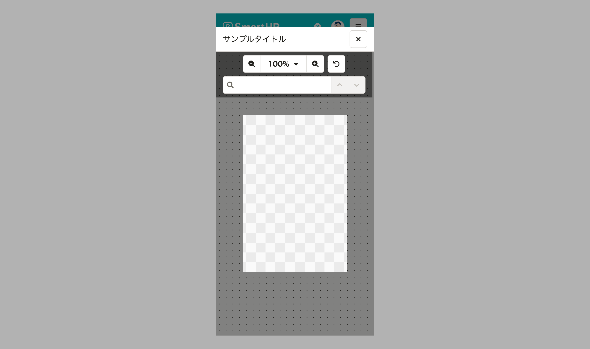

import ComponentStory from '@/components/article/ComponentStory.astro'
import ComponentPropsTable from '@/components/article/ComponentPropsTable.astro'
import Checklist from '@/components/article/Checklist/Checklist.astro'

画像やPDFファイルを表示・拡大縮小・回転できるファイルビューアーコンポーネントです。ファイルの内容をプレビューするときに使います。

<ComponentStory name="FileViewer" />

## 使用上の注意

以下のファイル形式をサポートしています：
- **画像ファイル**: JPEG、PNG、GIF など（`image/*` のMIMEタイプ）
- **PDFファイル**: `application/pdf`

## モバイル
FileViewerをダイアログで表示する際は、ユーザーがファイルの内容に集中できるように、画面いっぱいに広げる[拡大したダイアログ](/products/components/dialog/message-dialog/#h3-9)の使用を検討してください。

## 使い方チェックリスト

<Checklist name="FileViewer" />

## Props

<ComponentPropsTable name="FileViewer" />

