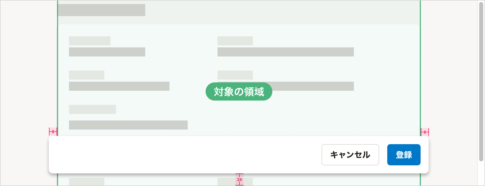
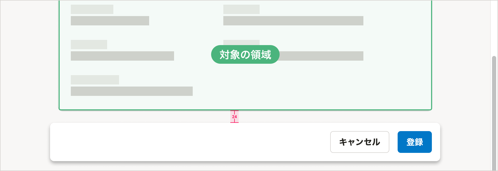
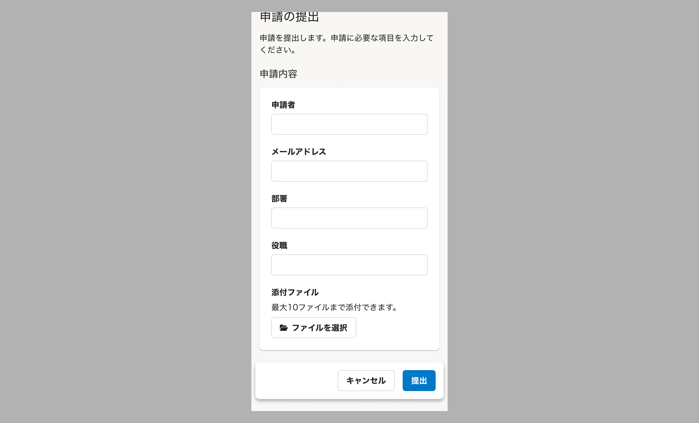
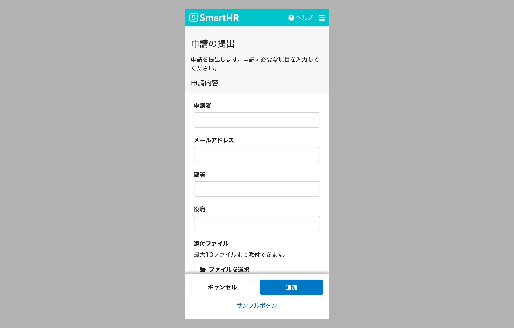
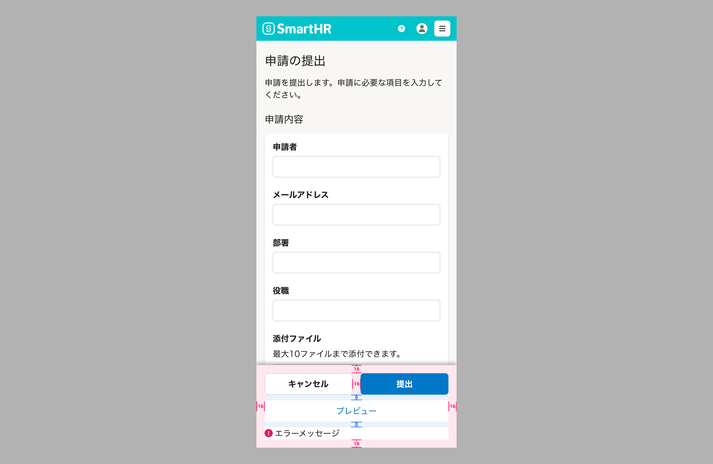

import { Image } from 'astro:assets'
import { BaseColumn, Cluster, ResponseMessage, Text } from 'smarthr-ui'
import ComponentPropsTable from '@/components/article/ComponentPropsTable.astro'
import ComponentStory from '@/components/article/ComponentStory.astro'
import DoAndDont from '@/components/article/DoAndDont.astro'
import FloatAreaLayoutDo from './images/float-area-layout-do.png';
import FloatAreaLayoutDont from './images/float-area-layout-dont.png';
import imageFloatAreaNoStickyMobileKeyboard from './images/float-area-nosticky-mobile-keyboard.png';
import imageFloatAreaStickyMobileKeyboard from './images/float-area-sticky-mobile-keyboard.png';

スクロール時に固定表示する領域のためのコンポーネントです。特定のアクションボタンやテキストを、スクロール位置にかかわらず画面内の特定の位置に表示できます。

主に[モーダルなUI](/products/design-patterns/modal-ui/)を作るために使います。

<ComponentStory name="FloatArea" />

## レイアウト

### 基本的な考え方

FloatAreaには、ページ全体、もしくはページの一部を対象としたボタンやテキストを置きます。**ページ内のどの部分が対象の領域なのかを視覚的に示す**ことを目指して、FloatAreaの位置や幅、[レイヤー順序](/products/design-tokens/z-index/)を調整してください。

<DoAndDont type="do">
  <Image slot="img" src={FloatAreaLayoutDo} alt="Do" />
  <Text slot="label">FloatAreaが右側のカラムだけに重なっているため、右側のカラムだけがFloatAreaの対象の領域であることがわかる</Text>
</DoAndDont>

<DoAndDont type="dont">
  <Image slot="img" src={FloatAreaLayoutDont} alt="Don't" />
  <Text slot="label">FloatAreaが2つのカラムに重なっているため、左側のカラムもFloatAreaの対象の領域に見える</Text>
</DoAndDont>

### レイアウト例

#### スクロール固定中

対象の領域の左右に`0.5（8px）`ずつはみ出し、画面の下辺から`1.5（24px）`の余白をとった位置に置きます。

#### スクロール固定解除後

対象の領域の下辺との間に `1.5（24px）` の余白を取ります。

## デザインパターン

[モーダルなUI](/products/design-patterns/modal-ui/)および[共通設定のアクションビュー](/products/design-patterns/main-admin-core-features/#h2-3)を参照してください。

## モバイル

<BaseColumn className="shr-mt-1">
  <ResponseMessage type="info">モバイル対応したFloatAreaはsmarthr-uiに実装予定です。</ResponseMessage>
</BaseColumn>

モバイルでは1画面で表示できる情報量に限りがあります。
FloatAreaが常に画面の下部に固定されていると、コンテンツを閲覧・操作できる領域が狭くなります。

そこで、FloatAreaを画面の下部に固定せず、コンテンツの最後に置くことを推奨します。

ただしユースケースに応じて必要な場合はFloatAreaを画面の下部に固定できます。  
仮想キーボードの入力操作の妨げにならないよう、入力要素にフォーカス中は固定を解除してください。
その場合、キーボード入力時に固定を解除することで、操作領域を確保してください。

<Cluster gap={1}>
  <DoAndDont type="do" width="calc(50% - 8px)">
    <Image slot="img" src={ imageFloatAreaNoStickyMobileKeyboard } alt="Do" />
    <Text slot="label">FloatAreaを画面の下部に固定した場合でも、keyboard入力時には固定を解除する</Text>
  </DoAndDont>

  <DoAndDont type="dont" width="calc(50% - 8px)">
    <Image slot="img" src={ imageFloatAreaStickyMobileKeyboard } alt="Don't" />
    <Text slot="label">keyboard入力時にもFloatAreaを画面の下部に固定する</Text>
  </DoAndDont>
</Cluster>

### レイアウト

FloatAreaを画面の下部に固定する場合、画面幅に対して左右の余白をなくす必要があります。

[Secondaryボタン](https://smarthr.design/products/components/button/#h3-2)（任意）と[Primaryボタン](/products/components/button/#h3-1)は横いっぱいに並べます。
また、[Tertiaryボタン](/products/components/button/#h3-3)（任意）は、上記のボタン群の下部に配置します。

#### 余白

モバイルでFloatAreaを画面の下部に固定する場合、余白は以下のとおりです。

## Props

<ComponentPropsTable name="FloatArea" />
